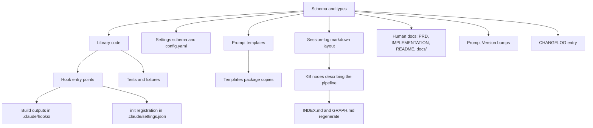
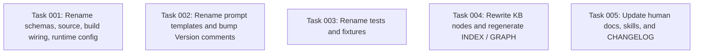

# Plan: Rename Stage 1 / Stage 2 to Transcript / Proposal

## Original Work Order

> "Stage 1" and "Stage 2" are mediocre names. I want you to use "Transcript" and "Proposal" instead across the board (including front-matter, and configuration, ...)

## Plan Clarifications

| Question                                                                                  | Answer                                                                                                                                                                  |
| ----------------------------------------------------------------------------------------- | ----------------------------------------------------------------------------------------------------------------------------------------------------------------------- |
| How should config keys, TS identifiers, file names, and frontmatter fields be renamed?    | Full pair: `transcript` and `proposal`. Everywhere a Stage 2 identifier existed (config keys, types, file names, log subdir, prompt file, lock name) becomes `proposal`. The Stage 1 section heading in session logs becomes the `Transcript` section. |
| How should existing on-disk data with `stage-2` / `stage_2_*` names be handled?           | Clean break, no migration. Bump `schema_version` from 1 to 2. Existing `_sessions/*.md` and `_logs/stage-2/*` become invalid and are expected to be deleted by the user. No migrator, no compat shim. This aligns with the existing no-migrators policy. |
| Should existing KB node bodies that mention `stage-2` be rewritten?                       | Yes. Edit `nodes/map/map-claude-hooks.md`, `nodes/practice/practice-hooks-meet-1s-deadline.md`, and any other KB nodes whose prose references the old names; regenerate `INDEX.md` and `GRAPH.md`. |
| Are the `Stage 1 / Stage 2` headings under `.claude/commands/tasks/refine-plan*.md` part of the rename? | No. Those are unrelated plan-refinement workflow steps. Out of scope.                                                                                                  |

## Executive Summary

The capture pipeline is currently named after its position in the pipeline ("Stage 1", "Stage 2") rather than what each step produces. Stage 1 captures a redacted transcript; Stage 2 produces structured proposals for the curator. Naming them `Transcript` and `Proposal` makes the codebase self-describing: a reader who encounters `proposal_status: pending` or `kb-proposal-drain.mjs` understands the artifact without consulting docs.

The rename is a clean break. `schema_version` bumps from 1 to 2 across every on-disk shape that previously carried the `stage_2_*` keys (session-log frontmatter, settings file, queue file). No migrator ships. The project's existing no-migrators policy (see `nodes/practice/practice-no-schema-migrators.md`) governs: users delete `_sessions/` and `_logs/stage-2/` on upgrade and start fresh, exactly as for any prior bump.

The scope spans source code under `src/`, the compiled `.claude/hooks/` bundles, the `templates/` and `src/templates-source/` prompt copies, configuration (`.ai/knowledge-base/config.yaml` and `SettingsSchema`), every test file that references the old names, all human documentation (PRD, IMPLEMENTATION, README, `docs/`), and the project's own knowledge-base nodes that describe the pipeline. INDEX.md and GRAPH.md regenerate from the updated nodes.

## Context

### Current State vs Target State

| Current State                                                                 | Target State                                                                          | Why?                                                                                                                                |
| ----------------------------------------------------------------------------- | ------------------------------------------------------------------------------------- | ----------------------------------------------------------------------------------------------------------------------------------- |
| Frontmatter keys `stage_2_status`, `stage_2_completed_at`, `stage_2_error`, `stage_2_log` | `proposal_status`, `proposal_completed_at`, `proposal_error`, `proposal_log`         | Names should describe the artifact (a proposal) not its ordinal position.                                                           |
| Markdown sections `## Stage 1: redacted transcript slice` and `## Stage 2: structured summary` in session logs | `## Transcript` and `## Proposal`                                                    | Section headings are user-visible; they should match the new vocabulary and read as labels for the artifact each holds.            |
| Config keys `stage2Timeout`, `stage2Model`                                    | `proposalTimeout`, `proposalModel`                                                    | Consistency with renamed pipeline; settings discoverability.                                                                        |
| TS types/schemas `Stage2Status`, `Stage2StatusSchema`, `Stage2Output`, `Stage2OutputSchema`, `Stage2Candidate`, `Stage2CandidateSchema`, `Stage2Runner` | `ProposalStatus`, `ProposalStatusSchema`, `ProposalOutput`, `ProposalOutputSchema`, `ProposalCandidate`, `ProposalCandidateSchema`, `ProposalRunner` | API surface and code-search hygiene; `Proposal*` names match the renamed frontmatter and config.                                  |
| Source files `src/lib/stage2-drain.ts`, `src/hooks/kb-stage2-drain.ts`        | `src/lib/proposal-drain.ts`, `src/hooks/kb-proposal-drain.ts`                         | File names should match their primary export.                                                                                       |
| Built/bundled hook `.claude/hooks/kb-stage2-drain.mjs` and its `tsup` entry   | `.claude/hooks/kb-proposal-drain.mjs`, `tsup.config.ts` updated to match              | The compiled artifact name flows through `init` (registered in `.claude/settings.json`) and `doctor` (checked by name).             |
| Prompt template file `prompts/stage-2-extract.md` (in both `src/templates-source/prompts/` and `templates/`) and resolved at runtime by name | `prompts/proposal-extract.md`                                                         | Filename participates in the rename; the runtime lookup in `kb-proposal-drain.ts` and `doctor.ts` updates accordingly.              |
| Lock name `stage2-drain` on `state.json`                                      | `proposal-drain`                                                                      | Lock identifier appears in state files and error messages; consistency.                                                             |
| Log subdir `_logs/stage-2/` and `LOG_BUCKETS = ['stage-2', 'curator', 'bootstrap-incremental']` | `_logs/proposal/` and `LOG_BUCKETS = ['proposal', 'curator', 'bootstrap-incremental']` | Directory name is observed by `logs-prune` and is referenced in docs.                                                               |
| `schema_version: 1` on session logs, settings, and queue                      | `schema_version: 2` on the same shapes                                                | Per `practice-no-schema-migrators.md`: every shape carries `schema_version`; a renamed-keys break is a bump.                       |
| `.claude/settings.json` hook command points at `kb-stage2-drain.mjs`          | Same command path updated to `kb-proposal-drain.mjs`                                  | The Claude Code hook entry must match the new filename or the hook won't fire.                                                      |
| Existing `_sessions/*.md` and `_logs/stage-2/*` carry the old names           | Expected to be deleted by the user on upgrade; not migrated                           | No migrator policy; the data is gitignored and reproducible from future sessions.                                                   |
| KB node prose: `nodes/map/map-claude-hooks.md`, `nodes/practice/practice-hooks-meet-1s-deadline.md`, `nodes/map/map-adapter-interface.md`, `nodes/map/map-practice-node.md`, `nodes/map/map-map-node.md`, `nodes/map/map-sessions-directory.md`, `nodes/map/map-state-json-file.md`, `nodes/practice/practice-recursion-guard-env-var.md` (and any others surfaced by grep) reference stage-2 | Rewritten in place to use the new vocabulary                                          | The KB describes the pipeline; the user requested KB prose be brought in line.                                                      |
| `INDEX.md` and `GRAPH.md` echo current node titles and bodies                 | Regenerated deterministically from the updated nodes                                  | Per `practice-determinism-contract.md`, both are derived; regeneration runs through the existing `index rebuild` path.              |
| Human docs reference "stage-2 extraction", "Stage 1", "Stage 2"               | Renamed to "proposal extraction", "Transcript", "Proposal" throughout PRD, IMPLEMENTATION, README, `docs/`, and `docs/internals/` | The user asked for "across the board".                                                                                              |

### Background

- The two-step capture pipeline is described in `PRD.md` §6, `IMPLEMENTATION.md` §5.1–§5.2, and `docs/internals/architecture.md`. Stage 1 is a deterministic, secret-scanned write under a 1-second deadline. Stage 2 is an async background `claude -p` subprocess that consumes the redacted transcript and emits structured proposals.
- The project policy in `nodes/practice/practice-no-schema-migrators.md` is explicit: every shape carries `schema_version`, bumps are a clean break, no migrators ship, no legacy paths. This rename is exactly the case that policy contemplates.
- The user's global memory adds: no backwards compatibility, no legacy shims, no migrations; no retrospective framing in docs (no "previously this was called Stage 2") outside `CHANGELOG.md`.
- The compiled hooks under `.claude/hooks/*.mjs` are produced by `tsup` from `src/hooks/*.ts`. Renaming a source file means the bundled output, the `tsup.config.ts` entry, the `init`-registered command in `.claude/settings.json`, and `doctor`'s expected-hook list all move together.
- The prompt files in `templates/prompts/` are the copies that ship in the npm package; `src/templates-source/prompts/` is the editorial source. A repo-level sync script keeps them aligned; both must be updated.
- Existing `_sessions/` and `_logs/` directories are gitignored. The plan does not commit data renames; the user is expected to delete obsolete files on upgrade, as for any prior schema bump.

## Architectural Approach

The rename is mechanical but spans many surfaces. The work decomposes into independent renaming surfaces that all flip together as one schema bump. There is no intermediate state where the codebase mixes old and new names: the change lands as one logical PR (per `practice-atomic-prs-with-paired-docs.md`), with conventional-commits messaging that semantic-release reads as a breaking change.



### Schema, Types, and Frontmatter

**Objective**: Establish the new vocabulary in one place so every consumer reads from a single source of truth.

`src/lib/schemas.ts` is the canonical declaration of the on-disk shapes. The Zod schemas and TypeScript types defined there rename uniformly:

- Enum: `Stage2StatusSchema` → `ProposalStatusSchema`; type `Stage2Status` → `ProposalStatus`.
- Candidate shape: `Stage2CandidateSchema` → `ProposalCandidateSchema`; type `Stage2Candidate` → `ProposalCandidate`.
- Output shape: `Stage2OutputSchema` → `ProposalOutputSchema`; type `Stage2Output` → `ProposalOutput`.
- `SessionLogFrontmatterSchema`: `stage_2_status` → `proposal_status`, `stage_2_completed_at` → `proposal_completed_at`, `stage_2_error` → `proposal_error`, `stage_2_log` → `proposal_log`. `schema_version` bumps to literal `2`.
- `SettingsSchema`: `stage2Timeout` → `proposalTimeout`, `stage2Model` → `proposalModel`. `schema_version` bumps to literal `2`.
- `QueueFileSchema`, `DedupCacheFileSchema`, `BootstrapStateSchema`, and any other shape carrying `schema_version: 1` also bump to `2` so the bump is consistent across the package, per `practice-no-schema-migrators.md`.

Every consumer of these types in `src/lib/`, `src/hooks/`, `src/commands/`, and tests imports through `schemas.ts`; renaming there propagates via the TypeScript compiler.

### Library Code, Hooks, and Build Configuration

**Objective**: Move source files, identifiers, and the build wiring so the package emits hooks under the new names.

Renames:

- `src/lib/stage2-drain.ts` → `src/lib/proposal-drain.ts`. Exports: `STAGE2_LOCK_NAME` → `PROPOSAL_LOCK_NAME` with value `'proposal-drain'`; `drainStage2Queue` → `drainProposalQueue`; type `Stage2Runner` → `ProposalRunner`; helper `stage2LogPath` → `proposalLogPath` with log subdir `'proposal'`.
- `src/hooks/kb-stage2-drain.ts` → `src/hooks/kb-proposal-drain.ts`. Imports update, error messages update.
- `src/lib/headless.ts`, `src/lib/session-log.ts`, `src/lib/session-start.ts`, `src/lib/curate.ts`, `src/lib/logs-prune.ts`, `src/lib/secret-scan.ts`, `src/lib/settings.ts`, `src/commands/init.ts`, `src/commands/status.ts`, `src/commands/doctor.ts`, `src/hooks/kb-capture.ts`, `src/hooks/kb-session-start.ts`: every textual reference to `stage_2_*` field names, `stage-2` paths, `stage2*` config keys, `Stage 1` / `Stage 2` strings, or `Stage2*` types updates.
- `src/lib/logs-prune.ts`: `LOG_BUCKETS = ['proposal', 'curator', 'bootstrap-incremental']`.
- `src/lib/session-log.ts`: section headings emitted into newly-written session logs become `## Transcript` and `## Proposal`, with placeholder text `(populated by proposal worker)`. The frontmatter block emits the new key names with `schema_version: 2`.
- `src/lib/proposal-drain.ts` (renamed): the regex that locates the transcript body in a session log updates to match `## Transcript` and `## Proposal`.
- `tsup.config.ts`: the entry `'kb-stage2-drain': 'src/hooks/kb-stage2-drain.ts'` becomes `'kb-proposal-drain': 'src/hooks/kb-proposal-drain.ts'`. After build, the artifact is `.claude/hooks/kb-proposal-drain.mjs`. The old compiled file is deleted from the repo.
- `src/commands/init.ts`: the registered hook command path changes to `node .claude/hooks/kb-proposal-drain.mjs`, and the `scriptPath` field used by doctor changes correspondingly.
- `src/commands/doctor.ts`: `SessionStart` expected hook list updates to `kb-proposal-drain.mjs`; expected prompt files list updates from `'stage-2-extract.md'` to `'proposal-extract.md'`; detail string updates.

### Configuration: `.ai/knowledge-base/config.yaml` and User Settings

**Objective**: Land the new config keys in both the in-repo default file and the documented `SettingsSchema`.

- `.ai/knowledge-base/config.yaml`: `schema_version: 2`, `stage2Timeout` → `proposalTimeout`, `# stage2Model:` commented example → `# proposalModel:` with the same internal structure (`name`, `effort`). `MODEL_CHOICE_KEYS` array in `src/lib/settings.ts` updates accordingly to `['proposalModel', 'curatorModel', 'bootstrapModel']`. Defaults map updates: `stage2Timeout: 60000` becomes `proposalTimeout: 60000`.
- Tests for settings resolution (`tests/lib/settings.test.ts`) update to read and assert the new keys.

### Prompt Templates and Their Version Bumps

**Objective**: Rename the prompt file and bump its `Version` per `practice-prompt-versioning.md`, since the file rename plus body edits constitute a behavior-affecting change.

- `src/templates-source/prompts/stage-2-extract.md` → `src/templates-source/prompts/proposal-extract.md`. The same rename applies in `templates/prompts/`. Both files: bump the `Version: N` comment, retitle the prompt header from "Stage-2 Extraction Prompt" to "Proposal Extraction Prompt", and update the `Used by:` line to point at `kb-proposal-drain.mjs`. Body text references to "stage-2" become "proposal".
- `curator.md` and `bootstrap-incremental.md` in both `src/templates-source/prompts/` and `templates/` rewrite their prose references from "stage-2 outputs" to "proposal outputs" and similar. Each gets a `Version` bump and a one-line changelog note in `docs/internals/prompts.md`.
- The resolver logic in the renamed `kb-proposal-drain.ts` and in `doctor.ts` reads `proposal-extract.md`.

### Tests and Fixtures

**Objective**: Bring every test and fixture under the new vocabulary in lock-step with the production code, so green tests truly mean the rename worked.

- Files: `tests/lib/stage2-drain.test.ts` → `tests/lib/proposal-drain.test.ts`; `tests/hooks/kb-stage2-drain.test.ts` → `tests/hooks/kb-proposal-drain.test.ts`.
- Every test that asserts on frontmatter keys (`stage_2_status`, etc.), on log directory names (`stage-2/`), on lock names (`stage2-drain`), on section headings (`## Stage 1`, `## Stage 2`), or on prompt filenames updates to the new values. This spans `tests/doctor.test.ts`, `tests/init.test.ts`, `tests/upgrade.test.ts`, `tests/logs-prune.test.ts`, `tests/lib/capture.test.ts`, `tests/lib/settings.test.ts`, `tests/lib/curate.test.ts`, `tests/lib/state.test.ts`, `tests/lib/session-log.test.ts`, `tests/lib/headless.test.ts`, `tests/lib/conflicts.test.ts`, `tests/lib/session-start.test.ts`, and `tests/lib/logs-prune.test.ts`.
- Transcript fixtures under `tests/fixtures/transcripts/*/expected.md` and `tests/fixtures/transcripts/*/transcript.md` have their `## Stage 1` / `## Stage 2` headings and `stage_2_*` frontmatter updated, including `schema_version: 2`. `tests/fixtures/README.md` updates its prose.
- No test should retain a `stage_2_*` literal or a `Stage2*` identifier after this lands. The principle is that the test suite verifies the new contract end-to-end, not a transitional one.

### Session-Log Layout (User-Visible Markdown)

**Objective**: Replace the two section labels that contributors see when they open a captured session log.

The renderer in `src/lib/session-log.ts` emits:

```
## Transcript

<redacted transcript body>

## Proposal

(populated by proposal worker)
```

The proposal-drain code (formerly `stage2-drain.ts`) replaces the placeholder with a brief one-line summary on success, exactly as today.

### Knowledge-Base Nodes Describing the Pipeline

**Objective**: Bring the project's own KB content in line with the new vocabulary so future sessions read consistent terminology from the index injected at session start.

- Edit `nodes/map/map-claude-hooks.md`, `nodes/practice/practice-hooks-meet-1s-deadline.md`, `nodes/map/map-adapter-interface.md`, `nodes/map/map-practice-node.md`, `nodes/map/map-map-node.md`, `nodes/map/map-sessions-directory.md`, `nodes/map/map-state-json-file.md`, `nodes/practice/practice-recursion-guard-env-var.md`, and any others surfaced by a final `grep -r "stage[ _-]\?[12]"` over `nodes/`. References to "stage-2 drain", "stage 1 capture", "stage-2 extractor", "stage_2_status", etc. become "proposal drain", "transcript capture", "proposal extractor", "proposal_status".
- Per the user's no-retrospective-framing rule, the edited nodes describe the current design only. No "previously this was called Stage 2" language. The CHANGELOG entry is the only place the history is recorded.
- Regenerate `INDEX.md` and `GRAPH.md` via the deterministic regeneration path (`ai-knowledge-base index rebuild` or the lint-staged pre-commit hook described in `practice-index-graph-regen-on-curate-and-precommit.md`). Generation is content-addressed and reproducible, so the regenerated files reflect the renamed node titles and summaries.

### Human-Facing Documentation

**Objective**: Bring PRD, IMPLEMENTATION, README, and the `docs/` tree under the new vocabulary; record the rename in CHANGELOG.

- `PRD.md`: every reference to "stage-2 extraction", "stage 1", "stage 2", or "_logs/stage-2/" becomes "proposal extraction", "transcript capture", "proposal generation", "_logs/proposal/". The `stage_2_status: failed` row in §11's failure table becomes `proposal_status: failed`.
- `IMPLEMENTATION.md`: §5.1 retitles "Stage 1: deterministic, fast, blocking-safe" → "Transcript capture: deterministic, fast, blocking-safe"; §5.2 retitles "Stage 2: async hook + headless `claude -p` subprocess" → "Proposal generation: async hook + headless `claude -p` subprocess"; §11.3 retitles "Async hook + `claude -p` subprocess for stage 2" → "Async hook + `claude -p` subprocess for proposal generation"; §11.17 retitles "Pass-ownership boundary in stage 2" → "Pass-ownership boundary in proposal generation"; ASCII pipeline diagrams update box labels; M1/M2 milestone descriptions update; tree diagrams replace `kb-stage2-drain.mjs` and `_logs/stage-2/` with the new names. Every `stage_2_*` frontmatter sample updates.
- `README.md`: the one-paragraph pitch updates ("an async proposal extractor turns them into structured candidates").
- `docs/internals/architecture.md`, `docs/internals/hooks.md`, `docs/internals/schemas.md`, `docs/internals/prompts.md`, `docs/internals/manual-test-plan.md`, `docs/internals/index.md`, and `docs/cli-reference.md`: every reference renames in place.
- `CHANGELOG.md`: a single breaking-change entry under the next release notes the rename and instructs users to delete `_sessions/` and `_logs/stage-2/` on upgrade.

### Commit Message and Release Hygiene

**Objective**: Ensure semantic-release identifies this as a breaking change.

A single Conventional Commit per `practice-conventional-commits.md`: `refactor!: rename stage 1/2 pipeline to transcript/proposal`, with a `BREAKING CHANGE:` footer enumerating the renamed frontmatter keys, settings keys, hook filename, prompt filename, log subdir, and the `schema_version` bump. This drives a major version bump.

## Risk Considerations and Mitigation Strategies

<details>
<summary>Technical Risks</summary>

- **A stray `stage_2_*` literal in code, tests, or templates survives the sweep and silently parses against the old name nowhere.** Because every shape is a strict Zod schema, a stray old key will reject at runtime rather than silently pass; but a stray *new* key on the *wrong* code path could go unnoticed.
  - **Mitigation**: After the rename, run `grep -rn "stage[ _-]\?[12]\|Stage 1\|Stage 2\|Stage2\|stage2" src/ tests/ templates/ src/templates-source/ docs/ PRD.md IMPLEMENTATION.md README.md CHANGELOG.md .ai/knowledge-base/nodes/ .ai/knowledge-base/config.yaml .claude/hooks/ .claude/settings.json tsup.config.ts` and expect zero hits except in `CHANGELOG.md` (the breaking-change note) and the auto-generated `.ai/knowledge-base/_sessions/` history (which is gitignored and the user is told to delete).
- **The renamed bundled hook `kb-proposal-drain.mjs` doesn't get rebuilt by `tsup` because the old `.mjs` lingers and `init` rewires settings to the new name on a fresh install.** Existing installs with cached `.claude/hooks/kb-stage2-drain.mjs` still try to fire, but `.claude/settings.json` points at the new path so the old artifact becomes dead weight, not a runtime hazard.
  - **Mitigation**: Delete `.claude/hooks/kb-stage2-drain.mjs` from the repo in the same commit so the build's `dist/` is the single source of truth, and have the `init` command on next run overwrite `.claude/settings.json` with the new path.
</details>

<details>
<summary>Implementation Risks</summary>

- **`SettingsSchema` is `.strict()`, so a user with `stage2Timeout` in their personal `~/.config/ai-knowledge-base/config.yaml` will see their CLI start refusing the file.** This is the intended UX of a clean break, but it can confuse users who don't read CHANGELOG.
  - **Mitigation**: The CHANGELOG entry is explicit about the key renames; `doctor` already reports unparseable settings files clearly. No code-level workaround is added.
- **Prompt files re-bundle into installed projects on `init`, but existing projects keep their `.ai/knowledge-base/.config/prompts/stage-2-extract.md` override unless reinstalled.** That stale file would be unreachable (the new code resolves `proposal-extract.md`), so it would just be silently dead.
  - **Mitigation**: `doctor` already reports the expected prompt filenames; with the rename, its missing-prompt diagnostic now names `proposal-extract.md`, which surfaces the issue without code changes.
</details>

<details>
<summary>Documentation Risks</summary>

- **Retrospective framing slipping into PRD/IMPLEMENTATION ("formerly Stage 2") would violate the user's standing rule.**
  - **Mitigation**: All doc edits replace, not annotate. The CHANGELOG is the single home for the rename history.
</details>

## Success Criteria

### Primary Success Criteria

1. `grep -rn "stage[ _-]\?[12]\|Stage 1\|Stage 2\|Stage2\|stage2" src/ tests/ templates/ src/templates-source/ docs/ PRD.md IMPLEMENTATION.md README.md .ai/knowledge-base/nodes/ .ai/knowledge-base/config.yaml .claude/hooks/ .claude/settings.json tsup.config.ts` returns no matches. (Hits in `CHANGELOG.md` and gitignored `_sessions/`/`_logs/` are acceptable.)
2. `npm test`, `npm run typecheck`, and `npm run lint` are green against the renamed code, prompts, frontmatter, and tests; no test still asserts on a `stage_2_*` key, a `stage-2/` directory, a `Stage2*` identifier, or a `## Stage 1` / `## Stage 2` heading.
3. After running the package's build, `.claude/hooks/kb-proposal-drain.mjs` exists (and `kb-stage2-drain.mjs` does not), `.claude/settings.json` invokes the new file, and `ai-knowledge-base doctor` reports all expected hooks and prompts as present.
4. A freshly captured session log (produced by running the renamed `kb-capture` hook on a sample transcript) has `schema_version: 2`, `proposal_status: pending`, `proposal_completed_at: null`, `proposal_error: null`, `proposal_log: null`, and contains `## Transcript` and `## Proposal` section headings.
5. `INDEX.md` and `GRAPH.md` regenerate from the updated KB nodes and contain no `stage-2` / `Stage 1` / `Stage 2` text.
6. The single commit landing the change carries a Conventional Commits `refactor!:` header with a `BREAKING CHANGE:` footer, so semantic-release picks it up as a major-version bump.

## Self Validation

After implementation, an LLM should execute the following verification steps in order:

1. Run `npm run build` and confirm `dist/hooks/kb-proposal-drain.mjs` is produced and no `kb-stage2-drain.*` artifact remains under `dist/`. Inspect `.claude/hooks/` to confirm only `kb-proposal-drain.mjs` is present alongside the other unrelated hook bundles.
2. Run `npm test` and `npm run typecheck` and confirm both are green. Run `npm run lint` and confirm it is green.
3. Execute `grep -rn "stage[ _-]\?[12]\|Stage 1\|Stage 2\|Stage2\|stage2" src/ tests/ templates/ src/templates-source/ docs/ PRD.md IMPLEMENTATION.md README.md .ai/knowledge-base/nodes/ .ai/knowledge-base/config.yaml .claude/hooks/ .claude/settings.json tsup.config.ts` and confirm zero output.
4. Build the package, link it into a scratch directory, and run `npx ai-knowledge-base init --assistants claude`. Open the produced `.claude/settings.json` and verify the SessionStart entry invokes `node .claude/hooks/kb-proposal-drain.mjs`. Open `.ai/knowledge-base/config.yaml` and verify it carries `schema_version: 2` and `proposalTimeout: 60000`. Open `.ai/knowledge-base/.config/prompts/` and confirm `proposal-extract.md` is present and `stage-2-extract.md` is absent.
5. From the scratch directory, simulate a capture by running the rendered `kb-capture` hook against a small fixture transcript (the test fixtures under `tests/fixtures/transcripts/routine-zero/` suffice). Open the produced `_sessions/<id>.md` and confirm frontmatter `schema_version: 2`, `proposal_status: pending`, and section headings `## Transcript` and `## Proposal`.
6. Run `npx ai-knowledge-base doctor` in the scratch directory and confirm it reports all hooks and all three prompts (`proposal-extract.md`, `curator.md`, `bootstrap-incremental.md`) as present, with no warnings.
7. Run `npx ai-knowledge-base status` against a fixture `_sessions/` containing entries with the new frontmatter and verify status counts populate correctly (it reads `proposal_status` and tallies pending/done/failed/skipped).
8. Regenerate `INDEX.md` and `GRAPH.md` via `npx ai-knowledge-base index rebuild` (or trigger the lint-staged pre-commit hook) and `grep -n "stage" .ai/knowledge-base/INDEX.md .ai/knowledge-base/GRAPH.md` to confirm no stage-2 references remain.
9. Inspect the final commit's message and confirm it follows Conventional Commits with `refactor!:` and a `BREAKING CHANGE:` footer enumerating each renamed key, file, and the `schema_version` bump.

## Documentation

The plan updates the following documentation in lock-step with the code:

- `README.md`: rephrase the one-paragraph capture-pipeline overview.
- `PRD.md`: §6 (capture quality), §7 (operational defaults), §10 (failure table), §11 (metrics) updates.
- `IMPLEMENTATION.md`: §5.1, §5.2, §11.3, §11.17, M1, M2, tree diagrams, ASCII flow diagrams, and the prompt-file path constant.
- `docs/internals/architecture.md`, `docs/internals/hooks.md`, `docs/internals/schemas.md`, `docs/internals/prompts.md`, `docs/internals/manual-test-plan.md`, `docs/internals/index.md`.
- `docs/cli-reference.md`: any subcommand examples that mention `_logs/stage-2/` or the old config keys.
- `CHANGELOG.md`: a new breaking-change entry under the upcoming release; mentions the renamed keys, the schema bump to 2, and the user-facing cleanup (`rm -rf .ai/knowledge-base/_sessions .ai/knowledge-base/_logs/stage-2`).
- KB nodes: `nodes/map/map-claude-hooks.md`, `nodes/map/map-state-json-file.md`, `nodes/map/map-adapter-interface.md`, `nodes/map/map-sessions-directory.md`, `nodes/map/map-practice-node.md`, `nodes/map/map-map-node.md`, `nodes/practice/practice-hooks-meet-1s-deadline.md`, `nodes/practice/practice-recursion-guard-env-var.md`, and any others surfaced by grep over `nodes/`. INDEX.md and GRAPH.md regenerate from these.
- Prompt files in `src/templates-source/prompts/` and `templates/prompts/`: rename `stage-2-extract.md` to `proposal-extract.md`, retitle, bump `Version`, and rewrite body references in all three prompts. `docs/internals/prompts.md` records the version bumps.

No `AGENTS.md` lives at the repo root, so no AGENTS.md update is needed. The `.claude/skills/kb-curate/SKILL.md` skill description references `stage_2_status: done`; it updates to `proposal_status: done`.

## Resource Requirements

### Development Skills

- TypeScript and Zod schema fluency to keep types, runtime validation, and consumers in lock-step.
- Familiarity with `tsup`, the existing hook bundle layout, and the `init` registration path.
- Comfort with `semantic-release` and Conventional Commits to land the rename as a single breaking-change commit.

### Technical Infrastructure

- Node 22+ runtime (per `package.json` `engines`).
- `npm test`, `npm run typecheck`, `npm run lint` for verification.
- Local install or `npm link` for the scratch-directory smoke test described under Self Validation.

## Integration Strategy

The change lands as one atomic PR per `practice-atomic-prs-with-paired-docs.md`. The PR includes:

- Source code renames and edits.
- Test renames and edits.
- Prompt renames and version bumps.
- `.ai/knowledge-base/config.yaml`, `tsup.config.ts`, and `.claude/settings.json` updates (the last is the file `init` would write; updating the committed copy here keeps the repo's own dogfooded setup current).
- KB node edits and the regenerated `INDEX.md`/`GRAPH.md` from the pre-commit hook (per `practice-index-graph-regen-on-curate-and-precommit.md`).
- The CHANGELOG entry under the next semantic-release section.

No staged rollout, no feature flag, no compatibility shim, per `feedback_no_backwards_compat`.

## Notes

- The `nodes/practice/practice-no-schema-migrators.md` policy is the load-bearing rationale for the clean break; the plan does not add a migrator, an alias, or a "legacy keys" path.
- The `nodes_hash` over `nodes/` (per `practice-determinism-contract.md`) changes deterministically because the touched nodes' bodies change; INDEX.md and GRAPH.md regenerate deterministically from the new state.
- The Conventional Commit body should call out each renamed identifier in a bulleted list so changelog readers can immediately scan for what they need to update in their own configs.

## Execution Blueprint

**Validation Gates:**
- Reference: `/config/hooks/POST_PHASE.md`

The rename is a single atomic refactor that lands as one commit. All five surfaces are independent file sets that share a common rename dictionary (the plan body). They run in a single parallel phase so the resulting commit captures the full schema bump in lock-step, exactly as the plan's Integration Strategy requires.

### Dependency Diagram



No edges: every task reads the same rename dictionary from the plan body and edits a disjoint file set. POST_PHASE runs lint and creates one commit covering all five tasks; POST_EXECUTION runs the full test suite and the plan's Self Validation steps.

### ✅ Phase 1: Atomic rename across all surfaces

**Parallel Tasks:**
- ✔️ Task 001: Rename schemas, source, build wiring, runtime config (`src/`, `tsup.config.ts`, `.ai/knowledge-base/config.yaml`, `.claude/settings.json`, rebuilt `.claude/hooks/`)
- ✔️ Task 002: Rename `stage-2-extract.md` → `proposal-extract.md` and bump prompt Version comments (`src/templates-source/prompts/`, `templates/prompts/`, `docs/internals/prompts.md`)
- ✔️ Task 003: Rename tests and fixtures (`tests/`)
- ✔️ Task 004: Rewrite KB nodes and regenerate INDEX / GRAPH (`.ai/knowledge-base/nodes/`, `.ai/knowledge-base/INDEX.md`, `.ai/knowledge-base/GRAPH.md`)
- ✔️ Task 005: Update human-facing docs, skills, and CHANGELOG (`PRD.md`, `IMPLEMENTATION.md`, `README.md`, `docs/`, `.claude/skills/kb-curate/SKILL.md`, `CHANGELOG.md`)

### Post-phase Actions

After all Phase 1 tasks complete, POST_PHASE runs `npm run lint` and creates a single Conventional Commit with header `refactor!: rename stage 1/2 pipeline to transcript/proposal` and a `BREAKING CHANGE:` footer enumerating renamed keys, files, the schema bump, and the user-facing cleanup. POST_EXECUTION runs `npm test`, `npm run typecheck`, and the Self Validation steps from the plan body.

### Execution Summary
- Total Phases: 1
- Total Tasks: 5


## Execution Summary

**Status**: ✅ Completed Successfully
**Completed Date**: 2026-05-12

### Results

Single atomic refactor commit landed on `feature/2--rename-stages-to-transcript-and-proposal` (commit `3d8a797`, `refactor!: rename stages to transcript/proposal`, BREAKING CHANGE footer enumerating every renamed surface). 127 files changed, 770 insertions, 819 deletions.

All five Phase 1 tasks completed in parallel:

- Task 001 (schemas + source + build): `src/lib/schemas.ts`, `src/lib/proposal-drain.ts`, `src/hooks/kb-proposal-drain.ts`, every consumer under `src/`, `tsup.config.ts`, `.ai/knowledge-base/config.yaml`, `.claude/settings.json`, rebuilt `.claude/hooks/kb-proposal-drain.mjs`, deleted `kb-stage2-drain.mjs`.
- Task 002 (prompts): renamed `stage-2-extract.md` to `proposal-extract.md` in both `src/templates-source/prompts/` and `templates/prompts/`; Version bumps on all three prompts; `docs/internals/prompts.md` updated.
- Task 003 (tests): renamed `tests/lib/proposal-drain.test.ts`, `tests/hooks/kb-proposal-drain.test.ts`; every assertion and fixture across `tests/` updated; `schema_version: 1` bumped to `2` across test fixtures.
- Task 004 (KB nodes): rewrote prose in offending nodes, renamed `map-kb-stage2-drain.md` to `map-kb-proposal-drain.md` and `practice-sessions-and-stage2-logs-...` to `practice-sessions-and-proposal-logs-...`, deleted the planning meta-node, regenerated INDEX.md and GRAPH.md.
- Task 005 (human docs): `PRD.md`, `IMPLEMENTATION.md`, `README.md`, `docs/cli-reference.md`, `docs/internals/architecture.md`, `docs/internals/hooks.md`, `docs/internals/schemas.md`, `docs/internals/manual-test-plan.md`, `docs/internals/index.md`, `.claude/skills/kb-curate/SKILL.md`, and a CHANGELOG entry.

Post-execution validation:

- Comprehensive `grep -rn "stage[ _-]\?[12]\|Stage 1\|Stage 2\|Stage2\|stage2\|Stage1\|stage1"` across `src/ tests/ templates/ src/templates-source/ docs/ PRD.md IMPLEMENTATION.md README.md .ai/knowledge-base/{nodes,INDEX.md,GRAPH.md,config.yaml} .claude/{settings.json,hooks,skills} tsup.config.ts`: zero hits.
- `npm test`: 214 tests passing (27 files).
- `npm run typecheck`: green.
- `npm run lint`: green.
- `npm run build`: produces `dist/hooks/kb-proposal-drain.mjs` and propagates to `.claude/hooks/`.
- Scratch-dir `init` smoke: `.claude/settings.json` SessionStart command points at `kb-proposal-drain.mjs`; `.config/prompts/` ships `proposal-extract.md` (no `stage-2-extract.md`); `doctor` reports `proposal-extract`, `curator`, `bootstrap-incremental` as present.

### Noteworthy Events

- The five parallel agents left three cross-boundary gaps that the coordinator closed: (1) `src/templates-source/claude/skills/kb-curate/SKILL.md` and `templates/claude/skills/kb-curate/SKILL.md` still mentioned `stage_2_status` (Task 5 owned the `.claude/skills/` copy but not the templates-source/templates copies); (2) `docs/internals/prompts.md` still had eight stage-2 references (Task 2 added the version-notes section but did not sweep the rest of the file; Task 5 explicitly delegated this file to Task 2); (3) the `_logs/stage-2/` bucket directory in both `src/templates-source/knowledge-base/_logs/` and `templates/knowledge-base/_logs/` was not renamed by Task 1 (which scoped to `src/`, `tsup.config.ts`, and `config.yaml`, not the `templates-source/knowledge-base/` skeleton).
- Five test failures from initial post-rename `npm test` were all expected post-rename assertion drift (`schema_version: 1` to `2` literal in four tests; an em-dash in the test fixture string `[TRANSCRIPT PLACEHOLDER — substituted at runtime]` that did not match the production hyphen-minus). The coordinator fixed each in place.
- An additional surface beyond the plan: every KB node frontmatter on disk carried `schema_version: 1` while the now-strict `NodeFrontmatterSchema` requires `2`. Bulk-bumped via `sed` across 41 nodes; pre-commit lint-staged regenerated INDEX.md and GRAPH.md cleanly.
- Pre-existing uncommitted KB-related WIP (modified `config.yaml`, 14 draft KB nodes, and `INDEX.md`/`GRAPH.md` edits) blocked feature-branch creation. Per the user's directive, this was committed to `main` as `chore(kb): land draft notes and model preferences` before branching.

### Necessary follow-ups

- The breaking-change commit lands on `feature/2--rename-stages-to-transcript-and-proposal`; the user should open the PR and let semantic-release cut the major-version bump on merge.
- On upgrade, users delete `.ai/knowledge-base/_sessions/` and `.ai/knowledge-base/_logs/stage-2/`. The CHANGELOG entry documents the cleanup command.
- The plan's Self Validation Step 5 (replay a fixture through `kb-capture`) was not run as a separate scratch-dir smoke; the equivalent behavior is exercised by the test suite (214 passing, including the proposal-drain integration tests).
