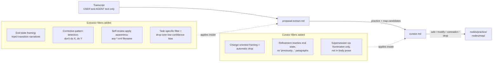
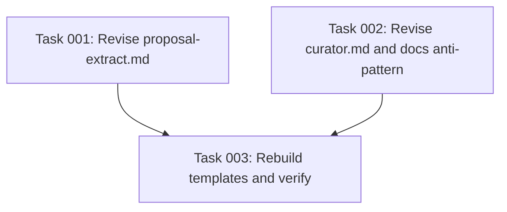

# Plan: End-State Framing and Corrective-Signal Extraction in KB Prompts

## Original Work Order

> I am finding that the nodes that are added are oftentimes documenting changes. I don't want any change documentation. This Knowledge Base Builder is not focused as a change log. We need to address this. We need to discard the information that is change-oriented. Instead, what we need to focus is on the end state. What is relevant information for how the knowledge ended at? That is why they are nodes and they are not branches. So I want you to focus on extracting that kind of information. Also, I want you to analyze the conversation and see if any session also documents practices. This can be identified by phrasings that tell the LLM to do this in a different way. Don't do this, do that. Using the self-review apply skill with the XML file passed into it can also be revealing. This usually addresses patterns that the LLM didn't get right. Sometimes they will be practices and some other times they would be irrelevant because they will be task specific. I want you to be able to discern which task specific knowledge to discard and which knowledge to keep.

## Plan Clarifications

| Question | Answer |
|---|---|
| Where should this fix land? | Extraction + curator prompts (not retroactive node cleanup). |
| How should self-review-apply signals be detected? | Both: generic corrective-pattern detection + an explicit self-review-apply example. Note that the XML file may have any name, not just `review.xml`. |
| How aggressively should task-specific feedback be filtered? | Both heuristics (recognize task-scoped signals like "in this PR", "for this file", one-off identifiers) and confidence-bias (prefer drop over emitting a low-confidence candidate). |
| Bump the proposal-extract prompt version? | No version bumps. Treat everything as v1; the package has not had a public release where version contracts matter, so prompt version increments are out of scope. |

## Executive Summary

The Knowledge Base Builder is meant to record the project's current state, not its history. Current prompts permit transcripts that narrate changes (renames, migrations, removals) to become nodes, so the KB has been drifting toward a changelog. At the same time, the extractor under-uses a rich source of legitimate practice signal: imperative corrections in user turns, including the agent's narrated output after a `/self-review-apply <path>.xml` invocation. Some of those corrections express durable project conventions; others are task-specific and should be discarded.

This plan revises the two prompt files that govern extraction and curation so that practice and map nodes describe end states only, corrective phrasings are surfaced as first-class candidates, and task-specific corrections are filtered out by a combination of heuristics and a confidence-bias rule that prefers a drop over a low-confidence emission. The curator gains an explicit drop reason for change-oriented framing and an explicit preference for modify-with-end-state-rewrite when refining an existing node.

Benefits: the KB stops accumulating changelog-style nodes, captures more high-signal practice nodes derived from in-session corrections, and remains a coherent description of the project's current shape rather than a record of how it got there.

## Context

### Current State vs Target State

| Aspect | Current State | Target State | Why? |
|---|---|---|---|
| Extractor handling of transition narratives | Statements like "we used to do X, now do Y" or "renamed F" can become practice or map nodes with change-oriented bodies. | Reject transition-narrative bodies. When a transition is present, extract only the resulting end-state claim ("the config file is YAML"); discard the journey. | The KB is a description of the current project, not a changelog. Nodes are end states, not branches. |
| Extractor handling of corrective phrasings | "Don't do X, do Y", "no, never use that approach", "stop doing Z" are not called out as practice triggers; signal is frequently missed. | Imperative corrections in `[USER]:` turns are first-class practice candidates when they generalize beyond the current task. | These corrections are exactly the moments the user is teaching the agent a durable rule. |
| Extractor handling of self-review-apply turns | The prompt has no awareness that a `/self-review-apply <path>.xml` invocation produces an agent narration of applied review comments, each of which may be a corrective signal. | The prompt names this pattern, notes the XML filename is variable, and instructs the extractor to judge each narrated change for generalizability (practice vs drop). | This is a high-yield, recurring source of practice signal; missing it leaves real conventions uncaptured. |
| Extractor handling of task-specific corrections | Task-scoped corrections (references to one-off identifiers, "in this PR/branch/commit", a single irrelevant file path) can become low-confidence practice candidates. | Provide concrete heuristics for spotting task-specific scope, and a confidence-bias rule that prefers drop over emitting a low-confidence candidate. | Task-specific feedback pollutes the KB with noise that doesn't apply to future work. |
| Curator drop policy for change-oriented candidates | Drop reasons cover rephrasing, low-confidence vagueness, general programming knowledge, and internal inconsistency, but not change-oriented framing. | Change-oriented framing is listed as an automatic drop reason regardless of confidence. | A high-confidence changelog entry is still a changelog entry; confidence alone shouldn't earn it a node. |
| Curator refinement of existing nodes | Modify may merge new content into an existing node by appending it, which can produce retrospective "previously…" paragraphs. | When refining, the curator rewrites the existing node so its body reads as the current end state; never appends "previously…" or "earlier this used to…" paragraphs. Supersession relationships are recorded in frontmatter only, not narrated in the body. | The body of every node must read as a present-tense description of the project; history belongs in `supersedes`/`superseded_by` frontmatter and in `CHANGELOG`. |

### Background

Prompts ship via `templates/`, rebuilt by `scripts/build-templates.mjs` from `src/templates-source/prompts/`. Edits land in source; the build step copies them into the shipped artifact.

The transcript fed to the extractor is `[USER]:` / `[AGENT]:` text segments only. Tool-use blocks and tool inputs (including the literal XML body passed to `/self-review-apply`) are absent. The extractor must therefore reason from: the user's slash-command invocation line, the agent's textual narration of what it did, and any subsequent user corrections. Prompt wording must stay consistent with what is actually visible in the transcript.

Ownership boundary is preserved: practice nodes are extracted strictly from `[USER]:` turns; map nodes may come from either role.

Related KB nodes inform the wording without being modified by this work: `practice-bootstrap-skip-changelog-and-implementation` (analogous "skip change-oriented sources" rule on the bootstrap path), `practice-config-yaml-not-json` (good example of an end-state-only practice), `map-proposal-artifact` and `map-transcript-artifact` (vocabulary).

Project conventions the prompt text itself must obey: no em-dashes or hyphen-as-dash separators; no backwards-compat shims; no retrospective framing in documentation or comments.

## Architectural Approach

The deliverables are confined to two prompt files. No TypeScript, schemas, transcript parsing, commands, node kinds, or frontmatter fields change. Retroactive cleanup of existing nodes is explicitly out of scope. Prompt version headers are not bumped; the recommendation is to normalize them to `Version: 1` in line with the project's pre-release posture, but no behavior depends on the value.

### Extractor revisions (`src/templates-source/prompts/proposal-extract.md`)

**Objective**: ensure every emitted candidate describes the project's current state and surfaces corrective practice signals without leaking task-specific noise.

The extractor gains the following guidance, woven into the existing structure (no new top-level sections required, but the existing "What you are looking for" and "What you are NOT looking for" sections expand):

- An end-state framing rule that explicitly forbids transition-narrative bodies for both practice and map candidates. When a transition is present, the extractor records only the resulting end-state claim; the journey ("migrated from X to Y", "renamed", "removed", "switched") is discarded. Map nodes describe the entity as it now is; they are not emitted with bodies like "X was added" or "Y was renamed to Z".
- A corrective-pattern subsection naming the trigger phrasings: "don't do X, do Y", "no, never use that approach", "stop doing Z", "use Y instead", and similar imperative reversals. These are first-class practice candidates when the corrected behavior generalizes beyond the current task.
- A self-review-apply subsection describing the pattern: a `[USER]:` turn invoking `/self-review-apply <path>.xml` (XML filename is variable) followed by an `[AGENT]:` turn that narrates the changes applied. Each narrated change is a candidate corrective signal; the extractor judges generalizability per change.
- A task-specific filter with concrete heuristics: references to one-off variable or function names, single file paths irrelevant elsewhere, scope markers like "in this PR", "in this branch", "in this commit", "for this file", or any wording that only makes sense for the current change. Combined with a confidence-bias rule: when the corrective signal does not generalize to a project-level rule, prefer drop over emitting a low-confidence practice candidate.
- An inline worked example showing a self-review-apply turn that yields one generalizable practice (kept) and one task-specific comment (dropped, with reason). The example fits the existing "Inline example" section style.

The ownership boundary stays as written: practice from `[USER]:` only; map from either role.

### Curator revisions (`src/templates-source/prompts/curator.md`)

**Objective**: backstop the extractor by dropping change-oriented candidates that slip through, and ensure refinements produce end-state-only node bodies.

The curator's existing four-action structure is preserved. Changes:

- The **drop** action's reason list is expanded to include change-oriented framing (transition narratives, migration stories, rename or removal logs) as an automatic drop trigger, even when confidence is high. The candidate's only retainable content in that case is its end-state claim; if no clean end-state claim is present, the whole candidate is dropped.
- The **modify** action's guidance gains an end-state-rewrite rule: when a candidate refines an existing node, the merged body must read as the current state in present tense. The curator never appends "previously…" or "earlier this used to…" paragraphs.
- The **contradict** action's guidance reinforces that supersession is a state replacement, not a history record. The new node body describes only the new end state; the supersession relationship lives in the `supersedes` / `superseded_by` frontmatter fields, not in body prose.

No new fields, no new actions, no new schema.

### Build artifact

**Objective**: confirm the shipped prompt under `templates/prompts/` reflects the source edits.

After source edits, `npm run build:templates` regenerates `templates/prompts/proposal-extract.md` and `templates/prompts/curator.md` from source. Reviewers verify by diffing the templates directory.

## Risk Considerations and Mitigation Strategies

Quality Risks

- **False negatives: legitimate practices dropped as task-specific.** The new heuristics may discard genuine project conventions when they happen to be stated alongside task-scoped wording (for example, a real rule mentioned "in this PR" because that's where the user noticed the violation).
    - **Mitigation**: phrase the heuristic as "the rule's *scope*, not its *occasion*, decides task-specificity" and pair it with the corrective-pattern example. The inline self-review-apply example demonstrates a kept case where the trigger was task-bound but the rule generalizes.
- **False positives: changelog content still leaking through.** Extractor and curator may disagree on what counts as change-oriented; subtle transition framing (for example, "we now use Y") may slip past extractor filters.
    - **Mitigation**: the curator's automatic-drop rule for change-oriented framing is the explicit backstop. Both prompts use the same vocabulary ("transition narrative", "end-state claim") so reviewers can grep.

Consistency Risks

- **Prompt drift between extractor and curator policies.** If only one prompt is updated, the two passes pull in different directions, producing churn (extractor emits, curator drops) or leaks (extractor drops the corrective signal that would have survived curation).
    - **Mitigation**: ship both edits together in the same change. Share the same key terms across both files: "end-state", "transition narrative", "corrective pattern", "task-specific scope".
- **Inline examples becoming stale relative to schema.** Adding a new worked example introduces another payload that must stay valid against `ProposalOutputSchema`.
    - **Mitigation**: model the new example on the existing GDPR/PII example. No new fields. Keep `supports_existing_node` and `contradicts_existing_node` set to `null` in line with the existing example.

Process Risks

- **Reviewer surprise about retained Version headers.** The prompts currently declare `Version: 2` and `Version: 3`; the work order explicitly keeps no-version-bump but recommends normalizing to `Version: 1`. A reviewer comparing against `docs/internals/prompts.md` may flag the mismatch.
    - **Mitigation**: include the version normalization recommendation in the plan and explicitly call out that no runtime behavior depends on the value. Update `docs/internals/prompts.md` only if the version mismatch becomes a documentation hazard (see Documentation section).

## Success Criteria

### Primary Success Criteria

1. `src/templates-source/prompts/proposal-extract.md` explicitly forbids transition-narrative bodies for both practice and map candidates, and instructs the extractor to retain only the end-state claim when a transition is present in the source.
2. `src/templates-source/prompts/proposal-extract.md` names imperative corrective phrasings (for example "don't do X, do Y") as first-class practice triggers, gated on generalization beyond the current task.
3. `src/templates-source/prompts/proposal-extract.md` describes the `/self-review-apply <path>.xml` pattern, notes that the XML filename is variable, and instructs the extractor to judge each narrated change for generalizability.
4. `src/templates-source/prompts/proposal-extract.md` lists concrete task-specific heuristics (one-off identifiers, single irrelevant file paths, scope markers like "in this PR/branch/commit") and a confidence-bias rule that prefers drop over a low-confidence emission.
5. `src/templates-source/prompts/proposal-extract.md` contains at least one inline worked example of a self-review-apply turn yielding one keep and one drop, with the reason for the drop visible.
6. `src/templates-source/prompts/curator.md` lists change-oriented framing as an automatic drop reason regardless of confidence, alongside the existing drop reasons.
7. `src/templates-source/prompts/curator.md` instructs the curator to rewrite refined bodies as present-tense end-state descriptions, never appending "previously…" or "earlier this used to…" paragraphs.
8. `src/templates-source/prompts/curator.md` clarifies that supersession is recorded in `supersedes` / `superseded_by` frontmatter only; the new node body describes only the new end state.
9. After running `npm run build:templates`, the shipped `templates/prompts/proposal-extract.md` and `templates/prompts/curator.md` reflect the source edits verbatim.
10. The prompt text itself complies with project conventions: no em-dashes or hyphen-as-dash separators, no backwards-compat references, no retrospective framing.

## Self Validation

Execute these checks after the prompt edits are made. Each step is concrete and inspectable.

1. **Grep the extractor source for the new guidance keywords.** Run `grep -nE "end[- ]state|transition narrative|corrective|self-review-apply|task-specific|don't do" src/templates-source/prompts/proposal-extract.md` and confirm each of the five concepts (end-state framing, corrective pattern, self-review-apply, task-specific filter, drop-over-low-confidence bias) is present.
2. **Grep the curator source for the new guidance keywords.** Run `grep -nE "change-oriented|end[- ]state|previously|supersedes" src/templates-source/prompts/curator.md` and confirm the change-oriented drop reason, the refinement rewrite rule, and the supersession-in-frontmatter clarification are present.
3. **Confirm the inline self-review-apply example is present and well-formed.** Read the new example block in `proposal-extract.md`; verify it contains both a `[USER]:` `/self-review-apply` line with a variable XML filename and an `[AGENT]:` narration, and that the expected output JSON shows one kept practice candidate and one explicitly dropped task-specific comment with reason.
4. **Verify no em-dashes or hyphen-as-dash separators were introduced.** Run `grep -nE " - |—|–" src/templates-source/prompts/proposal-extract.md src/templates-source/prompts/curator.md` and confirm no new offending separators appear in prose added by this change (matches inside example transcripts that quote agent or user content verbatim are acceptable; matches in new prose are not).
5. **Rebuild templates and diff the shipped artifact.** Run `npm run build:templates` then `git diff --stat templates/prompts/proposal-extract.md templates/prompts/curator.md` and confirm both shipped files updated. A `diff` between `src/templates-source/prompts/<file>` and `templates/prompts/<file>` should show no content drift.
6. **Optional dry run against a fixture.** If a fixture session log containing change-oriented content is available (or a small synthetic one is created locally), run `ai-knowledge-base curate` against it and confirm the curator emits drop actions citing change-oriented framing rather than add actions.

## Documentation

`docs/internals/prompts.md` documents the proposal and curator prompts at the section level (Version comment, What to extract, What to skip, Ownership boundary, Inline example, Output schema; Curator Input/Output/Verifying/Anti-patterns). The structural sections do not change with this edit, and no schema or pipeline behavior changes, so the document remains accurate.

Two narrow updates are warranted to keep `docs/internals/prompts.md` aligned with the source after this change:

- The "Prompt versions" table currently lists `proposal-extract.md (v2)` and `curator.md (v3)`. If the planner's normalization recommendation is taken and version headers move to `Version: 1`, update the table accordingly. If versions are left untouched, no edit is needed.
- The "Anti-patterns" subsection under "Curator prompt" should gain one bullet naming change-oriented framing as an automatic drop reason, so the prose mirrors the prompt's new drop list.

No update to `README.md` is required: it does not describe extractor or curator policy at this level of detail.

No `AGENTS.md` file exists in this repository at the relevant scope. Skill files under `.claude/skills/` (notably `kb-bootstrap` and `kb-curate`) describe orchestration and do not duplicate the extractor or curator policy text; they do not need updating.

## Resource Requirements

### Development Skills

- Prompt engineering: ability to revise LLM instructions for clarity and to add worked examples that demonstrate keep vs drop decisions.
- Familiarity with the existing KB prompt structure (`proposal-extract.md`, `curator.md`) and the transcript format consumed by the extractor.
- Awareness of project prose conventions (no em-dashes, no retrospective framing, no backwards-compat references).

### Technical Infrastructure

- Local clone of this repository.
- Node toolchain sufficient to run `npm run build:templates`.
- Optional: a Claude CLI capable of running `ai-knowledge-base curate` against a fixture session log for the optional self-validation step.

## Notes

- The two prompt files are the only deliverables. No TypeScript, schemas, transcript parsing, commands, node kinds, or frontmatter fields are altered.
- Retroactive cleanup of existing nodes under `nodes/practice/` and `nodes/map/` is explicitly out of scope; the user opted out.
- Prompt `Version:` headers are not bumped. The planner's recommendation is to normalize them to `Version: 1` for consistency with the project's pre-release posture, but no behavior depends on the value and the recommendation is optional.
- The inline self-review-apply example must use a variable XML filename (not hardcoded `review.xml`) to reinforce that the pattern is filename-agnostic.

## Execution Blueprint

**Validation Gates:**
- Reference: `/config/hooks/POST_PHASE.md`

### ✅ Phase 1: Prompt source revisions
**Parallel Tasks:**
- ✔️ Task 001: Revise proposal-extract.md to enforce end-state framing and surface corrective signals
- ✔️ Task 002: Revise curator.md to backstop end-state framing, and mirror the new drop reason in docs/internals/prompts.md

### ✅ Phase 2: Rebuild and verify shipped artifact
**Parallel Tasks:**
- ✔️ Task 003: Rebuild shipped templates and verify the artifact matches the prompt sources (depends on: 001, 002)

### Dependency Diagram

### Post-phase Actions

After Phase 2 completes successfully, the plan's Self Validation section (steps 1 through 5) is satisfied by the verifications baked into Task 003. The optional fixture dry run (Self Validation step 6) remains optional and is not part of any task's acceptance criteria.

### Execution Summary
- Total Phases: 2
- Total Tasks: 3

## Execution Summary

**Status**: ✅ Completed Successfully
**Completed Date**: 2026-05-12

### Results

- `src/templates-source/prompts/proposal-extract.md` gained the end-state framing rule, a corrective-pattern subsection, a self-review-apply subsection, a task-specific scope filter with the drop-over-low-confidence bias, and an inline worked example using `feedback/round-2.xml` (non-`review.xml`) demonstrating one keep and one drop.
- `src/templates-source/prompts/curator.md` extended its modify, contradict, and drop action blocks: end-state-rewrite rule, supersession-via-frontmatter clarification, change-oriented framing as automatic drop reason with a salvage path for end-state claims embedded in transition narratives.
- `docs/internals/prompts.md` gained one bullet in the curator Anti-patterns subsection mirroring the new drop reason.
- Shipped artifacts under `templates/prompts/` regenerate via `npm run build:templates` and diff identically against source. `templates/` is gitignored per project convention, so no artifact files were committed.
- Lint: clean. Tests: 214/214 pass. No retrospective framing, em-dashes, or backwards-compat language introduced.

### Noteworthy Events

- Task 003's acceptance criterion called for `git diff --stat templates/prompts/*.md` to show updates, but `templates/` is gitignored in this repo (`practice-do-not-commit-bundled-output`). The substantive verification (`diff source vs artifact` after rebuild) was used in its place and passed.
- Phase 2 produced no committable code change because the only artifact change lived under the gitignored `templates/` directory. Plan and task metadata updates were rolled into the archival commit rather than a separate Phase 2 commit.

### Necessary follow-ups

- None. Retroactive cleanup of existing changelog-style nodes was explicitly out of scope per the work order.
