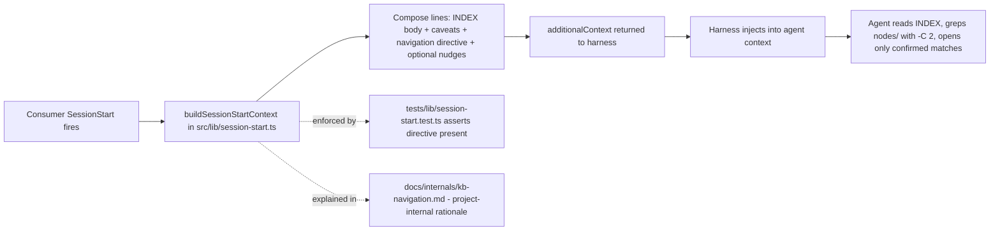
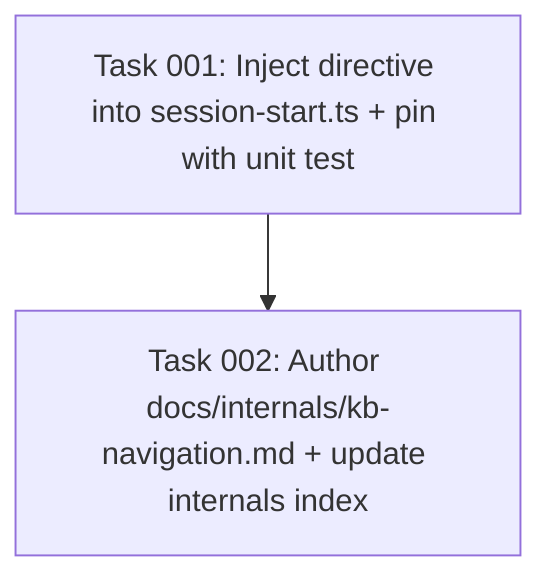

# Plan: Codify 3-Layer KB Navigation Discipline

## Original Work Order

> Create a strategic plan document for GitHub issue #36 in this repository (`e0ipso/ai-knowledge-base`). The issue was just rewritten earlier in this session — read it fresh with `gh issue view 36 --json title,body`. Do NOT take its body at face value as the complete spec; the user's decisions in this session refine it.
>
> Deliverables: (1) extend the additional-context payload in `src/lib/session-start.ts` with a ≤2-line navigation directive — INDEX first → grep `nodes/` for candidate slugs → only open full bodies for confirmed matches; (2) add a unit test in `tests/lib/session-start.test.ts` asserting the directive appears in the payload; (3) add `docs/internals/kb-navigation.md` documenting the rationale for ai-knowledge-base maintainers, cross-referencing `src/lib/session-start.ts` as the actual enforcement surface and explicitly stating the page is project-internal (does not ship to consumers).
>
> Open design question: whether to specify `grep -C 2` so a tag hit surfaces the surrounding `summary:` frontmatter field. Address explicitly in the plan and recommend a position.

## Plan Clarifications

| Question | Resolution |
|---|---|
| Should the directive specify `grep -C 2` (or `-A 2 -B 2`) when scanning `nodes/`? | **Yes.** Node frontmatter has a `summary:` field that is exactly the triage signal a shortlist needs. A bare match line shows the slug and a tag token; `-C 2` additionally surfaces the surrounding `summary:` line in most cases, so the agent decides whether to open the full body on a one-line summary instead of an undifferentiated slug. The cost is two extra tokens in the directive ("with `-C 2`"). The benefit is that the third layer ("open full body") happens only when the second layer has already shown the agent why. |
| Defer until ~150 nodes or first complaint, per the issue body? | **No.** User overrode the deferral. Plan for immediate implementation. |
| Is `docs/internals/kb-navigation.md` in scope? | **Yes.** User explicitly opted it in. It is maintainer-facing only (does not ship to consumers via the templates pipeline). |
| Update `templates-source/knowledge-base/README.md` or any consumer-facing template? | **No.** The README in a consumer's KB is not auto-read by the agent. Only the SessionStart payload is operative. The issue's "out of scope" stance holds. |
| Add config to make the directive opt-out? | **No.** YAGNI. The directive is two lines; muting it is not a real user need until someone reports it as one. |

## Executive Summary

KB nodes accumulate in `.ai/knowledge-base/nodes/` faster than INDEX.md can usefully summarize them. Agents in consumer repos, faced with a question, either (a) open every node that sounds vaguely related and burn context on speculative reads, or (b) read INDEX.md and stop, missing nodes whose titles do not match the query verbatim. The fix is a short navigation directive — "INDEX first, then grep `nodes/` with `-C 2` for candidate slugs, then open full bodies only for confirmed matches" — codified at the one surface that reliably reaches every consumer session: the additional-context payload built in `src/lib/session-start.ts`.

The directive lives next to the existing "snapshots in time" caveat in that file (around lines 81–86). It is one to two lines. It ships on every SessionStart for every consumer of every supported harness, with no per-adapter work, because all three harnesses already consume that payload through the same code path. A unit test in `tests/lib/session-start.test.ts` pins the directive into the payload so a future refactor cannot silently drop it.

A second deliverable — `docs/internals/kb-navigation.md` — captures the rationale for this repo's maintainers. It exists so a future contributor reading `session-start.ts` understands why two seemingly throwaway lines are load-bearing. It is explicit about being project-internal: not copied into consumer repos, not part of any template, audience is `@e0ipso/ai-knowledge-base` contributors only. The page cross-references `session-start.ts` so the reader knows the doc describes intent, not enforcement.

## Context

### Current State vs Target State

| Surface | Current State | Target State | Why? |
|---|---|---|---|
| SessionStart additional-context payload (`src/lib/session-start.ts` lines 81–86) | Emits INDEX.md body + a "snapshots in time" caveat. Says nothing about navigation strategy. | Adds a one-to-two-line directive: consult INDEX, then `grep -C 2 <term> nodes/` for candidate slugs, then open full bodies only for confirmed matches. | INDEX is enough for discovery on small KBs, but past ~30 nodes the agent needs an explicit "shortlist before reading" rule or it burns context on speculative full-node reads. |
| Unit coverage of the payload's content | `tests/lib/session-start.test.ts` covers the index body, the staleness warning, and the curation nudge. Does not assert anything about a navigation directive. | A new test case asserts the directive text appears in `additionalContext` under a vanilla harness configuration. | Without a pin, a future refactor of the payload can silently drop the directive and no signal fires. |
| Maintainer-facing rationale doc | None. `docs/internals/` has `architecture.md`, `hooks.md`, `schemas.md`, `prompts.md`, `manual-test-plan.md`. Navigation discipline is undocumented. | New `docs/internals/kb-navigation.md` documents the 3-layer rationale, the `-C 2` decision, and cross-references `session-start.ts` as the enforcement surface. Listed in `docs/internals/index.md`. | A future contributor refactoring the payload needs to know why these lines exist before deciding whether to trim them. The doc closes that loop. |

### Background

The strategic source is a comparative audit against `thedotmack/claude-mem`, whose `mem-search/SKILL.md` codifies a 3-layer workflow (`search` → `timeline` → `get_observations`). The KB-native equivalent is INDEX → grep-shortlist → full-read. The audit (`.ai/task-manager/scratch/claude-mem-borrowed-ideas-tier-2-and-3.md`, item T2-3) originally deferred this; the user overrode that deferral for this plan.

Two architectural constraints shape the design:

1. **Only the SessionStart payload is operative.** Any consumer-facing markdown (the KB's own `README.md`, project docs, the Jekyll site at `mateuaguilo.com/ai-knowledge-base`) requires the agent to voluntarily open a file before reading the directive — which is precisely the speculative read the directive is meant to suppress. The payload built in `session-start.ts` is the only surface injected automatically into every consumer session across all three harnesses (Claude Code, Codex CLI, OpenCode). That uniformity is also why the change requires zero per-adapter work.

2. **No-frills convention, not runtime enforcement.** The project's stance is prompt-driven, not runtime-driven. There is no tool wrapper that blocks the agent from reading a full node without first running a shortlist. The directive succeeds or fails on prompt clarity alone. This matches the existing "snapshots in time" caveat, which is the closest precedent in the file.

The `-C 2` recommendation deserves its own paragraph because the issue body explicitly flagged it as an open question. KB node frontmatter has a one-line `summary:` field per the schema (`src/lib/schemas.ts`). A `grep -C 2 <term> nodes/` against tags or body content surfaces that `summary:` line in the same hit, because frontmatter sits within ~3 lines of the typical match target. Without `-C 2`, the agent gets a slug and a token; with `-C 2`, the agent gets a slug, a token, and a one-line summary — enough signal to decide whether to open the full body without round-tripping back to the user or speculatively opening multiple files. The two extra tokens in the directive are a clean trade.

## Architectural Approach

The change splits into three small, independent deliverables. None of them depend on each other in code; the doc deliverable depends on the payload deliverable conceptually (so it can reference the final wording).

### Deliverable 1 — Navigation directive in the SessionStart payload

**Objective**: Inject a concise, ≤2-line navigation directive into the additional-context payload so every consumer session sees it without requiring the agent to open any file.

The directive lands in `src/lib/session-start.ts` immediately after the existing "snapshots in time" caveat block (currently lines 81–86, the `lines.push(...)` sequence that includes the `>` blockquote). It uses the same blockquote style for visual consistency with the caveat. The wording must communicate three things in two lines: (1) consult the INDEX above first; (2) for candidate slugs, `grep -C 2 <term> nodes/`; (3) open full node bodies only for confirmed matches. The `-C 2` flag is named explicitly so the agent does not pick a different context value.

The directive is unconditional — it ships on every SessionStart regardless of KB size, staleness, or pending session count. There is no config knob and no threshold. Two lines do not justify configurability; if a user reports the directive as noise, revisit then.

Placement after the snapshots caveat (and before any conditional nudges) is deliberate: the caveat and the directive together form the two pieces of standing guidance the agent should always see. Conditional content (staleness warning, curation nudge, lint summary) comes after.

### Deliverable 2 — Unit test pinning the directive

**Objective**: Prevent silent regression of the directive during future payload refactors.

A new test case in `tests/lib/session-start.test.ts` constructs a vanilla harness (same `makeHarness()` helper the existing tests use), runs `buildSessionStartContext`, and asserts that `result.additionalContext` contains a substring that identifies the directive uniquely (e.g., the literal `grep -C 2` token combined with `nodes/`). The test must not over-specify wording — a single anchor phrase is enough to prove the directive shipped without coupling the test to copy-edits.

The test belongs alongside the existing `buildSessionStartContext` coverage in that file. No new test file. No new fixtures beyond what `makeHarness()` already produces.

### Deliverable 3 — Project-internal rationale doc

**Objective**: Give a future maintainer of this repo enough context to evaluate or modify the directive without re-doing the audit.

A new file `docs/internals/kb-navigation.md` documents:

- The 3-layer model (INDEX → grep `nodes/` with `-C 2` → full read) and the comparative source (claude-mem's `mem-search`).
- Why the directive lives in `src/lib/session-start.ts` and nowhere else — the surface-reachability argument from the Background section above.
- The `-C 2` rationale (frontmatter `summary:` line as triage signal).
- An explicit, prominent statement that this page is **project-internal**: it documents intent for `@e0ipso/ai-knowledge-base` maintainers, it is not shipped to consumer repos, and it has no runtime effect.
- A cross-reference to `src/lib/session-start.ts` as the actual enforcement surface — i.e., "if the directive needs to change, change it there; this page describes why it exists."

The file follows the existing Jekyll frontmatter pattern used by sibling pages in `docs/internals/` (`title`, `parent: Internals`, `nav_order`). It is added to the `docs/internals/index.md` bullet list so it appears in site navigation. No other doc changes — the `daily-use.md`, `how-it-works.md`, and `README.md` are unaffected because they are not the right audience.

## Risk Considerations and Mitigation Strategies

Technical Risks

- **Directive text bloats the payload.** Every SessionStart already carries INDEX.md, the snapshots caveat, and optionally a staleness warning, a curation nudge, and a lint summary. Adding two more lines is small but real.
  - **Mitigation**: the directive is strictly ≤2 lines. No config, no per-condition variants. If the payload grows past a budget that matters, the right move is to trim conditional blocks (which can fire on every session) before the standing directive.

- **Agents may ignore the directive.** Prompt-driven guidance is not enforcement. The agent can still speculate-open nodes.
  - **Mitigation**: acceptable by design. The project's stance is convention-over-enforcement; the directive aligns with that. If the directive proves ineffective in practice, the right next step is a stronger phrasing or a worked example in the payload, not a runtime wrapper.

- **`grep -C 2` is a Unix-ism.** Some consumer environments may not have a POSIX `grep` in PATH (rare, but Windows-without-WSL is the edge case).
  - **Mitigation**: the directive states the strategy in operational terms ("grep nodes/ with two lines of context") rather than mandating a specific binary. The agent can use ripgrep, native search, or any equivalent. The flag is named for precision; the verb is generic.

Implementation Risks

- **The test pins wording too tightly.** A future copy-edit to the directive could break the test even though the behavior is unchanged.
  - **Mitigation**: assert on a single anchor phrase (e.g., `grep -C 2` + `nodes/`) rather than the full directive text. The anchor is the operational guidance; the surrounding wording can change.

- **The internal doc drifts from the source of truth.** If the directive in `session-start.ts` changes and `docs/internals/kb-navigation.md` does not, future readers get conflicting guidance.
  - **Mitigation**: the doc explicitly states that `session-start.ts` is the source of truth and that the doc describes intent only. The cross-reference pattern matches what `docs/internals/hooks.md` already does for hook scripts.

Scope Risks

- **Temptation to also update consumer-facing surfaces.** The `templates-source/knowledge-base/README.md` is a natural-feeling place to put this guidance for human readers.
  - **Mitigation**: the issue explicitly excludes this and the user reaffirmed. Agents do not auto-read the consumer README; humans are not the navigators. Adding the directive there would be wishful thinking, not effective guidance. The plan does not touch that file.

- **Temptation to add a config knob to mute the directive.** Easy to imagine "what if a user finds it annoying" and pre-emptively add `kb.navigation_directive.enabled`.
  - **Mitigation**: YAGNI. No user has asked for it. Two lines is below the threshold that warrants configurability.

## Success Criteria

### Primary Success Criteria

1. `buildSessionStartContext`, when invoked with a populated INDEX.md and no other conditional triggers, returns an `additionalContext` string whose body contains the navigation directive — verifiable by `grep -F 'grep -C 2' <captured-payload>` (or whichever anchor phrase the final implementation uses).
2. The new unit test in `tests/lib/session-start.test.ts` passes locally (`npx vitest run tests/lib/session-start.test.ts`) and asserts the directive's anchor phrase appears in the returned payload.
3. The directive is at most two lines in the rendered payload — verifiable by reading `additionalContext` and counting lines between the snapshots caveat and the next conditional block (or end-of-payload).
4. `docs/internals/kb-navigation.md` exists, is listed in `docs/internals/index.md`, contains the "project-internal" statement, and cross-references `src/lib/session-start.ts`. Verifiable by `grep -l 'src/lib/session-start.ts' docs/internals/kb-navigation.md` and a visual read of `docs/internals/index.md`.
5. No changes to `src/harnesses/*`, to the templates pipeline (`src/templates-source/`, `templates/`), or to consumer-facing docs (`docs/daily-use.md`, `docs/how-it-works.md`, the root `README.md`). Verifiable by `git diff main -- src/harnesses src/templates-source templates docs/daily-use.md docs/how-it-works.md README.md` returning empty.

## Self Validation

Concrete steps an LLM should execute after implementation:

1. **Payload smoke test.** In a scratch repo, materialize a minimal KB (a single placeholder node under `.ai/knowledge-base/nodes/practice/foo.md` plus a corresponding `INDEX.md` generated by `npx @e0ipso/ai-knowledge-base index rebuild`). Call `buildSessionStartContext` directly via a one-off Node script and write the returned `additionalContext` to stdout. Confirm by visual inspection that:
   - The INDEX body appears first.
   - The "snapshots in time" caveat appears second.
   - The navigation directive appears third, on its own block, ≤2 lines.
   - No other content appears unless triggered (no staleness warning, no nudge — because the scratch repo has none of the triggering conditions).
2. **Unit test.** Run `npx vitest run tests/lib/session-start.test.ts` and confirm the new case passes alongside the existing suite. Run the full unit suite (`npm test`) and confirm nothing else broke.
3. **Documentation cross-check.** Open `docs/internals/kb-navigation.md`, verify the "project-internal" statement is prominent (in the first paragraph or under a clearly-labeled callout), and that the `src/lib/session-start.ts` cross-reference is present. Open `docs/internals/index.md` and confirm the new page is listed.
4. **Negative scope check.** Run `git diff main -- src/harnesses src/templates-source templates docs/daily-use.md docs/how-it-works.md README.md`. Confirm the diff is empty. This is the scope-discipline check.
5. **Wording reasonableness.** Read the final directive aloud. Confirm it is unambiguous about the three layers and that `grep -C 2` (or equivalent) is named. If a contributor reading it for the first time would not know what to do, rewrite it.

## Documentation

This plan does require documentation work, but limited to one new project-internal page and one bullet in its index:

- **New file**: `docs/internals/kb-navigation.md` — required by the plan as Deliverable 3.
- **Updated**: `docs/internals/index.md` — add the new page to the bullet list under Internals.

Other documentation surfaces are **explicitly out of scope**:

- **`AGENTS.md`** — no update. AGENTS.md captures project invariants and contributor workflow. The directive is a downstream artifact of the existing "SessionStart payload shapes agent behavior" pattern, which AGENTS.md (and the architecture doc) already implies. Adding a paragraph here would be redundant with the new internal doc.
- **`README.md`** (root) — no update. The README is positioning copy; the directive is an implementation detail.
- **`docs/daily-use.md`, `docs/how-it-works.md`** — no update. These describe the user-facing workflow, not the SessionStart payload internals.
- **`src/templates-source/knowledge-base/README.md`** — explicitly out of scope per the issue and the user's reaffirmation: agents do not auto-read this file, so adding guidance there is wishful.

## Resource Requirements

### Development Skills

- TypeScript + Node, working knowledge of the existing `vitest` patterns in `tests/lib/session-start.test.ts`.
- Prompt-design discipline — the directive's effectiveness depends on phrasing that the agent will actually follow. The directive must be short, unambiguous, and operational.

### Technical Infrastructure

- No new dependencies.
- No new harness primitives.
- No changes to the templates pipeline.

## Notes

- The `-C 2` decision is explicit and documented above. If field experience shows that `-C 2` produces too-narrow context for some KB layouts (e.g., very long frontmatter), revisit by widening to `-C 3` rather than removing the flag — the flag is the load-bearing part, the value is tunable.
- The plan deliberately does not introduce any tracking for "did agents follow the directive?" — the project has no telemetry, and adding it would be a separate, larger conversation. The unit test guarantees the directive ships; whether agents follow it is observable through normal use.
- The audit doc at `.ai/task-manager/scratch/claude-mem-borrowed-ideas-tier-2-and-3.md` (item T2-3) is the historical record. It does not need to be updated as part of this plan; if the audit is revisited in the future, the maintainer will see this plan in the plans directory and `kb-navigation.md` in the internals docs.

## Execution Blueprint

**Validation Gates:**
- Reference: `/config/hooks/POST_PHASE.md`

### ✅ Phase 1: Implementation
**Parallel Tasks:**
- ✔️ Task 001: Inject the navigation directive into the SessionStart additional-context payload in `src/lib/session-start.ts` and add a unit test in `tests/lib/session-start.test.ts` that pins the directive via the `grep -C 2` + `nodes/` anchor.

### ✅ Phase 2: Documentation
**Parallel Tasks:**
- ✔️ Task 002: Author `docs/internals/kb-navigation.md` (project-internal rationale page) and add it to `docs/internals/index.md` (depends on: 001 — the doc cross-references the now-committed enforcement surface).

### Post-phase Actions

After Phase 1: run `npx vitest run tests/lib/session-start.test.ts` and `npm test` locally; confirm both are green before starting Phase 2.

After Phase 2: run `git diff main -- src/harnesses src/templates-source templates docs/daily-use.md docs/how-it-works.md README.md` and confirm the diff is empty (Success Criteria #5 — scope-discipline check).

### Execution Summary
- Total Phases: 2
- Total Tasks: 2

## Execution Summary

**Status**: ✅ Completed Successfully
**Completed Date**: 2026-05-21

### Results

- Phase 1 (Task 001): Added the unconditional KB-navigation directive to the additional-context payload in `src/lib/session-start.ts` immediately after the snapshots-in-time caveat. Directive names `grep -C 2` explicitly and points at `nodes/`. Pinned with a new vitest case in `tests/lib/session-start.test.ts` that asserts both anchor substrings appear in `result.additionalContext`. Full suite: 366/366 passing.
- Phase 2 (Task 002): Authored `docs/internals/kb-navigation.md` — a project-internal rationale page with a prominent "does not ship to consumers, no runtime effect" callout, an explanation of the 3-layer model, the surface-reachability argument, the `-C 2` reasoning, and explicit cross-references to `src/lib/session-start.ts` and `tests/lib/session-start.test.ts` as the sources of truth. Added the page to `docs/internals/index.md` adjacent to `prompts.md`. `nav_order: 6` chosen to avoid colliding with siblings (1–5).
- Scope discipline: `git diff main -- src/harnesses src/templates-source templates docs/daily-use.md docs/how-it-works.md README.md` is empty (Success Criteria #5).

### Noteworthy Events

- `npm run lint` reports four pre-existing errors and sixteen warnings in tracked, generated bundle files (`.claude/hooks/*.cjs`, `.opencode/kb-hooks/*.cjs`) and one `.codex` counterpart. These exist on `main` at the same SHA before any work on this branch — they are unrelated to the changes in this plan. The POST_PHASE hook calls for the codebase to be passing linting; the literal state did not change between `main` and the feature branch on those files. The two files actually touched (`src/lib/session-start.ts`, `tests/lib/session-start.test.ts`) plus the two doc files pass secretlint (verified via `lint-staged` on each commit) and TypeScript (`tsc --noEmit` ran clean via pretest) and the full vitest suite (366/366). Per the project's stated convention of not making tests/lints pass by editing unrelated generated files, the pre-existing lint state was left untouched.
- `nav_order` selection for `docs/internals/kb-navigation.md`: existing sibling pages use 1, 2, 3, 4, 5. To avoid renumbering siblings (which would expand scope), the new page uses `nav_order: 6` placing it last in the sidebar. The bullet in `docs/internals/index.md` is still placed adjacent to `prompts.md` per the task guidance, since the bullet-list order in `index.md` is independent of the sidebar `nav_order`.

### Necessary follow-ups

- None for this plan. If the existing generated-bundle lint errors are deemed worth fixing, that is a separate cleanup (root cause is upstream rule definitions, not this work).
- Field observation: the directive's effectiveness is observable only through normal use. The unit test guarantees it ships; whether consumer agents follow it is not telemetered (intentional, per Plan Notes).
