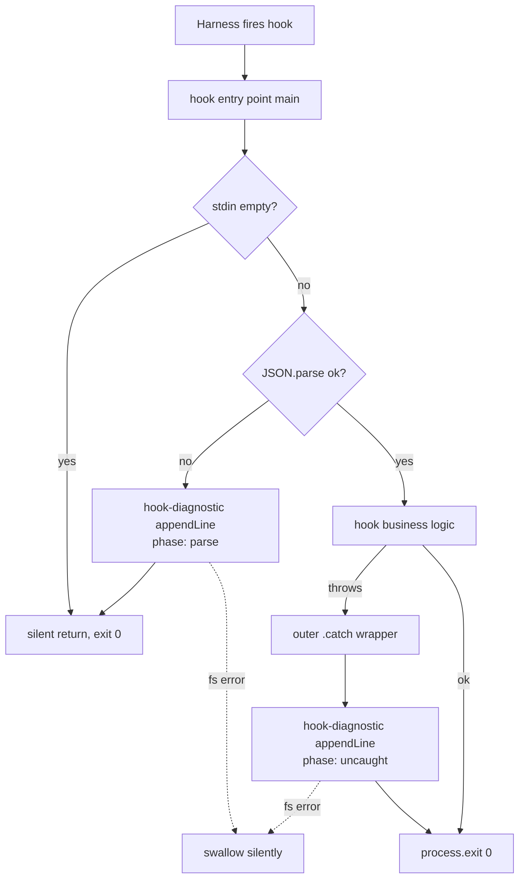
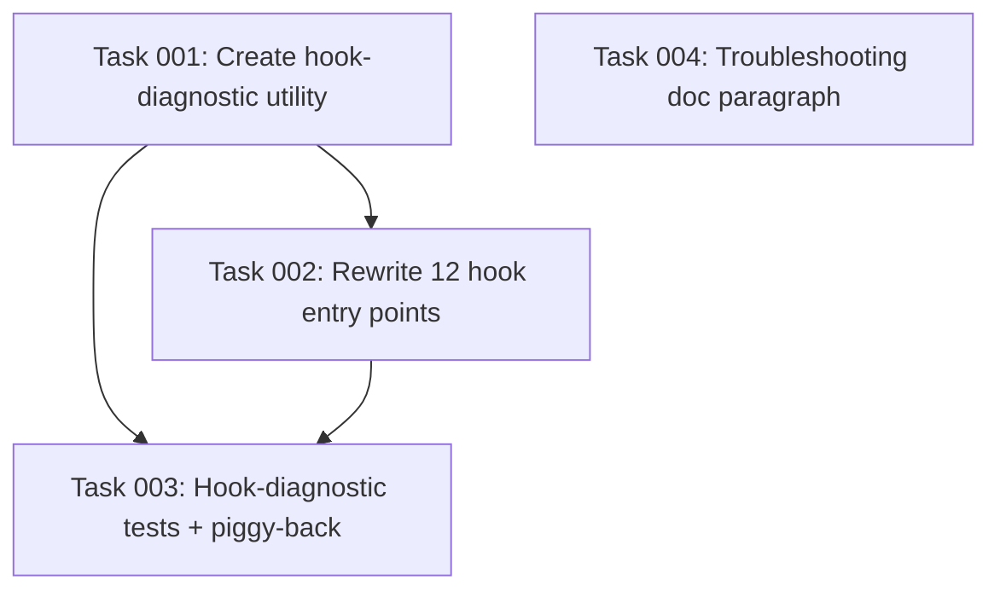

# Plan: Log swallowed errors in hook entry points before exit 0

## Original Work Order

> for issue #33
>
> **Issue #33 — Log swallowed errors in hook entry points before exit 0**
>
> Every hook entry point under `src/harnesses/*/hooks/*.ts` (12 files across the three harnesses) ends with `void main().catch(() => process.exit(0))` and has at least one mid-function silent return on parse failure (`try { payload = JSON.parse(raw) } catch { return; }`). These are the right *exit* behavior for the project's "hooks never block" policy. They are the wrong *observability* behavior: when something unexpected throws inside `main()`, or when the harness sends malformed JSON, the error is swallowed with no trace. The user gets a hook that silently does nothing and has no way to find out why.
>
> The fix is small and self-contained: before swallowing, append a single JSON line to a dated, gitignored diagnostic log. The hook still exits 0. The hook still doesn't block the session. The user (or maintainer triaging a bug report) gets a paper trail.
>
> Acceptance criteria: shared utility `src/lib/hook-diagnostic.ts` exposing one function that appends `{ ts, hook, phase, error }` JSON lines to `<kb-root>/_logs/hook-errors-YYYY-MM-DD.log`; rewrite all 12 hook entry points to use it for `uncaught` and `parse` phases; confirm gitignore coverage; unit tests for valid line, fs-error tolerance, and synthetic throw → one line + exit 0; one paragraph in `docs/troubleshooting.md`.

## Executive Summary

The package's hook entry points uphold a strict "never block the session" policy by enforcing a 1-second wall-clock deadline and treating every exception path as `exit 0`. That policy is correct, but its current implementation discards information: a malformed payload, a thrown error during capture, or a transient filesystem fault all look identical to "hook didn't run", with no breadcrumb left for the user or maintainer. This plan adds a single best-effort sink — one JSON line per swallowed event, appended to a dated log file under the project's knowledge-base `_logs/` directory — so that silent-failure bug reports become diagnosable without changing the exit contract.

The change is intentionally narrow and additive. A new `src/lib/hook-diagnostic.ts` module exposes one function whose write itself is wrapped in a try/catch (a failed diagnostic write must never become the failure it was trying to report). All 12 hook entry points across the three harness adapters (Claude Code, Codex, OpenCode) are updated to call it in two places: at the top-level `void main().catch(...)` wrapper for uncaught throws, and at each `JSON.parse` catch block for parse failures. Empty-stdin returns remain silent because that is normal hook idle behavior, not an error.

This approach was chosen over richer alternatives (tri-state exit codes, JSON response envelopes, transport-vs-client taxonomies — all considered and rejected in closed issue #32) because the existing 1s deadline plus always-exit-0 policy is stricter and simpler than what richer mechanisms would replace. The only real gap is observability of the swallowed paths, and the smallest fix that closes it is the right one.

## Context

### Current State vs Target State

| Current State | Target State | Why? |
| --- | --- | --- |
| All 12 hook files end with `void main().catch(() => process.exit(0));` — uncaught throws produce no record | Each hook wraps `main()` so the catch first appends one JSON line tagged `phase: "uncaught"` to a dated log, then exits 0 | Preserve the exit contract; end silent failures from inside `main()`. |
| Each hook has at least one `try { JSON.parse(raw) } catch { return; }` block — malformed harness payloads produce no record | Each `JSON.parse` catch block first appends one JSON line tagged `phase: "parse"` before returning | Distinguish "harness sent bad JSON" from "harness sent nothing" (the empty-stdin path stays silent). |
| `repoPaths()` already exposes `logsDir = <kbDir>/_logs` but the directory is unused by hooks | Hooks write `hook-errors-YYYY-MM-DD.log` into that same `logsDir` | Reuse existing path resolution; one canonical home for hook diagnostics. |
| `.gitignore` already excludes `.ai/knowledge-base/_logs/` (explicit entry) and `*.log` (broad pattern) | No change needed; plan only verifies coverage as part of the AC | The original AC was conditional ("or covered by an existing pattern") — both patterns already apply. |
| `docs/troubleshooting.md` does not mention the `_logs/hook-errors-*.log` file | One short paragraph added pointing users at it for "hook is silently doing nothing" symptoms | The whole point of the log is human discoverability when triaging. |
| No tests verify the swallow paths' observability | Unit tests cover: valid one-line JSON, fs-error tolerance, synthetic-throw → one line + exit 0 | The diagnostic is itself best-effort; its tolerance is the contract that has to hold. |

### Background

The hook entry points were last touched as part of the harness-adapter work tracked in plans 22–26 (Claude Code, Codex, OpenCode adapters; harness memory ingestion). The shape is uniform across all three adapters by design — see the practice "Don't translate event names across harness adapters" in the project knowledge base — so the 12 call sites are highly regular and the rewrite is mechanical.

Closed issue #32 originally bundled this fix with several richer reliability proposals (tri-state exit codes, JSON response wrappers, separate stdin timeout, transport-vs-client error taxonomy, SessionStart nudge when the error log is non-empty). Re-evaluation against the codebase found that all of those either duplicated the existing hard-deadline / always-exit-0 policy or imported infrastructure shapes from other tools (e.g. claude-mem) that have nothing to defend against here. Only the diagnostic-log fragment survived as carrying its own weight. The plan respects that scoping: no nudge, no envelope, no exit-code games.

The diagnostic file uses NDJSON (one JSON object per line) rather than a structured log file or rotating logger. NDJSON is `tail -f`-friendly, trivially `jq`-able, and survives partial writes gracefully (a torn last line is just one lost record, not a corrupted file). Rotation is implicit via the `YYYY-MM-DD` filename — there is already a `logs-prune.ts` module in `src/lib/` that handles retention for the broader `_logs/` directory, so this fits the existing convention.

A failed diagnostic write must not itself surface — the utility swallows its own fs errors silently. This is deliberate: the whole module exists to handle the failure mode where exit 0 is non-negotiable; making the diagnostic itself capable of breaking that contract would defeat its purpose.

## Architectural Approach



### The diagnostic utility (`src/lib/hook-diagnostic.ts`)

**Objective**: Provide a single, dependency-light, fault-tolerant sink that turns a swallowed error into one NDJSON line on disk — and produces no observable effect if that write itself fails.

The module exports one function with a small, ergonomic signature: it takes a hook identifier (e.g. `"claude:kb-capture"`), a phase tag (`"uncaught" | "parse"` initially, but a free-form string so future call sites can add categories without a signature change), an error value, and the resolved logs directory. It computes today's date in UTC, builds the target path `<logsDir>/hook-errors-YYYY-MM-DD.log`, ensures the parent directory exists, and appends one JSON line of the shape `{ "ts": <ISO>, "hook": <string>, "phase": <string>, "error": <string> }`.

The entire body is wrapped in a single try/catch that swallows any fs error. This is the load-bearing invariant of the module: callers must be able to invoke it from inside their own catch blocks without fear of secondary throws. The function returns `void` and never throws.

The logs directory is supplied by the caller rather than resolved inside the utility. This keeps the module trivially testable against a tmpdir, and it matches the existing pattern where hooks call `repoPaths(root)` once and pass paths down. The caller already has `paths.logsDir` available.

UTC is used for the date stamp so that file rollover is timezone-independent and predictable in CI / cross-machine triage. The `ts` field is a full ISO-8601 timestamp (also UTC) so individual events still record local-clock ordering precisely.

### Hook entry-point rewrite (12 files, three harnesses)

**Objective**: Apply the same two-call edit uniformly so that every swallowed path produces a record, without changing the success path or the exit contract.

Each of the 12 files (`src/harnesses/{claude,codex,opencode}/hooks/{kb-capture,kb-lint-tick,kb-proposal-drain,kb-session-start}.ts`) gets the same two structural edits:

1. **Replace the trailing `void main().catch(() => process.exit(0));`** with a small inline wrapper that calls the diagnostic utility with `phase: "uncaught"` before exiting 0. Because the wrapper needs the logs directory, it computes `repoPaths(findRepoRoot(process.cwd()))` itself when `main()` failed before it could compute paths; if path resolution itself fails, the diagnostic is skipped and exit 0 still happens. The diagnostic call is `await`-ed only if the synchronous fs APIs aren't already in use elsewhere in the module — the simplest implementation uses `fs.appendFileSync` so the whole utility is sync and the catch wrapper stays trivial.

2. **In every `try { JSON.parse(raw) } catch { ... }` block**, add a call to the diagnostic with `phase: "parse"` and a short error string (the parse exception's `message`) before returning. The empty-stdin path (`if (raw.trim().length === 0) return;`) is left untouched — that is the normal idle-fire pattern for hooks and is not an error.

The `hook` identifier passed at each site uses a `harness:hookname` shape (e.g. `"claude:kb-capture"`, `"codex:kb-lint-tick"`) so a single log file is easy to filter by either dimension. The identifier is a hard-coded constant per file, not derived from `process.argv[0]` or any runtime guess, so it cannot drift with build/install shape changes.

`KB_BUILDER_INTERNAL=1` short-circuits at the top of `main()` in several hooks (recursion guard for `claude -p` subprocesses). The diagnostic should also be skipped in that branch — those recursive invocations exit before any work happens, and recording them would only generate noise. Concretely: the `KB_BUILDER_INTERNAL` early return stays first; the diagnostic only runs for paths that would otherwise have been silently swallowed.

### Tests (`tests/lib/hook-diagnostic.test.ts`)

**Objective**: Lock in the three behaviors the diagnostic exists to provide, and lock out the failure mode where the diagnostic itself becomes a session-blocker.

Three test cases, all using a per-test tmpdir for the logs directory:

1. **Happy path** — call the function once, read the resulting log file, assert exactly one line, assert that `JSON.parse` of that line yields an object with the four expected fields, the correct `hook`, the correct `phase`, a valid ISO timestamp, and a non-empty error message.

2. **fs-error tolerance** — point the function at a path that cannot be created (e.g. a path whose parent is an existing regular file, or an unwritable directory on platforms where that is reliable in CI). Assert that the call does not throw and returns `undefined`.

3. **End-to-end wrapper** — exercise the catch-wrapper shape by invoking a small helper that mirrors what the hook entry points do (call a function that throws, route the throw into `hook-diagnostic`, ensure exit 0 would be reached). Assert one log line is produced. The test verifies the *integration shape* the entry points use; it does not need to spawn the hook subprocess (the per-hook end-to-end is implicitly covered by their existing tests, which the new wrapper must not break).

A separate, smaller verification belongs in whichever existing hook test files already spawn a hook subprocess: assert that a deliberately broken payload (invalid JSON) leaves exit code 0 and produces one line in the logs directory. This piggy-backs on the per-hook test that already exists rather than duplicating subprocess plumbing in the diagnostic test file.

### Documentation (`docs/troubleshooting.md`)

**Objective**: Make the new log file discoverable to someone whose hook "isn't doing anything", without expanding the docs surface beyond what the AC requires.

One short paragraph, ideally added near the top of the troubleshooting page or under an existing "hooks" heading if one is present. The wording follows the AC's framing — something close to: "If a hook seems to be silently doing nothing (no output, no effect), check `<kb-root>/_logs/hook-errors-YYYY-MM-DD.log` for the most recent day. Each line is a JSON object recording one swallowed parse failure or uncaught throw, with the hook name, phase, and error message."

No new heading hierarchy unless the page already organizes by symptom; do not add an "Architecture" section explaining the design — that lives in the issue and this plan.

## Risk Considerations and Mitigation Strategies

<details>
<summary>Technical Risks</summary>

- **The diagnostic itself becomes a failure source**: A bug or fs edge case in `hook-diagnostic.ts` could surface as a thrown exception, defeating the entire purpose of the module.
    - **Mitigation**: The function body is wrapped in a single broad try/catch that swallows everything. Test case (2) explicitly verifies this with a fs-error injection. Code review must call out any code path that could escape that catch (e.g. synchronous throws during argument validation before the try block opens).

- **Path resolution failure in the outer `.catch` wrapper**: If `findRepoRoot()` itself throws (e.g. invoked outside any project), the catch wrapper would normally lose the chance to record the original error.
    - **Mitigation**: The wrapper performs path resolution inside its own inner try/catch. If path resolution fails, the diagnostic is skipped and `process.exit(0)` still runs. This is acceptable: a hook invoked outside any project has no place to write a log anyway.

- **Disk-full or read-only filesystem during diagnostic write**: `appendFileSync` could fail; we must not propagate.
    - **Mitigation**: Same as above — the outer try/catch covers all fs paths. Tests assert tolerance.

- **Date rollover at midnight UTC creating two files in one session**: A long-lived session that fires hooks before and after midnight will write to two files.
    - **Mitigation**: Accepted as designed. The file-per-day naming is the rotation mechanism and crossing the boundary is expected, not a bug. Filename uses UTC for predictability.

</details>

<details>
<summary>Implementation Risks</summary>

- **Inconsistent edits across 12 hook files**: Mechanical edits across many files invite typos and drift, especially in the `hook` identifier string.
    - **Mitigation**: Treat the 12 edits as one logical change — same patch shape applied uniformly. Code review specifically diffs the 12 files against each other for structural consistency. Identifiers follow a strict `harness:hookname` convention derived from the file path.

- **Tests that already spawn hook subprocesses may now produce stray log files in the working tree**: If those tests don't isolate the logs directory, they could leave `hook-errors-*.log` artifacts.
    - **Mitigation**: Existing hook tests already use tmpdirs for the kb root (per the established test pattern); the `logsDir` is derived from that root and so is naturally isolated. The new test for fs-error tolerance uses its own tmpdir.

- **The `KB_BUILDER_INTERNAL=1` early return is not present in every hook**: Some hooks may not have the recursion guard, so the rule "skip diagnostic when KB_BUILDER_INTERNAL=1" is not uniformly free.
    - **Mitigation**: The guard sits at the top of `main()` and exits before reaching any code that could throw or parse stdin; if it returns, the outer catch wrapper never runs. So no extra check is needed — the existing guard naturally suppresses diagnostic writes from recursive children. Implementation should verify this assumption holds in all 12 files and add the guard where missing (cheap, local edit).

</details>

<details>
<summary>Scope Risks</summary>

- **Temptation to add the SessionStart nudge from closed issue #32**: It would be easy to "while we're here" surface a hint when the error log has recent entries.
    - **Mitigation**: Explicit non-goal in the original issue. Do not add. The plan ends at "log exists, gitignored, documented" — surfacing is a separate decision.

- **Temptation to enrich the JSON line**: Stack traces, payload snippets, environment dumps all feel useful.
    - **Mitigation**: The AC pins the shape to four fields. Adding more invites a privacy-review surface area (transcripts/payloads can contain secrets — note that the broader codebase already runs secret-scan before persisting transcripts, and we do not want to bypass that lineage here). Stay with the four fields.

</details>

## Success Criteria

### Primary Success Criteria

1. `src/lib/hook-diagnostic.ts` exists, exports one function, and its body cannot throw under any tested input (the three unit tests pass and the file has no untested escape path on visual review).
2. All 12 hook entry points under `src/harnesses/*/hooks/*.ts` invoke the diagnostic exactly once on the uncaught-throw path and once per `JSON.parse` catch block; `grep` for the literal `void main().catch(() => process.exit(0))` returns zero matches across the harness directories.
3. Invoking a hook subprocess with deliberately malformed JSON on stdin produces exit 0 and exactly one JSON line in `<kbDir>/_logs/hook-errors-YYYY-MM-DD.log` with `phase: "parse"`.
4. Invoking a hook subprocess where the business logic throws (e.g. forced via a test-only injection or a corrupted-but-parseable payload that triggers a real error path) produces exit 0 and exactly one JSON line with `phase: "uncaught"`.
5. `git check-ignore .ai/knowledge-base/_logs/hook-errors-2026-05-21.log` reports the path as ignored (verifying the AC about gitignore coverage without modifying `.gitignore`).
6. `docs/troubleshooting.md` contains a paragraph pointing readers at the new log file.

## Self Validation

After all tasks complete, run these concrete checks:

1. **Static sweep for residual silent catches**:
   ```bash
   grep -rn "void main().catch(() => process.exit(0))" src/harnesses/
   grep -rn "} catch { return; }" src/harnesses/
   grep -rn "} catch {$" src/harnesses/
   ```
   The first should return zero matches. The latter two should be inspected; remaining catches must each include a diagnostic call.

2. **Run the unit test file** for the new module: `npm test -- hook-diagnostic` (or the project's equivalent invocation — confirm by reading `package.json` test scripts). All three diagnostic tests must pass. Run the full hook test suites alongside to confirm no regressions: `npm test -- src/harnesses` or equivalent.

3. **Live parse-error round-trip**:
   ```bash
   echo "not json" | node dist/harnesses/claude/hooks/kb-capture.js ; echo "exit=$?"
   ls -la <project>/.ai/knowledge-base/_logs/
   cat <project>/.ai/knowledge-base/_logs/hook-errors-*.log | tail -1 | jq .
   ```
   Expect `exit=0`, a `hook-errors-YYYY-MM-DD.log` file present, last line valid JSON with `phase: "parse"` and `hook: "claude:kb-capture"`.

4. **Live uncaught-throw round-trip** (one harness is sufficient): repeat the above with a payload that parses but triggers a downstream throw — for instance a `kb-capture` invocation with a valid-shape payload referencing a `transcript_path` that fails secret-scan in a way that escapes the inner try/catch. Confirm exit 0 and one new line with `phase: "uncaught"`.

5. **Gitignore verification**:
   ```bash
   touch .ai/knowledge-base/_logs/hook-errors-2026-05-21.log
   git check-ignore -v .ai/knowledge-base/_logs/hook-errors-2026-05-21.log
   ```
   Expect a match line citing the existing `.ai/knowledge-base/_logs/` (or `*.log`) entry. Clean up the touched file.

6. **Documentation check**: open `docs/troubleshooting.md` and confirm the new paragraph mentions `_logs/hook-errors-*.log` and the symptom "hook silently doing nothing".

7. **Cross-adapter consistency**: diff one trio of equivalent hooks (e.g. `kb-capture.ts` in claude, codex, opencode) and confirm the catch-wrapper and parse-catch edits are structurally identical (the only differences should be the harness identifier in the `hook` string).

## Documentation

- `docs/troubleshooting.md`: one paragraph as described above.
- `AGENTS.md`: no change required — the hook contract (1s deadline, always exit 0) is unchanged; the diagnostic is an implementation detail, not a behavioral promise contributors need to know about when building features.
- No changes to `README.md` or the docs site lede — this is an internal observability fix, not a user-facing feature.

## Resource Requirements

### Development Skills

- TypeScript, Node.js standard library (`fs`, `path`).
- Familiarity with the project's hook architecture (12 entry points across three harness adapters with mirrored shapes — see existing files for the template).
- Test authoring against the project's existing test framework (matches conventions in `/workspace/tests/`).

### Technical Infrastructure

- No new dependencies. `fs.appendFileSync` and `fs.mkdirSync({ recursive: true })` from the Node standard library are sufficient.
- Existing `repoPaths()` from `src/lib/paths.ts` provides the `logsDir`.
- Existing test scaffolding for hook subprocess invocation under `/workspace/tests/`.

## Notes

- The conditional in the AC about `.gitignore` ("added to `.gitignore` (or covered by an existing pattern that already excludes `_logs/`)") is already satisfied today: both `.ai/knowledge-base/_logs/` (explicit) and `*.log` (broad) appear in `.gitignore`. The plan treats this AC as a verification step, not a code change.
- The plan deliberately does not add a curate/SessionStart nudge when the error log has recent entries. That belongs to a separate decision if the diagnostic data shows it is worth doing.
- The `hook-diagnostic` module is a candidate for reuse in any future utility that needs to write swallow-tolerant logs, but no second caller is in scope here. Do not generalize the API beyond what the 12 hook call sites need.

## Execution Blueprint

**Validation Gates:**
- Reference: `/config/hooks/POST_PHASE.md`

### Dependency Diagram



No circular dependencies.

### ✅ Phase 1: Foundation and independent docs
**Parallel Tasks:**
- ✔️ Task 001: Create `src/lib/hook-diagnostic.ts` shared utility
- ✔️ Task 004: Add troubleshooting paragraph for the hook-errors log file

### ✅ Phase 2: Apply utility across all hook entry points
**Parallel Tasks:**
- ✔️ Task 002: Rewrite all 12 hook entry points to call `hook-diagnostic` (depends on: 001)

### ✅ Phase 3: Lock in behavior with tests
**Parallel Tasks:**
- ✔️ Task 003: Tests for `hook-diagnostic` and per-hook parse-failure round-trip (depends on: 001, 002)

### Post-phase Actions
- After Phase 3 completes, run the plan's Self Validation checklist (static sweep, live parse-error round-trip, live uncaught-throw round-trip, gitignore verification, doc check, cross-adapter consistency diff).

### Execution Summary
- Total Phases: 3
- Total Tasks: 4

## Execution Summary

**Status**: ✅ Completed Successfully
**Completed Date**: 2026-05-21

### Results
All four tasks shipped on `feature/28--log-swallowed-hook-errors` across three commits:

1. **Phase 1** (`c0c91ce`) — Added `src/lib/hook-diagnostic.ts` (one exported function, broad try/catch around the whole body, sync `appendFileSync`), and the troubleshooting paragraph in `docs/troubleshooting.md`.
2. **Phase 2** (`96f5abf`) — Rewrote all 12 hook entry points uniformly under `src/harnesses/{claude,codex,opencode}/hooks/`. The trailing `void main().catch(() => process.exit(0))` is gone everywhere; every `JSON.parse` catch records `phase: "parse"` before the existing fallthrough; the outer wrapper records `phase: "uncaught"`. Hook identifier hard-coded per file as `harness:hookname`.
3. **Phase 3** (`f8c4023`) — Added three unit tests in `tests/lib/hook-diagnostic.test.ts` (happy path, fs-error tolerance, wrapper shape) and one piggy-back end-to-end assertion in `tests/hooks/kb-capture.test.ts` that spawns the hook with invalid JSON and verifies exit 0 + one parse-phase log line. Test suite: 370 passed (up from 366).

Self-validation passed every check:
- `grep -rn "void main().catch(() => process.exit(0))" src/harnesses/` returns zero matches.
- Live parse-error round-trip produces `exit=0` and one valid NDJSON line with `hook:"claude:kb-capture"`, `phase:"parse"`.
- `.ai/knowledge-base/_logs/hook-errors-2026-05-21.log` is reported ignored by `.ai/knowledge-base/_logs/` in `.gitignore`.
- Troubleshooting paragraph mentions `<kb-root>/_logs/hook-errors-YYYY-MM-DD.log` and the "silently doing nothing" symptom.
- `tsc --noEmit` clean; `eslint src/ tests/` clean.

### Noteworthy Events
- The plan's claim that some hooks might lack the `KB_BUILDER_INTERNAL=1` recursion guard turned out to be unfounded: all 12 files already have it as the first executable statement in `main()`. No edits needed there.
- `npm run lint` reports errors in `.opencode/kb-hooks/*.cjs` working-dir install artifacts, which pre-date this branch and are not under `src/`/`tests/`. The repo's lint-staged pre-commit hook only runs eslint on staged files, so commits passed cleanly. No fix attempted — out of scope for plan 28.
- A commit message attempt mentioning `{claude,codex,opencode}` was rejected by a local pre-tool hook that treats `\bClaude\b` (case-insensitive) as an AI-disclosure pattern. Rewrote the message to refer to "the three harness adapter directories" instead.

### Necessary follow-ups
- None for the plan itself. If the diagnostic log proves useful in triage, a future plan could revisit the closed issue #32's SessionStart nudge (surface "you have N recent hook errors" on start). That decision was explicitly deferred and remains deferred until the log has shown its value.
