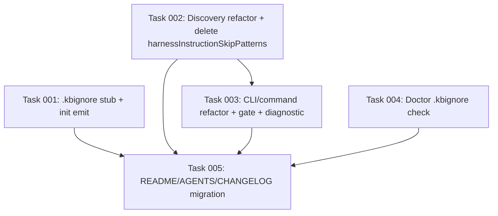

# Plan: `.kbignore` as the single scope surface for `bootstrap-incremental`

## Original Work Order

> for issue #39

(Issue #39 — "Replace `--from/--include/--exclude` with `.kbignore` (gitignore-style scope file)" — see the GitHub issue body for the full motivation, locked-in decisions, and acceptance criteria. Verbatim excerpt: "Replace all three flags with a single repo-root `.kbignore` file using full gitignore semantics … `init` generates a stub `.kbignore` with sensible defaults and comments … hard cutover in the next major release.")

## Plan Clarifications

| Question | Answer |
|---|---|
| Stub `.kbignore` default contents? | Minimal skip + heavy comments. **Move the harness-instruction skip directories** (currently produced by `harnessInstructionSkipPatterns` — `.claude/skills/`, `.claude/commands/`, `.claude/hooks/`, `.claude/plugins/`, and the equivalent per-adapter dirs) into the default `.kbignore`. They no longer live as an implicit `STATIC_SKIPS` extension. |
| Does `.kbignore` apply to harness memory ingestion (`discoverHarnessMemoryFiles`)? | **No.** Memory ingestion bypasses `.kbignore` entirely for adapter-listed IRIs. `.kbignore` governs only the markdown walk. |
| What is the walk root? | Always the repo root. No scoping flag, no positional path argument. Scope is controlled exclusively by `.kbignore`. |
| Pre-run UX when files are matched? | Print the file list and prompt `Proceed? [y/N]` interactively. `--yes` bypasses the prompt. Non-TTY without `--yes` aborts with a clear message. `--dry-run` skips the prompt (it is already a preview). |
| Diagnostic UX when zero files survive `.kbignore`? | Replace the current `No markdown files matched under <dir>` with a message that reports counts and points at the absolute path of `.kbignore`. |
| Doctor coverage? | Add a check that `.kbignore` exists and is non-empty (after comment/whitespace strip). |
| Backwards compatibility for `--from / --include / --exclude`? | **None.** Hard cutover. Removing the flags is a deliberate part of this work. CHANGELOG documents the migration. |

## Executive Summary

`bootstrap-incremental` today exposes three composing scope flags (`--from`, `--include`, `--exclude`) whose interaction is non-obvious enough that even the maintainer was bitten by it. Issue #39 traces the friction to mental-model surface area: three flags, three precedence rules, and an error message ("No markdown files matched") that hides the cause from a first-time user.

This plan replaces all three flags with a single source of truth — a repo-root `.kbignore` file using full gitignore semantics — and folds the existing implicit harness-instruction skip list into the generated stub so users can see and edit those defaults. The walk root becomes the repo root unconditionally, so scope is configured in one place that lives in version control alongside the project. A new interactive confirmation gate prints the resolved file list before any LLM call so the user catches scope mistakes synchronously instead of after a failed run. A `doctor` check ensures the file is present and useful.

The change is a deliberate breaking change in the next major release: no flag re-exposure, no shim, no auto-migration. The CHANGELOG and README quickstart absorb the migration cost; users edit `.kbignore` once and never re-learn the flag semantics. This trades a one-time disruption for permanent removal of a recurring source of confusion.

## Context

### Current State vs Target State

| Current State | Target State | Why? |
|---|---|---|
| `bootstrap-incremental --from <path> --include <glob> --exclude <glob>` with three composing precedence rules | `bootstrap-incremental` (no scope flags); scope is `.kbignore` at repo root | Three flags is one mental model too many; gitignore is already known. |
| Walk roots at `--from` path; default is required (no implicit root) | Walk root is always the repo root | `.kbignore` lives at the root; making the walk match removes the second axis of scope. |
| Implicit harness-instruction skip list (`harnessInstructionSkipPatterns`) auto-injected into discovery, invisible to the user unless they read the source | Default `.kbignore` includes those skips explicitly, with comments, so they are discoverable and editable | "Single source of truth" is real only if the user can see all the rules in one place. |
| `No markdown files matched under <dir>` on empty result — true but actively misleading when filters caused the empty set | Diagnostic message: counts scanned vs surviving, plus absolute path of `.kbignore` | The current message hides the cause. First-time users blame the path, not the filters. |
| No pre-run preview; user finds out what was processed only after the LLM ran | Interactive y/N gate listing every resolved file; `--yes` bypass; non-TTY without `--yes` aborts; `--dry-run` skips the gate | Pre-flight visibility catches scope mistakes before they cost a model run. |
| `init` does not write a `.kbignore` | `init` writes a commented `.kbignore` stub if one is not already present; `init --upgrade` writes the stub only when missing (does not overwrite) | First-run experience is whatever `init` lays down. The stub is the onboarding doc. |
| No `doctor` coverage of scope file | `doctor` warns if `.kbignore` is missing or empty (after stripping comments/whitespace) | The flag-removal makes the file load-bearing; doctor is where load-bearing setup checks live. |
| `--from`, `--include`, `--exclude` accepted in `cli.ts` and `bootstrap-incremental.ts` | All three removed from CLI, command interface, `BootstrapContext`, and `DiscoverOptions` | Removing the surface is the change. Keeping any of it defeats the YAGNI/cleanup intent. |

### Background

- The current scope pipeline lives in `src/lib/bootstrap.ts:179` (`discoverMarkdownFiles`) and reads `DiscoverOptions { sourceDir, repoRoot, include?, exclude?, gitignore?, extraStaticSkips? }`. The function applies `STATIC_SKIPS` (with an `--include` opt-back-in inversion), then `--exclude`, then `.gitignore`, then `--include` as a whitelist. The "must match at least one `--include`" branch (line 196) is what bit the maintainer.
- `harnessInstructionSkipPatterns` in `src/harnesses/registry.ts:52` produces patterns like `.claude/skills/**`, `.claude/commands/**`, `.claude/hooks/**`, `.claude/plugins/**` (plus per-adapter equivalents). These are auto-injected via `extraStaticSkips` in `bootstrap.ts:279`. After this plan lands, these patterns become content of the default `.kbignore` instead.
- Harness memory ingestion (`src/lib/memory-files.ts:113` → `discoverHarnessMemoryFiles`) lists adapter-supplied file IRIs and feeds them to bootstrap as synthetic `memory://<basename>` candidates. **It will continue to bypass `.kbignore` entirely.** Users who want to suppress memory ingestion of `CLAUDE.md` etc. must do so via adapter-level configuration, not `.kbignore`.
- The `ignore` package is already a dependency (used in `bootstrap.ts:5` for `.gitignore`). The same instance pattern (`ignore().add(content)`) handles `.kbignore`. Gitignore's `!` un-ignoring works exactly as documented; the only restriction is that a file under a directory excluded as a directory cannot be re-included. The stub's comments will call this out.
- `cli.ts:97` declares `--from` as `requiredOption`. Removing it changes the command from "required arg" to "zero args" — straight removal, no default substitution.

## Architectural Approach

```mermaid
flowchart TD
    A[user: bootstrap-incremental] --> B{`.ai/knowledge-base/.state/installed-version` exists?}
    B -- no --> Berr[error: run init first]
    B -- yes --> C[load `.gitignore` Ignore]
    C --> D[load `.kbignore` Ignore]
    D --> E[walk repo root for *.md]
    E --> F[filter: STATIC_SKIPS \ .gitignore \ .kbignore]
    F --> G{candidates empty?}
    G -- yes --> Gerr[diagnostic: counts + path to .kbignore]
    G -- no --> H[discoverHarnessMemoryFiles - bypasses .kbignore]
    H --> I[merge markdown + memory candidates]
    I --> J{--dry-run?}
    J -- yes --> K[print list, return]
    J -- no --> L{TTY and not --yes?}
    L -- yes --> M[print list, prompt y/N]
    L -- no, --yes --> N[print list, proceed]
    L -- no, non-TTY --> O[abort: --yes required]
    M -- y --> P[lock, run pipeline, write nodes]
    M -- n --> Q[abort cleanly]
    N --> P
```

### Component 1: Default `.kbignore` stub + `init` integration

**Objective**: Make the first-run experience self-documenting. The stub is simultaneously the default configuration and the teaching surface for gitignore syntax.

The stub ships as `templates/knowledge-base/.kbignore` (or a sibling template path; pick whichever keeps `copyTree` in `init.ts:64` ergonomic). `init` writes it to repo root if absent; `init --upgrade` does the same — never overwrites. Stub content:

- A short header comment explaining purpose, that syntax is gitignore-style, that paths are repo-root relative, and what is auto-skipped regardless of `.kbignore` (`.git/`, `node_modules/`, files in `STATIC_SKIPS`).
- A worked example showing a directory deny, a glob deny, and an `!`-prefixed un-ignore, plus a one-line note about the parent-directory caveat.
- A commented-out "common noise" block users can uncomment (e.g. `build/`, `dist/`, `coverage/`, `**/*.generated.md`).
- An **uncommented** deny block listing the harness instruction directories that `harnessInstructionSkipPatterns` produces today. Generated by enumerating registered harness adapters at `init` time so adding a future adapter does not require hand-editing the stub. This is the explicit migration of the implicit skip list.

`init`/`init --upgrade` both call into the same emit routine. Both check `existsSync(.kbignore)` and skip on present. Order of operations in `runInit`: write the stub immediately after `updateGitignore` (`init.ts:80`) so a single review pass covers both.

### Component 2: Discovery refactor — `.kbignore` replaces include/exclude

**Objective**: Reduce `discoverMarkdownFiles` to a single composed filter: `STATIC_SKIPS ∪ .gitignore ∪ .kbignore`.

Changes to `src/lib/bootstrap.ts`:

- `DiscoverOptions` drops `sourceDir`, `include`, `exclude`, and `extraStaticSkips`. Add `kbignore?: Ignore`. `repoRoot` remains. `gitignore?: Ignore` remains.
- `discoverMarkdownFiles` walks `repoRoot` instead of `sourceDir`. Existing `.git`/`node_modules` short-circuits in `walk` (line 212) stay. The filter chain becomes: posix-relativize → apply `STATIC_SKIPS` (no `--include` opt-back-in inversion; remove that branch) → apply `.gitignore` → apply `.kbignore` → sort → return.
- `BootstrapContext` drops `sourceDir`, `include`, `exclude`. Add nothing; `.kbignore` is loaded inside `runBootstrapIncremental` symmetrically with `.gitignore` (lines 271–274 grow a second clause).
- `harnessInstructionSkipPatterns` is **deleted** from `src/harnesses/registry.ts` along with its imports. Its responsibility moves to the stub. Note in CHANGELOG so anyone calling it externally (unlikely; it is not in the public API surface but worth flagging) sees the removal.

Changes to `src/commands/bootstrap-incremental.ts`:

- `BootstrapIncrementalOptions` drops `from`, `include`, `exclude`. `dryRun`, `timeoutMs`, `harness` remain. Add `yes?: boolean` (see Component 4).
- The `sourceDir` resolution + existence check (`bootstrap-incremental.ts:38–42`) is removed.
- `BootstrapContext` construction (lines 65–76) loses `sourceDir`, `include`, `exclude`. Gains `kbignore` loaded from repo root.

Changes to `src/cli.ts`:

- The `bootstrap-incremental` command (`cli.ts:92–130`) loses `.requiredOption('--from …')`, the two `.option('--include …')` / `.option('--exclude …')` declarations, and the corresponding fields in the action signature and forwarded options.
- Add `--yes` / `-y` flag (boolean, default false). Description: "skip the pre-run confirmation prompt".
- Updated `.description()` text: "Incrementally bootstrap the KB from markdown docs in this repo; scope is controlled by `.kbignore`."

### Component 3: Diagnostic messaging for the empty-set case

**Objective**: Replace `No markdown files matched under <dir>` with a message that distinguishes "nothing to scan" from "everything filtered".

`runBootstrapIncremental` already returns `status: 'no-docs'` when `relPaths.length === 0 && memoryCount === 0`. Extend the return shape to carry both the pre-filter count (files visited by `walk`) and the post-filter count, so the command layer can format:

- `Scanned N markdown file(s); 0 survived .kbignore + .gitignore filters. Check patterns in <abs path to .kbignore>.` when N > 0.
- `No markdown files found under <repo root>. Check that you are running from a project containing .md files.` when N == 0.

The diagnostic format lives in `bootstrap-incremental.ts` (the command layer), not in the lib, so the lib stays UI-agnostic. The lib's `BootstrapResult` gains a `scannedBeforeFilter: number` field on the `no-docs` branch.

### Component 4: Interactive pre-run confirmation gate

**Objective**: Show the resolved file list and require explicit confirmation before any LLM call.

Gate location: in `bootstrap-incremental.ts`, after candidates are resolved (so the user sees the actual interleaved set, including memory candidates and after unchanged-file filtering) but before `runBootstrapIncremental` calls the runner. Concretely, this requires hoisting candidate resolution out of `runBootstrapIncremental` or adding a "preview" mode to it; the cleaner approach is the latter — a new `previewBootstrapIncremental(ctx)` that performs discovery + state-diff + memory merge and returns the candidate list without acquiring the lock or running the runner. The existing `runBootstrapIncremental` then accepts the pre-resolved candidate list.

Behavior:

- `--dry-run`: skip the prompt. The dry-run path already prints what would be processed; the gate would be redundant.
- TTY + no `--yes`: print `Found N file(s) to process:` followed by `  <relPath>` lines (sorted, posix), then `Proceed? [y/N] `. Accept `y`/`Y`/`yes`. Anything else aborts cleanly with `Aborted; no changes made.`
- Non-TTY + no `--yes`: abort with `Refusing to run non-interactively without --yes. Re-run with --yes to confirm.` Exit code 2.
- `--yes`: print the list (no prompt) and proceed.
- Zero candidates after state-diff but non-zero discovered: print the diagnostic from Component 3 and exit 0 (nothing to do is not a failure).

The prompt uses Node's `readline` (no new dep). The TTY check is `process.stdin.isTTY && process.stdout.isTTY`.

### Component 5: `doctor` check for `.kbignore` presence

**Objective**: Surface the load-bearing nature of `.kbignore` in the standard verification command.

In `src/commands/doctor.ts`, add a check that:

- Passes if `.kbignore` exists at repo root and contains at least one non-comment, non-blank line.
- Fails (warning, not error — doctor stays non-fatal for advisory checks) otherwise. Message: `.kbignore missing or empty. Run \`init --upgrade\` to regenerate the default stub, or add your own patterns.` (Confirm against existing doctor output conventions when implementing; match severity levels used by other doctor checks.)

### Component 6: Tests

**Objective**: Cover the new shape; remove tests that pin the old shape.

- `tests/lib/bootstrap.test.ts`: rewrite discovery cases. Coverage: `.kbignore` excludes a directory; `.kbignore` un-ignores a file under a non-excluded parent (`*\n!docs/AGENTS.md`); `.gitignore` and `.kbignore` compose (union of exclusions); `STATIC_SKIPS` still applies independently; harness instruction dirs are no longer auto-skipped (deleted patterns) — they are skipped only because the default stub denies them.
- New: `tests/commands/bootstrap-incremental.test.ts` (or extend the existing one) covering the confirmation gate (`--yes`, TTY-mocked y/N, non-TTY abort), the diagnostic message variants, and the absence of `--from/--include/--exclude` in the CLI surface.
- New: `tests/commands/init.test.ts` coverage for `.kbignore` stub emit (created on init when absent, untouched when present, untouched on `--upgrade`). Verify the stub contains every directory `harnessInstructionSkipPatterns` would have produced.
- New: `tests/commands/doctor.test.ts` (or extend) covering missing/empty/comments-only/valid `.kbignore`.
- Delete the existing `extraStaticSkips`/`harnessInstructionSkipPatterns` tests (or whatever currently pins that surface).

### Component 7: Documentation

**Objective**: The issue is explicit that "documentation is not optional". Treat this section as required deliverables, not nice-to-haves.

- `README.md` quickstart: replace the `bootstrap-incremental --from … --include … --exclude …` example with a two-step flow (`init`, `bootstrap-incremental`) and a one-paragraph note on `.kbignore`. Include the gitignore-syntax pointer.
- `README.md` migration section: a short table of "old flag → `.kbignore` rewrite" for the three flags. Example: `--exclude 'build/**'` → `build/` in `.kbignore`; `--include 'docs/**'` → `*` then `!docs/` then `!docs/**` in `.kbignore`.
- `AGENTS.md` (root): update any mention of the old flag surface. Mirror the README quickstart.
- `CHANGELOG.md`: a clear "BREAKING" entry. Removed: `--from`, `--include`, `--exclude`. Removed: `harnessInstructionSkipPatterns` auto-injection. Added: `.kbignore`, `init` stub generation, confirmation gate, doctor check. Note that memory ingestion behavior is unchanged.
- Knowledge-base node (project KB): consider whether this work merits a `practice/` node (e.g. "kbignore-is-the-only-scope-surface"). Decide during implementation; do not add speculatively.

## Risk Considerations and Mitigation Strategies

<details>
<summary>Technical Risks</summary>

- **Walk-the-whole-repo on large monorepos**: `walk` in `bootstrap.ts:202` was previously bounded by `--from`; now it walks from repo root. In a 100k-file monorepo, the walk itself could be slow even before filters apply, and the filter chain runs after `walk` collects all `.md` candidates.
    - **Mitigation**: Push `.gitignore` and `.kbignore` *into* the directory-descent decision in `walk`, not just into the post-walk filter. The `ignore` package supports `ig.ignores(path)` cheaply enough to call on each directory. Skip descending into excluded directories entirely. Verify on a representative monorepo before merging. Add a perf-smoke test if practical.
- **Gitignore semantics misuse in the stub**: `!docs/README.md` after `*` does not work if `docs/` is excluded as a directory. A stub that demonstrates `!` incorrectly will entrench the bug it is trying to prevent.
    - **Mitigation**: The stub's worked example explicitly demonstrates the correct ordering (un-ignore the directory before un-ignoring children) and includes a one-line warning about the parent-directory caveat. Verified against the gitignore spec, not from memory.
- **`memory://` candidate leakage into the empty-set diagnostic**: If markdown candidates are zero but memory candidates are non-zero, the diagnostic about `.kbignore` is wrong — the run will proceed and process memory.
    - **Mitigation**: The diagnostic only fires when markdown discovery returns zero, regardless of memory count. If memory candidates exist, the gate prints them in the file list as `memory://<name>` entries and proceeds.
</details>

<details>
<summary>Implementation Risks</summary>

- **Removing `harnessInstructionSkipPatterns` while the default stub does the work**: There is a window during refactoring where a user without a `.kbignore` could ingest `.claude/skills/**` and similar harness-tooling markdown as KB content.
    - **Mitigation**: The gate ordering matters. Ship the `init` stub change in the same commit as the discovery refactor. Make `init --upgrade` re-emit the stub when missing so existing installs pick it up on upgrade. Document the requirement to run `init --upgrade` in the CHANGELOG migration note. Doctor warns on missing `.kbignore`, catching anyone who somehow skipped both.
- **`--from` removal breaks any CI script that pinned it**: Issue #39 calls this out explicitly as accepted.
    - **Mitigation**: CHANGELOG migration table. No flag shim, no deprecation warning — the issue's locked decision is hard cutover.
- **Confirmation gate complicates CI**: A run in CI without `--yes` will abort, which is the desired behavior, but anyone scripting `bootstrap-incremental` for the first time post-change will hit it.
    - **Mitigation**: The non-TTY abort message tells the user exactly what to add (`--yes`). README quickstart shows `--yes` in the "running in CI" callout. Issue #39 already accepts the breaking-change cost.
</details>

<details>
<summary>UX Risks</summary>

- **Stub becomes stale as harnesses are added**: A new harness adapter with its own `skillsDir` etc. would not be reflected in existing users' `.kbignore` files.
    - **Mitigation**: This is exactly the gitignore tradeoff — the file is checked in and human-owned. Document in the stub's header comment that new harnesses require manual additions, and add a hint to the `init --upgrade` flow if a known harness directory is *missing* from the existing `.kbignore` (advisory print, no auto-edit). Decide at implementation time whether the advisory print is worth its complexity; default to skipping it.
- **Confirmation prompt feels heavy for repeat runs**: Users who run `bootstrap-incremental` often will be annoyed by the y/N prompt.
    - **Mitigation**: `--yes` is the escape hatch and it's documented. The prompt only fires when the user has not opted out, which matches the gate's purpose.
</details>

## Success Criteria

### Primary Success Criteria

1. `bootstrap-incremental --help` shows no `--from`, `--include`, or `--exclude` flag. `--yes` and `--dry-run` are present.
2. A fresh project on which `init` was run contains a non-empty, commented `.kbignore` at the repo root with every harness-instruction directory denied by default.
3. `bootstrap-incremental` with no flags walks from the repo root, prints the resolved file list, and prompts the user before any LLM invocation. `--yes` bypasses the prompt; non-TTY without `--yes` aborts.
4. When `.kbignore` filters everything out, the error message reports the scanned count, the filtered-out count, and the absolute path of `.kbignore`. It never says "No markdown files matched" without a hint.
5. `doctor` warns if `.kbignore` is missing or empty (after comment strip).
6. Discovery tests cover gitignore-semantic patterns including `!` un-ignoring and parent-directory restrictions. The deleted `--from/--include/--exclude` tests do not regress as orphaned imports.
7. README, AGENTS.md, and CHANGELOG carry the migration story. A user reading only these files can rewrite their old flags into `.kbignore` patterns.

## Self Validation

After all tasks complete, an LLM should verify by:

1. Running `npm run build` (or equivalent) and `npm test` from `/workspace`; both pass with the new tests included and the deleted tests removed.
2. Running `node dist/cli.js bootstrap-incremental --help` and confirming the output contains `--yes`, `--dry-run`, `--timeout`, and `--harness`, and does NOT contain `--from`, `--include`, or `--exclude`.
3. In a scratch directory: `npx <built-tarball> init --harnesses claude`, then `cat .kbignore` and confirm (a) the file exists, (b) it has a header comment explaining gitignore syntax, (c) it includes the harness instruction directories (`.claude/skills/`, `.claude/commands/`, `.claude/hooks/`, `.claude/plugins/` and per-adapter equivalents) as deny patterns.
4. Run `node dist/cli.js bootstrap-incremental --dry-run` in that scratch directory and confirm the resolved file list is printed and the command exits without prompting.
5. Run `node dist/cli.js bootstrap-incremental` interactively, confirm the y/N prompt appears with the candidate list, type `n`, confirm clean abort.
6. Run `node dist/cli.js bootstrap-incremental < /dev/null` (non-TTY, no `--yes`) and confirm the abort message and a non-zero exit code.
7. Temporarily empty `.kbignore` and run `node dist/cli.js doctor`; confirm the warning fires. Restore the file.
8. Add `*` to `.kbignore`, run `node dist/cli.js bootstrap-incremental --dry-run`, and confirm the diagnostic message reports the scanned count and references the absolute path of `.kbignore`.
9. `grep -R 'harnessInstructionSkipPatterns' src/` returns no matches (symbol fully removed).
10. `grep -RE -- '--from|--include|--exclude' src/cli.ts src/commands/bootstrap-incremental.ts` returns no matches (flags fully removed).

## Documentation

This plan **requires** documentation updates (Component 7). They are deliverables, not afterthoughts:

- `README.md` — quickstart rewrite + migration table.
- `AGENTS.md` — quickstart parity with README.
- `CHANGELOG.md` — BREAKING entry covering all six removed/added behaviors.
- Generated `.kbignore` stub — itself a documentation surface; treat its comments with the same rigor as README prose.

Optionally, after implementation, evaluate adding a `practice/` KB node capturing "`.kbignore` is the only scope surface for `bootstrap-incremental`" so future contributors do not propose re-introducing scope flags.

## Resource Requirements

### Development Skills

- TypeScript / Node CLI authoring (commander.js).
- Familiarity with the `ignore` package and gitignore semantics (including the parent-directory restriction on `!`).
- Vitest (or whatever the project's test runner is — confirm at implementation time) for the discovery and command tests, including TTY mocking.

### Technical Infrastructure

- Existing dependencies suffice: `ignore`, `picomatch`, `commander`, `proper-lockfile`. No new packages.
- Local dev install of the package in a scratch repo for the self-validation steps that need `init` + `bootstrap-incremental` end-to-end.

## Integration Strategy

The change ships as one cohesive PR landing in the next major release. No feature flag, no parallel code paths. The migration cost is paid once via CHANGELOG + README, and the doctor check + diagnostic message catch users who miss the changelog.

## Notes

- The first-round clarification "should `.kbignore` apply to memory ingestion" was answered "yes" initially and then explicitly reversed to "no" in the second round. The final answer (memory ingestion bypasses `.kbignore`) is what this plan implements. This is also a simplification — no behavior change to harness memory.
- The issue's "Open design questions" section asks about stub aggressiveness and memory-ingestion scope. Both are now resolved (minimal-skip-with-comments + harness-tooling dirs; memory bypasses).
- `runBootstrapIncremental`'s lock acquisition (`bootstrap.ts:362`) stays where it is. The confirmation gate happens before the lock so an aborted-at-prompt run does not block concurrent KB operations.

---

Plan Summary:
- Plan ID: 30
- Plan File: /workspace/.ai/task-manager/plans/30--kbignore-bootstrap-scope/plan-30--kbignore-bootstrap-scope.md

## Execution Blueprint

**Validation Gates:**
- Reference: `/config/hooks/POST_PHASE.md`

### Dependency Diagram



No circular dependencies.

### ✅ Phase 1: Foundations (parallel)
**Parallel Tasks:**
- ✔️ Task 001: `.kbignore` stub generator + `init` emit (completed)
- ✔️ Task 002: Discovery refactor + delete `harnessInstructionSkipPatterns` (completed)
- ✔️ Task 004: `doctor` `.kbignore` check (completed)

### ✅ Phase 2: CLI/command surface
**Parallel Tasks:**
- ✔️ Task 003: CLI/command refactor + confirmation gate + diagnostic (completed)

### ✅ Phase 3: Documentation
**Parallel Tasks:**
- ✔️ Task 005: README + AGENTS.md + CHANGELOG (completed)

### Post-phase Actions
None beyond the standard validation gate referenced above.

### Execution Summary
- Total Phases: 3
- Total Tasks: 5

## Execution Summary

**Status**: ✅ Completed Successfully
**Completed Date**: 2026-05-22

### Results

Plan 30 landed as a single feature branch (`feature/30--kbignore-bootstrap-scope`) across three phases:

- **Phase 1 (Foundations)** — Introduced `src/lib/kbignore-stub.ts` (`renderKbignoreStub` + `ensureKbignore`), wired stub emission into `init` and `init --upgrade`, refactored `discoverMarkdownFiles` to walk repo root with `STATIC_SKIPS ∪ .gitignore ∪ .kbignore`, pushed both ignore files into `walk` descent short-circuits for perf on large repos, added `scannedBeforeFilter` to the `no-docs` `BootstrapResult` branch, deleted `harnessInstructionSkipPatterns` from `src/harnesses/registry.ts`, and added a doctor warning when `.kbignore` is missing or comment-only.
- **Phase 2 (CLI/command surface)** — Removed `--from`, `--include`, `--exclude` from `cli.ts` and the command options/context types. Added `-y/--yes`. Introduced `previewBootstrapIncremental(ctx)` so candidate resolution can run before lock acquisition; `runBootstrapIncremental` consumes `ctx.preview` when supplied. Added the interactive confirmation gate (TTY prompt, `--yes` bypass, non-TTY exit 2 with the verbatim message, `--dry-run` skip) and the empty-set diagnostic (zero-scanned vs zero-surviving variants). New `tests/commands/bootstrap-incremental.test.ts` covers the gate and diagnostic.
- **Phase 3 (Documentation)** — README quickstart now uses the two-step `init` + `bootstrap-incremental` flow with a CI callout for `--yes` and a three-row migration table. AGENTS.md mirrors the policy and removes all references to the old flags. CHANGELOG carries a `BREAKING` entry covering removed flags, the removed `harnessInstructionSkipPatterns` auto-injection, the new `.kbignore` surface, the init stub, the confirmation gate, the doctor warning, and the unchanged memory-ingestion behaviour, with a pointer back to the README migration section.

Final verification: `npm run build` and `npm test` pass (51 files, 440 tests). All Self-Validation grep checks pass (`harnessInstructionSkipPatterns` is gone from `src/` except for a docstring reference in `kbignore-stub.ts`; `--from/--include/--exclude` are gone from `src/cli.ts` and `src/commands/bootstrap-incremental.ts`; old-flag mentions in user docs are confined to the migration table). `node dist/cli.js bootstrap-incremental --help` shows `--dry-run`, `-y/--yes`, `--timeout` and no removed flags.

### Noteworthy Events

- The plan's self-validation step 2 lists `--harness` among the expected flags on `bootstrap-incremental --help`. Verified that `--harness` is a top-level program flag (visible via `ai-knowledge-base --help`), not a subcommand flag — this is pre-existing behaviour, unchanged by this plan. The spirit of the validation (no `--from/--include/--exclude` on the subcommand; `--yes`/`--dry-run`/`--timeout` present) is satisfied.
- One residual mention of `harnessInstructionSkipPatterns` survives in `src/lib/kbignore-stub.ts` as a docstring that explains what the stub replaces. The symbol itself is fully removed; the docstring is intentional historical context for maintainers reading the new module.
- Pre-commit lint-staged stashed and re-staged changes once during phase 2 commit, requiring a re-`git add` retry. The full build + 440-test suite ran twice on that commit. No code impact.

### Necessary follow-ups

- None required by this plan. The "consider a `practice/` KB node for `.kbignore` is the only scope surface`" item was explicitly deferred per the plan's YAGNI guidance and is not blocking.
