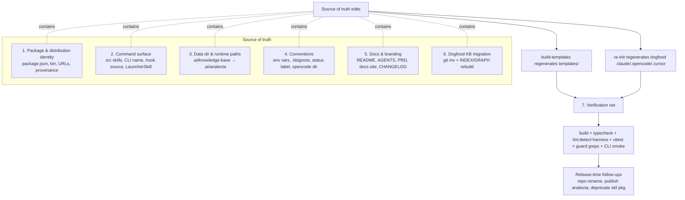
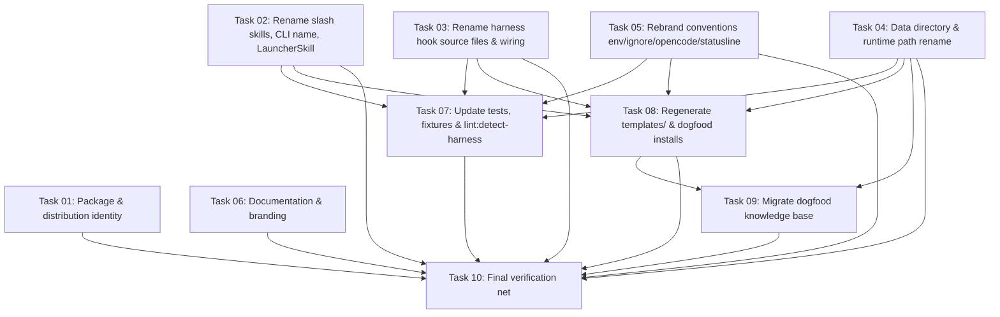

# Plan: Rename the project to `analecta`

## Original Work Order

> rename the project to analecta, use `/ana-*` instead of `/kb-*`

## Plan Clarifications

| Question | Answer |
|----------|--------|
| New npm package name (and CLI bin)? | **`analecta`, unscoped** (drop the `@e0ipso/` scope). Bin renamed to `analecta`. |
| Rename the data directory `.ai/knowledge-base/` the tool writes into user repos? | **Yes → `.ai/analecta/`.** Accepted as a hard break for existing installs. |
| Backwards-compatibility support? | **None — clean break.** No `/kb-*` aliases, no runtime support for the old dir. npm-package deprecation of `@e0ipso/ai-knowledge-base` is captured as a documented **follow-up**, not part of this code change. |
| Rename depth beyond the user-facing surface? | **Also internal identifiers** — `kb-*` hook filenames, code identifiers/types, env vars, and `kb-*` references in tests/docs are rebranded too. |

### Naming conventions settled by this plan (assumed where the work order was silent — override if undesired)

| Surface | Old | New | Rationale |
|---------|-----|-----|-----------|
| npm package | `@e0ipso/ai-knowledge-base` | `analecta` | Work order. |
| CLI bin / `program.name()` | `ai-knowledge-base` | `analecta` | Bin follows package. CLI **subcommands unchanged** (`init`, `doctor`, `curate`, `bootstrap`, …). |
| Slash skills | `kb-bootstrap` / `kb-curate` / `kb-add` | `ana-bootstrap` / `ana-curate` / `ana-add` | Work order (`/ana-*`). |
| Deployed hook files | `kb-session-start`, `kb-capture`, `kb-proposal-drain`, `kb-lint-tick` | `ana-session-start`, `ana-capture`, `ana-proposal-drain`, `ana-lint-tick` | Short `ana-` form, matches commands. |
| OpenCode hooks dir | `kb-hooks/` | `ana-hooks/` | Keeps avoiding the runtime-reserved `.opencode/hooks/`. |
| Data directory | `.ai/knowledge-base/` | `.ai/analecta/` | Clarification. Substructure (`nodes/`, `_sessions/`, `_logs/`, `.state/`, `.config/`, `INDEX.md`, `GRAPH.md`, `config.yaml`) unchanged. |
| Ignore file | `.kbignore` | `.anaignore` | Short form, matches command prefix. |
| Env vars | `KB_BUILDER_INTERNAL`, `KB_GITIGNORE_LINES` | `ANALECTA_BUILDER_INTERNAL`, `ANALECTA_GITIGNORE_LINES` | Full brand for env vars to avoid an ambiguous 3-letter prefix. |
| Hook status-line label | `KB` (after the emoji) | `ana` | Consistent with command prefix. |
| GitHub repo / homepage / docs site | `e0ipso/ai-knowledge-base`, `mateuaguilo.com/ai-knowledge-base` | `e0ipso/analecta`, `mateuaguilo.com/analecta` | Brand coherence; provenance requires repo match. |

The product noun is rebranded too: the collection is **an analecta**, and a single node is **an analect**. The generic descriptive phrase "knowledge base" may remain in explanatory prose where it aids a newcomer; this plan does not mandate blind substitution of every English occurrence of "knowledge base" — only identifiers, paths, brand references, and product-name usages.

## Executive Summary

This plan rebrands the project from `@e0ipso/ai-knowledge-base` to the unscoped package `analecta`, end to end: npm identity, CLI binary, the three slash skills (`/kb-*` → `/ana-*`), the per-harness hook files and their containing directory, environment variables, the `.kbignore` filter file, all internal `kb-*` code identifiers, and the data directory the tool writes into consumer repositories (`.ai/knowledge-base/` → `.ai/analecta/`). It is executed as a **clean break**: no aliases, no migrators, no dual-path compatibility — consistent with the repository's documented "strict schema, no migrators" philosophy.

The approach edits the **source of truth only** — `src/`, `scripts/`, root configuration, `docs/`, `tests/`, and `package.json` — and regenerates the build outputs (`templates/`) and the dogfooded harness installs (`.claude/`, `.opencode/`, `.cursor/`) via `npm run build` and re-`init`. This keeps the manual surface tractable despite ~2,400 raw `kb-` occurrences, because the bulk live in generated trees. The existing test suite, `typecheck`, and the `lint:detect-harness` drift check are the safety net that proves the mechanical rename is complete and correct.

The outcome is a coherently branded tool published under a short, memorable, unscoped name, with the deprecation of the old npm package and the GitHub repository rename handled as documented release-time follow-ups so the code change can land and be verified independently.

## Context

### Current State vs Target State

| Current State | Target State | Why? |
|---|---|---|
| Package `@e0ipso/ai-knowledge-base` (scoped) | Package `analecta` (unscoped) | The whole motivation: a short, unscoped, descriptive name. |
| CLI bin `ai-knowledge-base` | CLI bin `analecta` | The command users type should be the brand. |
| Slash skills `/kb-bootstrap`, `/kb-curate`, `/kb-add` | `/ana-bootstrap`, `/ana-curate`, `/ana-add` | Work-order requirement; cohesive command namespace. |
| Hook files `kb-session-start/capture/proposal-drain/lint-tick`; OpenCode `kb-hooks/` | `ana-*` equivalents; `ana-hooks/` | Internal identifiers rebranded for self-consistency. |
| Data dir `.ai/knowledge-base/` in consumer repos | `.ai/analecta/` | Brand coherence for the artifact users see and commit. |
| Env vars `KB_BUILDER_INTERNAL`, `KB_GITIGNORE_LINES` | `ANALECTA_*` | Internal identifiers rebranded. |
| Ignore file `.kbignore` | `.anaignore` | Internal identifiers rebranded. |
| `LauncherSkill` type = `'kb-bootstrap' \| 'kb-curate' \| 'kb-add'` | `'ana-*'` union | Type must track the renamed skills. |
| Repo `e0ipso/ai-knowledge-base`; docs `mateuaguilo.com/ai-knowledge-base` | `e0ipso/analecta`; `mateuaguilo.com/analecta` | Brand coherence; npm provenance requires repo URL match. |
| `lint:detect-harness` checks `kb-curate/SKILL.md` ENV_DETECTORS heredoc | Checks `ana-curate/SKILL.md` | Drift guard must point at the renamed skill. |

### Background

- **Edit source, not output.** Per `AGENTS.md`, `templates/` is generated by `scripts/build-templates.mjs` and must never be hand-edited; the dogfooded `.claude/`, `.opencode/`, `.cursor/` trees are `init` output. The authoritative inputs are `src/templates-source/`, `src/harnesses/<id>/hooks/`, `src/`, `scripts/`, root configs, `docs/`, and `tests/`. The raw occurrence counts (≈764 `ai-knowledge-base`, ≈1,622 `knowledge-base`, ≈2,414 `kb-`) are inflated by these generated trees and by this repo's own dogfood KB; the hand-edited surface is far smaller.
- **Clean-break is idiomatic here.** The constitution forbids migrators and compatibility shims for schema changes; the same posture is applied to the rename. A consumer on the old version keeps an `.ai/knowledge-base/` dir that the new CLI simply does not recognize; the upgrade path is "move the directory and re-run `init`", communicated via the changelog/upgrade note — not via code.
- **The repo dogfoods itself.** This repository contains a live `.ai/knowledge-base/` (55 nodes) and installed harness configs. These must be migrated in-tree (via `git mv` to preserve history) so the project continues to dogfood under the new name and so CI/lint that touches the KB keeps working.
- **Distinct env vars are few.** Despite 215 `KB_` hits, only two identifiers exist: `KB_BUILDER_INTERNAL` (the recursion guard set on harness child processes) and `KB_GITIGNORE_LINES`. Both must be renamed atomically across every setter and reader.
- **No schema-field change.** The frontmatter/state `schema_version` and field names are untouched; only the *location* (directory) and *brand identifiers* change. Therefore no `schema_version` bump and no migrator are warranted.

## Architectural Approach

The rename is a coordinated, single-branch refactor organized into seven components. Components 1–6 are source edits + regeneration; component 7 is the verification net that must be green before release. There is no runtime feature work — the behavior of the tool is unchanged; only its names and paths move.

### 1. Package & distribution identity
**Objective**: Establish `analecta` as the published artifact so installation, execution, and provenance all use the new name.

`package.json` `name` becomes `analecta`; the `bin` map key becomes `analecta` (target stays `./dist/cli.js`). `repository.url`, `homepage`, and `bugs.url` move to `e0ipso/analecta`. `publishConfig` stays `{access: public, provenance: true}` — `access: public` is still required for an unscoped publish, and provenance will validate only once the GitHub repo is renamed to match. Keywords and description are updated to reflect the brand while keeping the discoverable terms.

### 2. Command surface (skills, CLI, hooks)
**Objective**: Rename everything a user invokes, and the code that launches it.

The three skill source directories and their `SKILL.md` `name:`/description frontmatter move to `ana-bootstrap`, `ana-curate`, `ana-add`. `src/lib/launch-skill.ts` `LauncherSkill` union and the `/kb-…` references in its doc comment update accordingly. `src/cli.ts` `.name('ai-knowledge-base')` becomes `.name('analecta')` (subcommands unchanged). The per-harness hook **source** files under `src/harnesses/<id>/hooks/` (`kb-session-start`, `kb-capture`, `kb-proposal-drain`, `kb-lint-tick`) are renamed to `ana-*`, and any harness `settings`/registration that wires hook command paths is updated to the new filenames.

### 3. Data directory & runtime paths
**Objective**: Move the artifact the tool reads/writes in consumer repos to `.ai/analecta/`.

The path resolver (`src/lib/` paths module) changes the base segment from `knowledge-base` to `analecta`; all derived paths (`nodes/`, `INDEX.md`, `GRAPH.md`, `config.yaml`, `_sessions/`, `_logs/`, `.state/`, `.config/`) follow automatically. `init`, `doctor`, and any path string literals that hard-code `.ai/knowledge-base` are updated. No legacy-dir detection is added (clean break).

### 4. Conventions (env vars, ignore file, status label, opencode dir)
**Objective**: Rebrand the remaining internal identifiers so the codebase is self-consistent.

`KB_BUILDER_INTERNAL` → `ANALECTA_BUILDER_INTERNAL` and `KB_GITIGNORE_LINES` → `ANALECTA_GITIGNORE_LINES` across all setters/readers. `.kbignore` → `.anaignore` in the generator, the path constants, and `init`. The build pipeline's OpenCode branch renames the emitted directory from `kb-hooks/` to `ana-hooks/`. Hook status-line messages switch the `KB` label to `ana`.

### 5. Documentation & branding
**Objective**: Make human- and AI-facing docs describe `analecta`.

`README.md`, `AGENTS.md`, `PRD.md`, `CONTRIBUTING.md`, and the `docs/` Jekyll site (including baseurl/site URL and `docs/internals/kb-navigation.md` → `ana-navigation.md`) are rebranded. A new `CHANGELOG.md` entry documents the breaking rename and the consumer upgrade steps (move `.ai/knowledge-base/` → `.ai/analecta/`, rename `.kbignore` → `.anaignore`, adopt `/ana-*`, re-run `init`). Existing changelog history is not rewritten.

### 6. Dogfood KB migration
**Objective**: Keep this repository dogfooding under the new name with history intact.

`git mv .ai/knowledge-base .ai/analecta`. Node files whose **names** embed `kb-` referring to the old skills (e.g. `map-kb-bootstrap-skill.md`) and node bodies referencing `/kb-*`, `.kbignore`, or `KB_*` are updated to the new terms. `INDEX.md` and `GRAPH.md` are regenerated via the CLI so links remain valid.

### 7. Tests & verification guards
**Objective**: Prove the rename is complete and behavior is unchanged.

Test files named `kb-*` (`tests/hooks/kb-capture.test.ts`, `kb-proposal-drain.test.ts`, `kb-lint-tick.test.ts`, and the per-harness `kb-capture.test.ts` suites) are renamed to `ana-*`, and assertions referencing old names/paths/env vars/ignore file are updated. `scripts/lint-detect-harness.mjs` is pointed at `ana-curate/SKILL.md` and its ENV_DETECTORS heredoc kept in sync. Fixtures (transcripts, bootstrap docs) that embed old identifiers are updated. A guard grep over `src/ scripts/ docs/ tests/` for the old identifiers must return only intentional residue (e.g. the changelog's historical mention).

## Risk Considerations and Mitigation Strategies

Technical Risks

- **Incomplete/over-eager substitution across ~2.4k occurrences**: blind global replace can miss identifiers or corrupt unrelated substrings.
    - **Mitigation**: edit source-of-truth only and regenerate `templates/`; rely on `tsc --noEmit`, ESLint, and the full vitest suite to surface stragglers; finish with explicit guard greps for each old token.
- **`lint:detect-harness` drift failure**: the env-detector heredoc lives in the curate skill and is checked against adapter code; renaming the skill or env vars without syncing both fails CI.
    - **Mitigation**: treat the heredoc and `detectFromEnv` as a paired edit; run `npm run lint` as a gate.
- **npm provenance break on publish**: provenance validates the `repository` URL against the building repo; publishing `analecta` before the GitHub repo is renamed fails.
    - **Mitigation**: sequence the repo rename before the first `analecta` publish (release-time follow-up).

Implementation Risks

- **Lost git history on the data-dir move**: deleting+recreating `.ai/knowledge-base/` would orphan 55 nodes' history.
    - **Mitigation**: use `git mv` for the directory and node files.
- **Stale hook wiring in dogfood installs**: harness `settings.json` files reference hook command paths by filename; renamed hooks break until regenerated.
    - **Mitigation**: regenerate `.claude/.opencode/.cursor` via `init`/build and confirm with `doctor`.
- **Release/CI config references the old package name**: the automated release pipeline (changelog/publish) may key on `ai-knowledge-base`.
    - **Mitigation**: audit and update CI/release configuration as part of component 1; verify a dry-run if available.

Adoption / Integration Risks (accepted)

- **Hard break for existing consumers**: their `.ai/knowledge-base/` and `.kbignore` stop being recognized; `/kb-*` disappears.
    - **Mitigation**: explicit, prominent CHANGELOG upgrade note; npm deprecation of the old package (follow-up) pointing to `analecta`; this break is an accepted, intentional decision.

## Success Criteria

### Primary Success Criteria
1. `package.json` declares `name: "analecta"`, `bin` key `analecta`, and `repository`/`homepage`/`bugs` pointing at `e0ipso/analecta`; `npm pack` produces an `analecta-*.tgz`.
2. A fresh `node dist/cli.js init --harnesses claude` in a clean temp repo creates `.ai/analecta/` (not `.ai/knowledge-base/`), a `.anaignore`, `/ana-bootstrap|curate|add` skills, and `ana-*` hook files; `node dist/cli.js doctor` reports healthy.
3. `npm run build`, `npm run typecheck`, `npm run lint` (including `lint:detect-harness`), and `npm test` all pass.
4. Guard greps for `ai-knowledge-base`, `kb-`, `KB_`, `kbignore`, and `.ai/knowledge-base` over `src/ scripts/ docs/ tests/` return no unintended matches (only intentional changelog history).
5. This repo's own KB lives at `.ai/analecta/` with regenerated `INDEX.md`/`GRAPH.md` and preserved git history; `.ai/knowledge-base/` no longer exists.

## Self Validation

After all work is complete, an LLM/operator must execute these concrete checks:

1. Run `npm run build && npm run typecheck && npm run lint && npm test` from the repo root and confirm every step exits zero; capture the summary lines.
2. Run `node dist/cli.js --help` and confirm the program name printed is `analecta` and the subcommands are intact.
3. In a throwaway directory (`mktemp -d`, `git init`), run `node <repo>/dist/cli.js init --harnesses claude,opencode,codex,cursor` then `... doctor`; confirm `.ai/analecta/` exists, `.anaignore` exists, the Claude skills directory contains `ana-bootstrap/ana-curate/ana-add`, hook files are `ana-*`, the OpenCode dir is `ana-hooks/`, and `doctor` passes. Then `grep -rIl 'kb-\|knowledge-base\|\.kbignore' .ai .claude .opencode .codex .cursor` in that temp repo returns nothing.
4. From the repo root run `grep -rIn -e 'ai-knowledge-base' -e 'kb-' -e 'KB_' -e 'kbignore' -e '\.ai/knowledge-base' src scripts docs tests` and confirm only intentional residual matches remain (e.g. a historical CHANGELOG line).
5. Confirm `git log --follow .ai/analecta/INDEX.md` shows history predating the move (proves `git mv`), and that `.ai/knowledge-base/` is absent (`test ! -d .ai/knowledge-base`).
6. Build the docs site locally (Jekyll) and confirm it builds with the new site URL/baseurl and that internal links resolve.
7. `node -e "console.log(require('./package.json').name, Object.keys(require('./package.json').bin))"` prints `analecta [ 'analecta' ]`.

## Documentation

Documentation/AGENTS updates are **required**:
- `README.md` — install/usage commands, badges, package name, `/ana-*` commands, `.ai/analecta/` paths, docs URL.
- `AGENTS.md` — opening identity line, command examples, structure section (hook filenames, `ana-hooks/`), env-var and skill references.
- `PRD.md` — product name and any `kb-*`/path references.
- `CONTRIBUTING.md` — maintainer commands and package name.
- `docs/` Jekyll site — site title/URL/baseurl, `docs/internals/kb-navigation.md` → `ana-navigation.md`, body references.
- `CHANGELOG.md` — a new breaking-change entry with the explicit consumer upgrade steps.

## Resource Requirements

### Development Skills
TypeScript/Node ESM refactoring; familiarity with this repo's harness-adapter architecture and the `build-templates` pipeline; npm publishing (unscoped, provenance) and GitHub repository administration.

### Technical Infrastructure
Node 22+, the existing toolchain (`tsup`, `vitest`, ESLint, Prettier, Jekyll for docs), `git` (for history-preserving moves), and `gh`/npm credentials for the release-time follow-ups.

## Integration Strategy

Land the entire rename on a single branch as one breaking release. The data-directory and identifier changes are interdependent and must ship together to keep the build, dogfood install, and tests coherent. Release-time follow-ups (not part of the code branch's green-build gate): (1) rename the GitHub repository `e0ipso/ai-knowledge-base` → `e0ipso/analecta` before first publish so provenance validates and redirects are created; (2) publish `analecta`; (3) `npm deprecate "@e0ipso/ai-knowledge-base@*" "renamed to 'analecta' — install analecta instead"` and optionally cut a final pointer release of the old package.

## Notes

- **Version strategy is unsettled** and should be decided before release: continue the existing series as `analecta@0.27.0`, or start the new package at `1.0.0`. Not blocking for this PRD; flag for the release step.
- **`ana-` vs `ANALECTA_` split is deliberate**: short `ana-` for the things users type (slash commands, hook/file names, `.anaignore`), full `ANALECTA_` for environment variables where a 3-letter prefix would be ambiguous. Override in the convention table above if a single uniform prefix is preferred.
- **npm-package deprecation is explicitly out of scope for the code change** per the work order and is recorded as a follow-up in the Integration Strategy.

## Execution Blueprint

**Validation Gates:**
- Reference: `/config/hooks/POST_PHASE.md`

### Dependency Diagram

No circular dependencies. Every task appears in exactly one phase below, and no
task precedes its dependencies.

### ✅ Phase 1: Source-of-truth edits
**Parallel Tasks:**
- ✔️ Task 01: Package & distribution identity
- ✔️ Task 02: Rename slash skills, CLI program name, and LauncherSkill type
- ✔️ Task 03: Rename per-harness hook source files and wiring
- ✔️ Task 04: Data directory & runtime path rename
- ✔️ Task 05: Rebrand conventions (env vars, `.anaignore`, OpenCode dir, status label)
- ✔️ Task 06: Documentation & branding

### ✅ Phase 2: Test sync & regeneration
**Parallel Tasks:**
- ✔️ Task 07: Update test sources, fixtures, and the lint:detect-harness guard (depends on: 02, 03, 04, 05)
- ✔️ Task 08: Regenerate `templates/` and dogfood harness installs (depends on: 02, 03, 04, 05)

### ✅ Phase 3: Dogfood data migration
**Parallel Tasks:**
- ✔️ Task 09: Migrate the dogfood knowledge base (depends on: 04, 08)

### ✅ Phase 4: Verification
**Parallel Tasks:**
- ✔️ Task 10: Final verification net (depends on: 01, 02, 03, 04, 05, 06, 07, 08, 09)

### Post-phase Actions
After each phase, run the validation gate in `/config/hooks/POST_PHASE.md`.
Phase 2 should not start until all Phase 1 source edits are committed; Phase 4
is the release gate — `npm run build && npm run typecheck && npm run lint &&
npm test` plus the guard greps and CLI smoke test must all be green.

### Execution Summary
- Total Phases: 4
- Total Tasks: 10

---

## Execution Summary

**Status**: ✅ Completed Successfully
**Completed Date**: 2026-06-03

### Results

The project was rebranded end to end from `@e0ipso/ai-knowledge-base` to the
unscoped `analecta`, delivered across three green commits on
`feature/39--rename-project-to-analecta` (each passing the full pre-commit gate),
plus this archival commit:

- **Package & distribution identity** — `package.json` name/bin/repository/
  homepage/bugs, `.releaserc`, `.lintstagedrc`, the `tsup` plugin banner, and the
  `.github` workflows.
- **Command surface** — slash skills `/kb-*` → `/ana-*`, CLI `.name('analecta')`,
  the `LauncherSkill` union, and 16 per-harness hook source files (`kb-*` → `ana-*`)
  with their build/registration wiring.
- **Runtime paths & conventions** — data dir `.ai/knowledge-base/` → `.ai/analecta/`
  via the path resolver; env vars `KB_*` → `ANALECTA_*`; `.kbignore` → `.anaignore`
  (stub module renamed); OpenCode `kb-hooks/` → `ana-hooks/`; status label `KB` → `ana`.
- **Docs & branding** — README, AGENTS.md, PRD, CONTRIBUTING, the Jekyll site
  (`title`/`baseurl`, `kb-navigation.md` → `ana-navigation.md`), and a new breaking
  CHANGELOG entry with consumer upgrade steps.
- **Tests & guards** — test files/fixtures synced and the `lint:detect-harness`
  drift guard repointed; `templates/` regenerated.
- **Dogfood migration** — `git mv .ai/knowledge-base .ai/analecta` (history
  preserved — `git log --follow` shows 35 pre-move commits), 8 `kb-`/brand-named
  nodes renamed with full `relates_to`/`depends_on` integrity across 55 nodes,
  node bodies rebranded, `INDEX.md`/`GRAPH.md` regenerated, and the installed
  harness configs regenerated to `ana-*`.

Final gate: `npm run build && npm run typecheck && npm run lint && npm test` all
green (411 tests); guard grep over `src scripts docs tests` returns 0 hits; a
fresh-install smoke test produces `.ai/analecta/`, `.anaignore`, `ana-*`
skills/hooks, and a passing `doctor`.

### Noteworthy Events

- **Environmental test failure (FORCE_COLOR).** `tests/commands/finddocs.test.ts`
  asserts a spawned CLI's stderr is empty, but this session's `FORCE_COLOR=3`
  makes Node emit a `NO_COLOR ignored` warning to stderr. Root cause is the
  ambient env, not the code; all test/commit runs were executed with
  `env -u FORCE_COLOR` rather than weakening the test or adding env-detection code.
- **Execution model adapted for safe parallelism.** The rename's identifier
  classes (package name, paths, `kb-`, `KB_` env vars, status labels) are
  interleaved in the *same* files, so a one-agent-per-task split would have had
  multiple agents editing the same files concurrently. Phase work was instead
  fanned out to **subtree-disjoint** agents (each fully rebranding its own files),
  using plain `mv` + a single central `git add` (avoiding `.git/index.lock`
  contention; git rename-detection preserved history).
- **No `--no-verify`.** The husky pre-commit runs the full suite, which is
  intentionally red mid-refactor (source renamed in Phase 1, tests synced in
  Phase 2). Rather than bypass the gate, commits were made only at green points;
  the first commit folds Phase 1 + Phase 2.
- **Task 08/09 interleave.** Regenerating the dogfood harness installs
  (`init --upgrade`, Task 08) requires the data dir to already live at
  `.ai/analecta` (Task 09's `git mv`), so the Phase-3 unit ran git mv → install
  regen → INDEX/GRAPH together.
- **Cross-agent race, caught and fixed.** A parallel agent kept an
  `ensureKbignore` import in `init.ts` while another renamed the export to
  `ensureAnaignore`; fixed centrally before validation.
- **Cursor `hooks.json` is additive.** Renaming hook files left orphaned `kb-*`
  entries (doctor only checks expected entries are present); the file was
  regenerated from scratch to drop them.
- **`.lintstagedrc` invocation.** Switched from `npx analecta` (unresolvable
  pre-publish) to the local `node ./dist/cli.js`, matching the repo's own
  documented "run the CLI from dist, not npx" convention.
- **OpenCode plugin filename kept.** `kb.ts`/`kb.mjs` was intentionally left
  unrenamed (the plan scoped the hook-file rename to the four event hooks);
  its contents were rebranded.
- **Pre-existing, unrelated:** two dangling `derived_from` external URLs in
  `map-cursor-harness-adapter` (doctor warning, not from this rename); the
  running session's pre-rename capture hook transiently recreates
  `.ai/knowledge-base/_sessions/` runtime noise (untracked, never committed).

### Necessary follow-ups

- **Release-time (per Integration Strategy):** rename the GitHub repo
  `e0ipso/ai-knowledge-base` → `e0ipso/analecta` before first publish (provenance
  validates against the repo URL), publish `analecta`, then
  `npm deprecate "@e0ipso/ai-knowledge-base@*" "renamed to 'analecta'"`.
- **Version decision:** the CHANGELOG entry was authored as `0.27.0`; confirm
  `0.27.0` vs `1.0.0` before release.
- **Docs site build not verified** in this environment (no Jekyll/bundler); build
  locally before a docs deploy. The `_config.yml` was rebranded
  (`title: analecta`, `baseurl: /analecta`).
- **Codex runtime not verified** — the `codex` CLI is not installed in this
  sandbox; codex's install artifacts (hooks + skills) were verified, but a live
  `doctor` against the codex binary was not possible.
- **Adapter robustness (optional):** the Cursor adapter appends hook entries and
  does not prune its own stale entries when a hook filename changes — surfaced by
  this rename; worth hardening so future filename changes self-clean.
