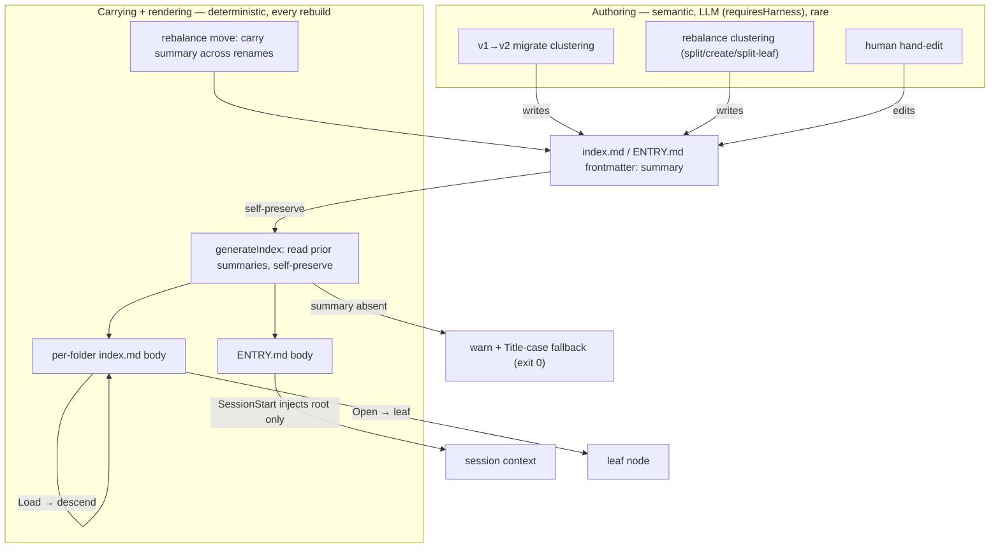
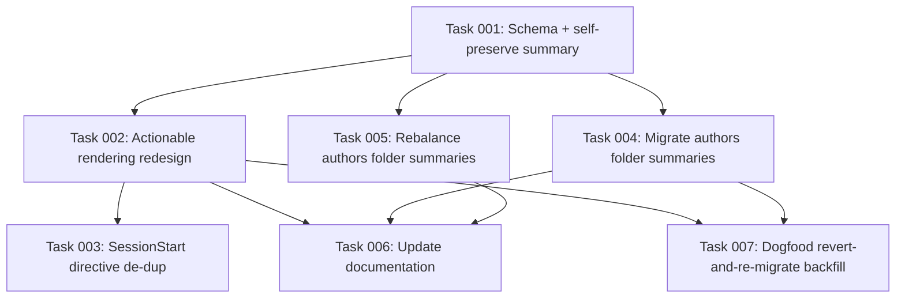

# Plan: Folder Summaries and Actionable Index Nodes

## Original Work Order

> I still don't like the contents of the index.md files (and ENTRY.md).
>
> ## index.md
>
> See .ai/kenkeep/nodes/knowledge-base/index.md for instance. An agent getting
> that file dumped into context does not have instructions. The context is poor,
> and there isn't very much invitation to dig further and how to do it. I am also
> unsure about how useful it is the "By Topic" section, thoughts?
>
> Imagine something like this:
>
> ```md
> ---
> schema_version: 2
> nodes_hash: 'sha256:afc36c3e...'
> node_count: 2
> summary: >-
>   The knowledge base representation in disk
> ---
> # kenkeep Index: knowledge-base
>
> ## Subfolders
> - Load (`index/`)[nodes/knowledge-base/index/index.md] for more information on how index.md files are created and loaded.
> - Load (`nodes/`)[nodes/knowledge-base/nodes/index.md] for more information on the different types of noes.
> - Load (`state/`)[nodes/knowledge-base/state/index.md] for more information on transient state about the application.
>
> ## Conventions (how we build)
> _None yet._
>
> ## Components (what exists)
> - Load (**.ai/kenkeep/ directory layout**)[`knowledge-base/map-kenkeep-directory.md`] to learn about: Per-repo scaffold ... #layout #state #directory
> - Load (**kenkeep npm package**)[`knowledge-base/map-kenkeep-package.md`] to learn about: Per-repo knowledge base ... #overview #package #npm
>
> ## By topic
> - **#directory (1):** .ai/kenkeep/ directory layout
> - ...
> ```
>
> As you can see, we are leveraging the `summary` property from the target
> subfolders and nodes. This makes `index.md` almost deterministic, except for
> the `summary` property. Note how the summaries need to be phrased so they fit
> with a preffix like `for more information on <summary>`, `to learn more about:
> <summary>`, ... Also note how we are dropping the noisy statistics that don't
> help with progressive disclosure. ENTRY.md need to follow suit with these
> changes. What other ideas do you have that pursue the goal of effective
> progressive disclosure?

## Plan Clarifications

| Question | Decision |
| --- | --- |
| Where do per-folder summaries live, given `index.md`/`ENTRY.md` are fully regenerated each rebuild? | **Self-preserve in `index.md` frontmatter.** The generator reads the prior file's `summary` and carries it forward; it is the only non-deterministic input. |
| Should a folder `summary` be required? What renders when it is missing? | **Warn, never block.** Un-summarized folders render the Title-cased folder-name fallback; `index rebuild` lists the gaps and exits zero. (Supersedes an earlier "require/block" leaning, which created a self-preserve bootstrap contradiction.) |
| Who authors folder summaries (a summary is semantic and cannot be derived deterministically)? | The two existing **quarantined LLM clustering moments**: the **v1→v2 migrate** step (folders it creates during flat→tree) and the **rebalance** clustering step (folders it creates: `split-folder`, `create-branch`, `split-leaf`). Humans may hand-edit. Deterministic code only carries the value. |
| Does this require a schema bump to v3? | **No.** v2 is unreleased, so the `summary` field folds into v2's index frontmatter and the existing v1→v2 migrate step. No new version hop, no leaf re-stamp, no forced upgrade. |
| How does THIS repo's already-v2 tree get summaries, since `migrate` will not re-fire on a v2 tree? | **Revert the dogfood tree to flat v1 and re-run the extended v1→v2 migrate**, so its summaries are authored through the real path. |
| Fate of the `## By topic` section? | **Keep, but make it actionable.** Per-tag buckets, each listing **at most 3 nodes** with **path + summary**, ranked by proximity. |
| How is "proximity" measured and over what candidate set? | **Jaccard over tags, whole tree.** `|A∩B| / |A∪B|`; candidates drawn from anywhere in the tree; deterministic tie-break by in-degree then title. |
| Which navigation affordances are in scope? | **All four:** imperative Load/Open phrasing; an embedded per-file descent directive; a parent breadcrumb up-link on non-root indexes; and dropping all body statistics (machine fields stay in frontmatter). |
| Backwards compatibility? | **Not required for released artifacts** (none exist on v2). The single in-flight v2 tree is reseeded via revert-and-re-migrate. `IndexFrontmatterSchema.summary` is added as optional so any transitional file still parses. |

## Executive Summary

The kenkeep knowledge base is navigated by progressive disclosure: a SessionStart
hook injects only the always-on entry catalog (`ENTRY.md`), and the agent descends
through per-folder `index.md` nodes, opening leaves on demand. Today those generated
files undercut that goal. A per-folder `index.md` arrives in context with **no
navigation instructions**, a subfolder's "intent" is merely its Title-cased folder
name (`deterministicIntent`, `index-gen.ts:241`), every section is prefixed with
**noisy statistics** (`_N node(s) • ~T estimated tokens_`, subtree rollups), and the
`## By topic` block re-lists titles already shown above **with no path to follow** — a
dead-end histogram.

This plan reworks both generated artifacts around a single new primitive: a
**per-folder `summary`** stored in the `index.md`/`ENTRY.md` frontmatter and
**self-preserved** across rebuilds, so the file stays "almost deterministic except for
the summary." A summary is a semantic abstraction that cannot be derived from leaf
text, so it is authored only at the two existing quarantined LLM moments — the v1→v2
**migrate** clustering step (existing tree) and the **rebalance** clustering step (new
folders) — while all deterministic machinery merely carries it. The rendering becomes
an explicit invitation to dig further: imperative **Load** (descend) and **Open**
(terminal read) pointers that splice in the target's summary, an embedded one-line
**descent directive** so a file is self-describing even when read in isolation, a
**parent breadcrumb** for agents that land deep via grep, **no statistics** in the
body, and a **reworked `## By topic`** that lists, per tag, the ≤3 most-central nodes
(by whole-tree tag Jaccard) as followable path + summary entries.

The approach is chosen because it keeps the determinism boundary exactly where the
codebase already draws it (LLM invents, deterministic primitive writes/carries),
introduces no schema version hop (v2 is unreleased), and reuses the existing migrate
and rebalance authoring paths rather than inventing a new store or command. The
outcome: an entry catalog and index tree that route an agent down and out with
actionable links, that read coherently in any context window, and that no longer spend
tokens on statistics that do not aid navigation.

## Context

### Current State vs Target State

| Current State | Target State | Why? |
| --- | --- | --- |
| Per-folder `index.md` carries no navigation guidance; the descent directive is only appended to `ENTRY.md` by the SessionStart hook (`session-start.ts:106`). | A compact descent directive is embedded in every generated `index.md` and `ENTRY.md` body, sourced from the shared `KK_NAVIGATION_DIRECTIVE` constant. | A file dumped into context (sub-agent, mid-session re-read, deep descent) must be self-describing; guidance that lives only in the hook is lost on any re-read. |
| A subfolder/branch "intent" is the Title-cased folder name (`deterministicIntent`). | The parent renders each child using the child's self-preserved `summary` (fallback to the name when absent). | A folder name (`knowledge-base`) is not a description; a real summary lets the parent invite descent meaningfully. |
| Folders have no summary anywhere; `IndexFrontmatterSchema` has none (`schemas.ts:207`). | `IndexFrontmatterSchema` gains an optional `summary`, self-preserved across rebuilds; it is the only non-deterministic field. | Progressive disclosure needs a one-line "what is in here" per folder, persisted so regeneration cannot wipe it. |
| Pointers are passive bullets (`- **title** [path] summary #tags`). | Imperative pointers: `Load [\`name/\`](…) for more information on <summary>` for descent; `Open [**title**](…) to learn about: <summary>` for leaves. | A verb-first instruction reads as an invitation to act; "Load"/"Open" also distinguish descent from a terminal leaf read. |
| Bodies lead with statistics: `_N node(s) • ~T estimated tokens_`, `(D here, T in subtree)`, branch counts `(6)`. | Bodies carry no statistics; `nodes_hash` and `node_count` remain in frontmatter for the staleness check. | Counts and token estimates are curation/`doctor` diagnostics, not navigation aids; they cost tokens on the always-on payload. |
| `## By topic` lists titles grouped by tag, no paths, re-stating the lists above. | `## By topic` lists, per tag present in the folder, the ≤3 most-central nodes (whole-tree tag Jaccard) as `Open [**title**](path) — <summary>`. | A topic block must be followable; a link-less histogram routes nowhere and duplicates the component lists. |
| Non-root `index.md` has no up-link. | Each non-root `index.md` carries a `↑ Parent: [name](../index.md)` breadcrumb. | Navigation must be bidirectional for an agent that lands deep via grep. |
| New folders (migrate flat→tree, rebalance split/create) leave an empty summary. | The v1→v2 migrate and rebalance clustering steps author a one-line summary per folder they create, written into that folder's `index.md` frontmatter. | A summary is semantic; the only sanctioned authoring moments are the existing quarantined LLM clustering steps. |
| THIS repo's tree is already v2 with no summaries; `migrate` will not re-fire on it. | The dogfood tree is reverted to flat v1 and re-migrated through the extended v1→v2 path. | Keeps a single authoring path; avoids a bespoke v2→v2 seeding command. |

### Background

- **Generation is deterministic and total.** `generateIndex` (`index-gen.ts:260`) is a pure
  function of the leaf set; `index rebuild`, the curator, `node add`, and `rebalance
  move` all rewrite every affected `index.md` plus `ENTRY.md`/`GRAPH.md`. Anything written
  into a body is therefore disposable — only frontmatter that the generator deliberately
  reads back can persist. This is why the folder summary must live in frontmatter and be
  explicitly self-preserved.
- **`ENTRY.md` is purpose-built, not the folder template.** `renderRootCatalog`
  (`index-gen.ts:165`) emits whole-tree totals and the branch list and is stamped with the
  GLOBAL `nodes_hash`; the SessionStart staleness check compares that hash to live `nodes/`
  (`session-start.ts:80`). The redesign must preserve those frontmatter fields.
- **The determinism boundary already exists.** Both `migrate` (`migrate.ts:11`–`22`,
  `requiresHarness`) and `rebalance` (`kk-curate/SKILL.md:433`, "the only non-deterministic
  step") sandwich exactly one quarantined LLM clustering step between deterministic
  primitives. Folder-summary authoring slots into those two steps without moving the
  boundary.
- **Per-folder hashing exists to localize churn.** Each folder index records a per-folder
  `nodes_hash` over its own direct leaves (`index-gen.ts:39`, `:304`) so a leaf edit only
  perturbs its own folder's index. The reworked whole-tree `## By topic` interacts with this
  invariant — see Risks.
- **No version bump.** `NODE_SCHEMA_VERSION` stays at 2 (`schemas.ts:9`). `migrate` is
  version-gated on the minimum leaf version (`migrate.ts:73`–`90`); the summary work folds
  into the existing v1→v2 step rather than introducing a v2→v3 hop.

## Architectural Approach

The design separates **authoring** (semantic, LLM, rare) from **carrying** (deterministic,
on every rebuild) from **rendering** (deterministic). The summary is authored once at folder
birth and thereafter self-preserved; rendering splices summaries into imperative pointers and
a proximity-ranked topic block.



### Folder summary as a self-preserved frontmatter field
**Objective**: Give every folder a persisted one-line description without breaking the
"generation is a pure function of leaves" model.

`IndexFrontmatterSchema` gains an **optional** `summary: string`. On each run, `generateIndex`
snapshots the existing `summary` of every folder's `index.md` (and the root `ENTRY.md`) before
regenerating, then re-stamps each value into the freshly generated frontmatter. Because the
snapshot is taken from the on-disk files that persist across the rebuild, the value is stable;
a leaf edit never alters a sibling's summary. When no prior file exists (a brand-new folder) or
the field is empty, the summary is treated as absent. The field is the sole non-deterministic
input; everything else in the body is a deterministic function of the leaf set plus the
harvested child summaries. The summary is authored to read as a sentence fragment that completes
the imperative prefixes (`for more information on …`, `to learn about: …`); this phrasing
contract is enforced at the authoring prompts and may be lint-checked, not mass-applied to
existing leaf summaries.

### Authoring paths: migrate and rebalance clustering
**Objective**: Populate summaries only at the two existing quarantined LLM moments, leaving the
deterministic core summary-free.

- **v1→v2 migrate** (`migrate-flat-to-tree.ts` plus its harness clustering): the same LLM call
  that clusters flat leaves into topical folders and names them additionally emits a one-line
  summary per folder it creates. The deterministic write primitive stamps that summary into the
  new folder's `index.md` frontmatter alongside the existing placement writes. This is the
  backfill path for any v1 repo and for this repo's tree (via revert-and-re-migrate).
- **rebalance** (`rebalance-move.ts` op schema + `kk-curate/SKILL.md` clustering step): the
  `split-folder` groups, `create-branch`, and `split-leaf` operations carry a `summary` per new
  folder. The clustering prompt authors it; the move primitive writes it into the new folder's
  `index.md` frontmatter, then the deterministic rebuild self-preserves it thereafter. `merge`
  creates no folder, so it carries no new summary; the destination keeps its self-preserved
  summary (which may be re-authored by a later clustering pass if it becomes misleading).

### Rendering redesign for ENTRY.md and index.md
**Objective**: Turn passive listings into an actionable, self-describing progressive-disclosure
surface.

- **Imperative descent pointers** (Subfolders in `index.md`, Branches in `ENTRY.md`):
  `- Load [\`<name>/\`](nodes/<dir>/index.md) for more information on <child summary | name fallback>.`
- **Imperative leaf pointers** (Components/Conventions):
  `- Open [**<title>**](<relPath>) to learn about: <summary> <#tags>`
- **Embedded descent directive**: a compact, deterministic single line derived from
  `KK_NAVIGATION_DIRECTIVE` is rendered into every `index.md` and `ENTRY.md` body. The
  SessionStart hook stops appending the full directive to the injected `ENTRY.md` body to avoid
  duplication; the constant remains the single source of truth.
- **Parent breadcrumb**: every non-root `index.md` renders `↑ Parent: [<parent name>](../index.md)`
  (root `ENTRY.md`/root `index.md` omit it).
- **No body statistics**: the `_N node(s) • ~T estimated tokens_` lines, the `(D here, T in
  subtree)` rollups, and the branch counts `(N)` are removed. `nodes_hash` and `node_count`
  stay in frontmatter; the per-folder `FolderMetrics` continue to be computed for `rebalance`
  but are no longer printed in the body.
- **Markdown correctness**: pointers use valid `[label](path)` link syntax. (The work order's
  sketch used `(label)[path]`, which renders as literal text; the implementation corrects it.)

### Reworked "By topic": per-tag, proximity-ranked, actionable
**Objective**: Replace the link-less histogram with a followable, bounded "most relevant nodes
for this topic" surface.

For each tag present among the folder's **direct leaves** (the bucket set is unchanged; buckets
ordered by size then alpha), the section lists **at most 3** nodes drawn from the **whole tree**
that carry that tag, each rendered as `Open [**title**](path) — <summary>`. Ranking is by
**centrality within the tag's whole-tree cohort**, where proximity between two nodes is the
**Jaccard overlap of their tag sets** (`|A∩B| / |A∪B|`): a node's score is the sum of its tag
Jaccard against the other members of that tag's cohort, so the most topically representative
nodes rise. Ties break by global in-degree then title, keeping the output deterministic. The
section thus points OUT to the canonical nodes for each topic the folder touches, rather than
re-stating the local component list.

### Missing-summary contract and existing-tree backfill
**Objective**: Make the feature shippable without a forcing gate, and seed the one in-flight tree.

- **Warn, never block**: when a folder has no summary, `index rebuild` renders the Title-cased
  name fallback in every pointer to that folder, prints a warning that lists the folders lacking
  a summary, and exits zero. No pre-commit/CI gate is added. This removes the self-preserve
  bootstrap contradiction entirely (there is no file-must-exist-before-authoring deadlock).
- **Backfill of this repo**: the dogfood `.ai/kenkeep` tree is reverted to the flat v1 layout
  and re-run through the extended v1→v2 migrate so its folder summaries are authored by the real
  path, exercising that path end-to-end as a side benefit.

## Risk Considerations and Mitigation Strategies

<details>
<summary>Technical Risks</summary>

- **Whole-tree `## By topic` breaks per-folder hash localization.** Pulling candidates from the
  whole tree means a tag change anywhere can reorder a distant folder's topic block, churning
  that folder's `index.md` and its per-folder `nodes_hash` even though its own leaves did not
  change — directly at odds with the localized-churn invariant (`index-gen.ts:39`).
    - **Mitigation**: Exclude the cross-tree `## By topic` block from the per-folder
      `nodes_hash` computation (hash only the folder's own leaves, as today), so cross-tree
      churn changes the rendered block but not the stability hash. Confirm the GLOBAL `ENTRY.md`
      hash still reflects the whole leaf set for the staleness check. Flag at implementation if a
      stricter byte-stability guarantee is wanted (the fallback is within-folder candidates).
- **Self-preserve fragility.** The summary lives only in a generated file; a `git restore` of
  generated artifacts, an external rewrite, or a `move`/`merge` that does not carry it will lose
  it silently.
    - **Mitigation**: Store it in frontmatter (survives body regen); `rebalance move` explicitly
      carries the summary across renames; `index rebuild` warns on absence; `doctor`/lint may
      surface missing summaries. Document that generated files are not hand-deleted.
- **Self-preserve ordering during a single rebuild.** A parent's render needs each child's
  summary; if both regenerate in one pass the child summary must come from the pre-rebuild
  snapshot.
    - **Mitigation**: Harvest all existing `index.md` summaries up front, before any file is
      overwritten; render from the snapshot. Self-preserve guarantees old and new child summaries
      are identical, so the order is safe.
</details>

<details>
<summary>Implementation Risks</summary>

- **"Warn, never block" allows indefinite name-fallback drift.** With no gate, a tree can ship
  with low-value name-only summaries.
    - **Mitigation**: migrate authors at creation, rebalance authors new folders, the rebuild
      warning lists offenders, and lint may add a non-fatal finding. Quality is driven by the
      authoring moments, not a hard stop.
- **Directive duplication / drift.** Embedding the directive in bodies while the hook also
  appends it would double-print and risk divergence.
    - **Mitigation**: Single `KK_NAVIGATION_DIRECTIVE` constant; the hook stops appending once
      the body carries it; tests assert the injected `ENTRY.md` contains it exactly once.
- **Dogfood revert-and-re-migrate is destructive to the current tree.** Reverting to v1 and
  re-clustering can reshape folders and re-cluster leaves.
    - **Mitigation**: Perform on the feature branch with the change reviewed via `git diff`;
      since v2 is unreleased and the tree is a dogfood artifact, reshaping is acceptable and the
      summaries land through the real path.
</details>

<details>
<summary>Integration Risks</summary>

- **Frontmatter schema change ripples.** Adding `summary` touches `IndexFrontmatterSchema`,
  consumed by `generateIndex`, `index-rebuild`, and `session-start` (`safeParse`).
    - **Mitigation**: Make `summary` optional so transitional files parse; the staleness path
      only reads `nodes_hash`, so it is unaffected; add coverage for present/absent summary.
- **Harness requirement on migrate/rebalance.** Summary authoring runs inside `requiresHarness`
  steps; headless/test paths must not spawn a real harness.
    - **Mitigation**: Reuse the existing deterministic cluster-override injection used by the
      migrate and rebalance tests so the suite stays harness-free.
</details>

## Success Criteria

### Primary Success Criteria
1. A generated per-folder `index.md` contains: an embedded one-line descent directive, a
   `↑ Parent` breadcrumb (non-root), imperative `Load …` subfolder pointers that splice the child
   summary (or name fallback), imperative `Open …` leaf pointers, a reworked `## By topic` with
   ≤3 actionable path+summary entries per tag, and **no** statistic lines.
2. A generated `ENTRY.md` follows suit: embedded directive, `Load …` branch pointers using each
   branch's summary, no whole-tree statistic line, and frontmatter still carrying the GLOBAL
   `nodes_hash`, `node_count`, and the new `summary`.
3. Editing one leaf and rebuilding leaves every unrelated folder's `summary` byte-stable
   (self-preserve verified by `git diff`).
4. Running the extended v1→v2 migrate on a flat fixture (with an injected deterministic cluster)
   writes a non-empty `summary` into every created folder's `index.md` frontmatter.
5. A rebalance `split-folder`/`create-branch`/`split-leaf` writes an authored `summary` into each
   new folder's `index.md`; a subsequent rebuild preserves it.
6. A folder with no summary renders the name fallback, `index rebuild` prints a warning naming it,
   and the command exits zero (no block).
7. Two consecutive rebuilds of the same tree produce byte-identical generated files (determinism
   holds, summary aside).
8. The SessionStart-injected `ENTRY.md` contains the descent directive exactly once.

## Self Validation

After all tasks are complete, an LLM must execute and confirm:

1. Build, then run `npx kenkeep index rebuild` on this repo's tree (post-backfill). Open
   `.ai/kenkeep/ENTRY.md` and `.ai/kenkeep/nodes/knowledge-base/index.md` and verify by direct
   inspection: embedded directive present, `Load`/`Open` imperative pointers with target
   summaries, parent breadcrumb on the non-root file, no statistic lines, and a `## By topic`
   block whose entries each carry a path and summary and number ≤3 per tag.
2. Run `git diff` after editing a single leaf body and rebuilding; confirm only that leaf's own
   folder index changed and all other folders' `summary` lines are untouched.
3. Run the migrate suite (or the command against a flat fixture with the deterministic cluster
   stub) and grep the produced folders' `index.md` for a non-empty `summary:`; confirm every
   created folder has one.
4. Construct a >12-leaf folder, run `npx kenkeep rebalance trigger` then `rebalance move` with a
   split plan carrying per-subfolder summaries; confirm the new subfolders' `index.md` frontmatter
   contains the authored summaries and a follow-up `index rebuild` preserves them.
5. Delete a `summary:` line from one folder's `index.md`, run `index rebuild`, and confirm the
   command prints a warning naming that folder, renders the Title-cased fallback in its parent's
   pointer, and exits with status 0.
6. Run `index rebuild` twice in a row with no other change and confirm the second run reports
   nothing to do / produces a byte-identical tree.
7. Invoke the SessionStart context builder and assert the injected text contains the descent
   directive exactly once (embedded, not also appended).
8. Run the full `vitest` suite and confirm green, including updated `index-gen`, `session-start`,
   `migrate`, and `rebalance` coverage.

## Documentation

Yes — this plan updates both human- and AI-facing documentation:

- **`AGENTS.md`**: the ENTRY/index format description, the navigation/descent guidance, and the
  statement that folder summaries are self-preserved and authored by migrate/rebalance.
- **`docs/how-it-works.md`** and **`docs/internals/architecture.md`**: the summary authoring vs
  carrying vs rendering separation, and the reworked `## By topic` semantics.
- **`docs/internals/prompts.md`**: the migrate and rebalance clustering prompts now author a
  folder summary; record the phrasing contract.
- **`.claude/skills/kk-curate/SKILL.md`** (and the `src/templates-source/skills/...` source):
  the rebalance clustering step authors a `summary` per new folder; op-plan examples updated.
- **`README.md`** / template READMEs and the `KK_NAVIGATION_DIRECTIVE` constant comment as needed.

## Resource Requirements

### Development Skills
- TypeScript/Node (ESM, `node:fs`/`posix`), Zod schema evolution, `gray-matter` frontmatter
  round-tripping, and Vitest. Familiarity with the kenkeep index/migrate/rebalance subsystems.

### Technical Infrastructure
- The existing kenkeep toolchain (tsup build, vitest, eslint/prettier). A host-harness adapter
  (claude/codex/opencode/cursor/copilot) for the live migrate/rebalance authoring paths;
  deterministic cluster-override injection for the test path so the suite never spawns a harness.

### External Dependencies
- None new. Reuses `gray-matter`, `zod`, and the existing harness registry.

## Integration Strategy

The change lands on the unreleased v2 line, so it integrates without a version hop or BC shim:
`summary` is added optional to `IndexFrontmatterSchema`; `generateIndex` gains a self-preserve
read; `index-rebuild` gains a warn-and-list path; the migrate and rebalance op/prompt surfaces
gain a `summary` field; and `session-start` stops double-emitting the directive. The dogfood tree
is reseeded by revert-and-re-migrate as the final integration step, which also serves as a live
end-to-end exercise of the extended migrate path.

## Notes

- The summary is deliberately the **only** non-deterministic field; reviewers should be able to
  reason about every other byte of a generated index as a function of the leaf set plus harvested
  child summaries.
- The whole-tree `## By topic` ↔ per-folder-hash tension (Risks) is the single design point most
  likely to need a follow-up micro-decision; the recommended resolution (exclude the cross-tree
  block from the per-folder hash) is captured so task generation can proceed.
- `merge` intentionally does not author a summary (it creates no folder); destination-summary
  staleness after a merge is accepted under the warn-only contract.

## Execution Blueprint

**Validation Gates:**
- Reference: `/config/hooks/POST_PHASE.md`



### ✅ Phase 1: Summary primitive foundation
**Parallel Tasks:**
- ✔️ Task 001 (completed): Add optional folder `summary` to the index schema and self-preserve it across rebuilds

### ✅ Phase 2: Rendering and authoring on the new primitive
**Parallel Tasks:**
- ✔️ Task 002 (completed): Rework `index.md`/`ENTRY.md` rendering — imperative pointers, embedded directive, breadcrumb, no statistics, proximity-ranked By topic (depends on: 001)
- ✔️ Task 004 (completed): Extend the v1→v2 migrate clustering to author a folder `summary` per created folder (depends on: 001)
- ✔️ Task 005 (completed): Extend rebalance ops to author a `summary` per new folder and update the kk-curate clustering step (depends on: 001)

### ✅ Phase 3: Integration, de-duplication, and docs
**Parallel Tasks:**
- ✔️ Task 003 (completed): Stop SessionStart (and copilot hooks-config) from double-emitting the descent directive (depends on: 002)
- ✔️ Task 006 (completed): Update human- and AI-facing docs for folder summaries and the actionable index format (depends on: 002, 004, 005)
- ✔️ Task 007 (completed): Backfill this repo's tree — revert `.ai/kenkeep` to flat v1 and re-run the extended migrate (depends on: 002, 004)

### Post-phase Actions
- After each phase, run `npm run build` and the full `vitest` suite; the phase gate is green build + green tests. Phase 3 additionally requires the dogfood `git diff` review (Task 007) to be inspected and accepted.

### Execution Summary
- Total Phases: 3
- Total Tasks: 7


## Execution Summary

**Status**: ✅ Completed Successfully
**Completed Date**: 2026-06-09

### Results

All 7 tasks across 3 phases were executed and their validation gates passed (green build + green lint + 283 passing vitest tests at completion).

- **Phase 1 — Summary primitive (Task 1).** Added an optional `summary` to `IndexFrontmatterSchema`. `generateIndex` harvests each folder's prior on-disk `index.md` summary (and the root `ENTRY.md` via an explicit `entryFile` parameter threaded from `runIndexRebuild`) before regenerating and re-stamps it verbatim, so it survives the otherwise-total rebuild. It is the only non-deterministic field; the per-folder `nodes_hash` still covers only that folder's own leaves.
- **Phase 2 — Rendering + authoring (Tasks 2, 4, 5).** Reworked `index.md`/`ENTRY.md` rendering: imperative `Load …`/`Open …` pointers that splice the target's summary (Title-cased name fallback), an embedded descent directive, a parent breadcrumb on non-root indexes, no body statistics, and a proximity-ranked `## By topic` (per direct-leaf tag, ≤3 whole-tree nodes by summed tag-Jaccard centrality, tie-broken by in-degree then title; excluded from the per-folder hash). The v1→v2 migrate clustering and the rebalance `split-folder`/`create-branch`/`split-leaf` ops now author a per-created-folder summary, stamped into the new folder's `index.md` frontmatter by a shared `stampFolderSummary` so the next rebuild self-preserves it (`merge` authors none). The kk-curate SKILL.md (installed copy + template source) documents the new field and phrasing contract.
- **Phase 3 — Integration, de-dup, docs, backfill (Tasks 3, 6, 7).** SessionStart and the copilot hooks-config stop double-emitting the directive (a substring guard appends it only for the legacy `INDEX.md` fallback), so the injected catalog carries it exactly once. AGENTS.md, `docs/how-it-works.md`, `docs/internals/architecture.md`, and `docs/internals/prompts.md` were updated to match the shipped behavior with no schema-bump claims. This repo's dogfood `.ai/kenkeep` tree was reverted to flat v1 and re-migrated through the real (claude) harness: 57 leaves were re-clustered into 11 topical branches, each receiving an authored summary, and the regenerated artifacts carry the new actionable format.

All eight plan **Self Validation** steps were executed and pass: ENTRY/index format inspection, single-leaf-edit localization, migrate summary authoring, rebalance author-then-preserve, missing-summary warn + name fallback + exit 0, two-rebuild byte-stability, SessionStart directive exactly once, and the full vitest suite.

### Noteworthy Events

- **No general-purpose sub-agent dispatch tool was available**, so phases were executed directly and sequentially in strict dependency order rather than via parallel agents. The dependency graph and all lifecycle hooks/gates were honored; the only difference from the skill's "parallel agents" wording is sequential execution within each phase.
- **Deferred micro-decision (a)** — how `generateIndex` receives the root `ENTRY.md` summary — was resolved with the recommended default: an explicit `entryFile?` parameter wired from `runIndexRebuild` (keeps `generateIndex` the single self-preserve owner).
- **Deferred micro-decision (b)** — how authored summaries land before the first rebuild — was resolved with the recommended default: a shared `stampFolderSummary` writes a minimal `index.md` immediately after placement so self-preserve carries it. Tasks 4 and 5 use the identical approach.
- **Gap closed during POST_EXECUTION validation:** the plan's Success Criterion 6 / Self Validation #5 requires `index rebuild` to *warn and name* folders lacking a summary, which neither Task 1 nor Task 2 had wired. Added `GeneratedIndex.foldersMissingSummary` and a non-fatal warning in `runIndexRebuild` (with tests), completing the "warn, never block" contract.
- **`RebalanceOpSchema` summary fields are required** (`z.string()`) on the folder-creating ops, matching the task spec; all existing hand-written op-plan test fixtures were updated to carry summaries.
- **Dead code removed** (`rollupStats`/`RollupStats` and the now-unused `leavesByDir` plumbing in the root catalog) so the renderer carries no statistics scaffolding.
- **Pre-existing dangling `derived_from` references** (11, pointing at `docs/cli-reference.md` and external URLs) are surfaced by `doctor` after the backfill. These existed verbatim in the committed baseline KB and were preserved unchanged by the migrate; they are a KB data-hygiene matter outside this plan's scope (index rendering and folder summaries), and `doctor`'s dangling check is not a build/test gate.

### Necessary follow-ups

- Optionally clean up the 11 pre-existing dangling `derived_from` references in the dogfood KB leaves (unrelated to this plan; a separate data-hygiene task).
- The dogfood tree's installed-version marker (0.26.4 vs package 1.1.0) is stale — a routine `npx kenkeep init --upgrade`, also out of scope here.
