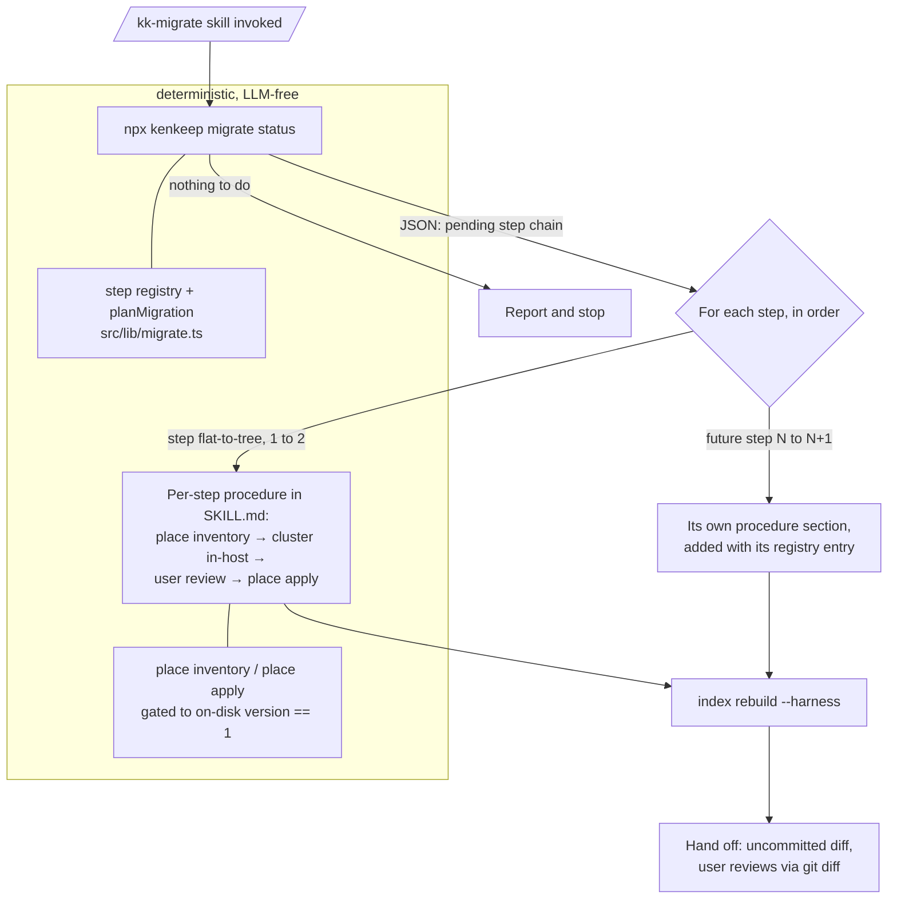
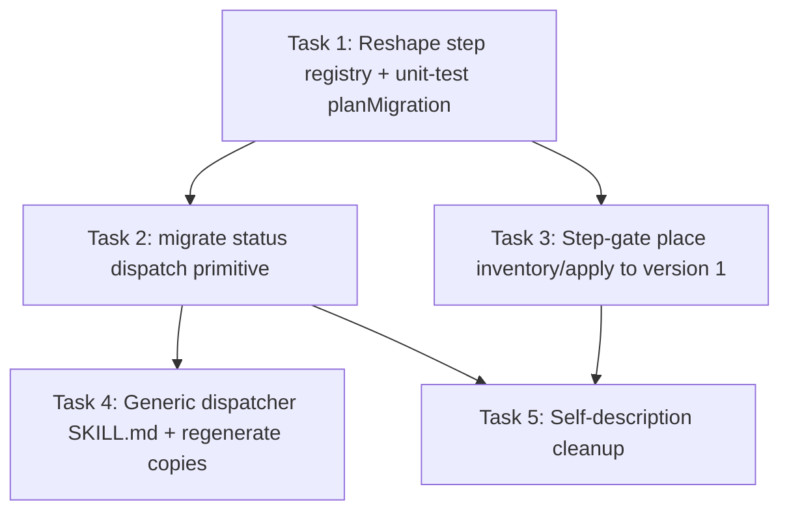

# Plan: Generic Migration Dispatch for /kk-migrate

## Original Work Order

> the `/kk-migrate` skill is not for migrating from v1 to v2, it is for running any pending migration. Is the code wired up for that? [Investigation confirmed it is not.] Make "/kk-migrate" generic with the context above.

## Plan Clarifications

| Question | Answer |
|---|---|
| How should /kk-migrate discover which migration step(s) are pending? | A new deterministic CLI primitive reports the pending step chain; the skill dispatches to the matching per-step procedure in SKILL.md. Version logic stays in tested code. |
| What happens to the dead `planMigration`/`MigrationStep` code in `src/lib/migrate.ts`? | Wire it into the new dispatch: the chain primitive resolves steps via `planMigration` over a step registry. A future schema bump adds one registry entry. |
| Is backwards compatibility required for the `place inventory`/`place apply` CLI contract and the current SKILL.md flow? | No. Contracts, descriptions, and SKILL.md may change freely; installed skill copies re-sync via init/upgrade. |
| Should the v1→v2 primitives be hard-gated to their step? | Yes. They must refuse to run unless the on-disk version is exactly 1, fixing the latent silent-mislabel bug. |

## Executive Summary

The `/kk-migrate` skill is documented and wired exclusively for the v1→v2 flat-to-tree migration, while its intent is to run *any* pending knowledge-base migration. The generic chain machinery (`MigrationStep`, `planMigration` in `src/lib/migrate.ts`) already exists but is dead code: the `migrate` CLI command that consumed it was removed when migration moved in-host, and nothing imports it today. Worse, the `place` primitives gate on the generic condition `current < NODE_SCHEMA_VERSION` but always perform the v1→v2 transform — when `NODE_SCHEMA_VERSION` next bumps, `place apply` would stamp the new version on un-migrated content without performing the actual transformation.

This plan makes migration dispatch generic and safe. A new deterministic, LLM-free CLI primitive (`migrate status`) detects the on-disk schema version and prints the ordered chain of pending steps as machine-readable JSON, resolved by the existing `planMigration` over a declarative step registry. The `/kk-migrate` skill is rewritten to start with that dispatch call and then execute one documented per-step procedure per chain entry — today the registry and the skill contain exactly one step (v1→v2 clustering via the existing `place` primitives), and a future schema bump adds one registry entry plus one procedure section. The `place` primitives are hard-gated to their step: they refuse to run unless the on-disk version is exactly 1.

This approach keeps the established division of labor — judgment in the host session, every byte written by deterministic tested primitives — and centralizes version logic in code rather than skill prose, so the skill and the CLI cannot drift on what "pending" means.

## Context

### Current State vs Target State

| Current State | Target State | Why? |
|---|---|---|
| SKILL.md describes and implements only the v1→v2 flat-to-tree migration | SKILL.md is a generic dispatcher: query the pending chain, then run each step's documented procedure in order | The skill's contract is "run any pending migration", not "run the v1→v2 migration" |
| `MigrationStep`/`planMigration` are dead code; their docstring references a dispatcher removed in commit 6e19caa | `planMigration` resolves the pending chain inside the new `migrate status` primitive over a declarative step registry | The code should either implement its documented design or not exist; the design is exactly what generic dispatch needs |
| `MigrationStep` carries `run()` and `requiresHarness`, artifacts of the removed in-CLI dispatcher | The step registry entry is declarative metadata (from/to versions, step identifier, the primitives that drive it) with no executable `run()` | Steps are executed by the in-host skill via primitives, never by the CLI; the interface must match reality |
| `place inventory`/`place apply` fire whenever `current < NODE_SCHEMA_VERSION` but always perform the v1→v2 transform | Both primitives refuse with a clear message unless the detected on-disk version is exactly 1 | Latent bug: a future `NODE_SCHEMA_VERSION` bump would stamp the new version on un-migrated v2 content, silently mislabeling it as current |
| The skill discovers "migration due" implicitly from `place inventory` output | The skill discovers it explicitly from `migrate status` JSON listing the pending steps | One source of truth for version logic, in tested code; the skill never reasons about versions itself |
| CLI help text describes the `place` group as "the" migration primitives | Help text describes `place` as the v1→v2 step's primitives and `migrate status` as the dispatch entrypoint | Accurate self-description once more than one step can exist |

### Background

- Migration moved in-host deliberately (commits a087470, 6e19caa): the clustering judgment runs in the agent session, and the deterministic `place` primitives do every write with ids and bytes preserved. This plan does not revisit that decision; it generalizes the entry point above it.
- `detectSchemaVersion` (src/lib/migrate.ts) reads the lowest version found across leaves, treating the legacy two-bucket `nodes/<kind>/` layout as version 1. It is already step-agnostic and is reused as-is.
- The skill has a single source of truth at `src/templates-source/skills/kk-migrate/SKILL.md`, built into `templates/skills/kk-migrate/SKILL.md`, and materialized per harness (`.agents/`, `.claude/`, `.opencode/` in this repo's dogfood install) by init/upgrade. All edits happen at the source; harness copies are regenerated, never hand-edited.
- `MIGRATE_COMMAND_HINT` (src/lib/migrate-guidance.ts) is the one place the node reader, `doctor`, and `init` name the skill. Its wording is already step-agnostic and survives; its doc comment, which narrates the v1→v2 flow specifically, needs to describe the generic dispatch.
- There is exactly one real migration today. The work order asks for generic dispatch, not for inventing a second migration: the registry ships with one entry, and no speculative v2→v3 artifacts are built.

## Architectural Approach

### Chain-Resolution Primitive (`migrate status`)

**Objective**: Give the skill a single, deterministic answer to "what migrations are pending?", keeping all version logic in tested code.

A new CLI command, `migrate status`, reuses `detectSchemaVersion` against the nodes directory and `planMigration` against the step registry. When nothing is pending (no KB, or already at `NODE_SCHEMA_VERSION`) it prints a one-line "nothing to do" report and exits 0, mirroring `place inventory`'s current short-circuit wording. When steps are pending it prints exactly one machine-readable JSON line on stdout — the ordered chain, each entry carrying the step's identifier, `from`/`to` versions, and the primitives that drive it — following the established machine-readable contract convention (`process.stdout`, no log prefix, matching `place inventory` and `rebalance trigger`). An unbridgeable gap (no registered step from the detected version) fails loudly with a clear error, as `planMigration` already guarantees.

Reintroducing a `migrate` command group is intentional: the removed `migrate` command *executed* migrations in-CLI; `migrate status` only reports. The command description must make that distinction explicit.

### Step Registry Reshape

**Objective**: Turn the orphaned `MigrationStep` interface into the declarative registry the dispatch actually consumes.

`MigrationStep` loses `run()` and `requiresHarness` — both are artifacts of the removed in-CLI dispatcher and contradict the in-host execution model. The reshaped entry is declarative: `from`, `to`, a stable step identifier (e.g. `flat-to-tree`), and the metadata `migrate status` emits (the CLI primitives that drive the step). The registry is a module-level constant with exactly one entry today. `planMigration`'s chain-walking logic and its fail-loudly-on-gap behavior are kept verbatim; its docstring and `MigrationStep`'s are rewritten to describe the actual consumer. The currently untested `planMigration` gains unit coverage (single step, multi-hop chain, gap error) since it becomes load-bearing.

### Step-Gating the v1→v2 Primitives

**Objective**: Make it impossible for the flat-to-tree transform to run against a tree it does not apply to.

`runPlaceInventory` and `runPlaceApply` each verify the detected on-disk version is exactly 1 before doing anything. `place inventory` keeps its existing "nothing to do" outputs for the no-KB and already-current cases, and gains a refusal for the "pending but not from version 1" case that names the correct step and points at `migrate status`. `place apply` gets the same gate before reading the placement document, closing the silent-mislabel path: today it would stamp `NODE_SCHEMA_VERSION` on leaves a future step has not actually transformed. The gate lives in the command layer next to the existing version check, not in the placement library, since `writePlacements` is the step's internal write primitive.

### Generic SKILL.md

**Objective**: Rewrite the skill as a dispatcher plus per-step procedure sections, edited only at the template source.

The frontmatter `description` changes from "migrate a v1 KB to v2" to "run any pending knowledge-base migration", keeping the existing trigger conditions (node reader / `doctor` / `init` guidance, or explicit user request). The body gains a dispatch step before everything else: run `migrate status`, stop on "nothing to do", otherwise execute each chain entry's procedure section in order. The existing v1→v2 content (inventory → in-host clustering → user review of the proposed grouping → `place apply` → `index rebuild` → git-free hand-off) becomes the `flat-to-tree` procedure section, unchanged in substance. The harness-resolution block and the constraints section (in-host only, never write node files directly, never invoke git, ids and edges are sacred) remain skill-global. The `<!-- Version: N -->` marker bumps so init/upgrade refreshes installed copies, and the dogfood copies in this repo are regenerated through the build/install flow, never hand-edited.

### Self-Description Cleanup

**Objective**: Make every surface that names the migration flow describe the generic design.

The `place` command-group help in `src/cli.ts` is rewritten to present `place` as the v1→v2 step's primitives under `migrate status` dispatch. The `MIGRATE_COMMAND_HINT` doc comment in `src/lib/migrate-guidance.ts` is updated to narrate dispatch-then-procedure rather than the v1→v2 flow specifically (the exported string itself already reads generically and is verified against the new wording). Doc comments in `src/commands/place.ts` and `src/lib/migrate-read.ts` that call themselves "the" migration primitives are scoped to the step they implement.

## Risk Considerations and Mitigation Strategies

Technical Risks

- **Mixed-version trees**: `detectSchemaVersion` returns the lowest leaf version, so a partially migrated tree re-enters the chain at its oldest leaf. The v1→v2 step is already tolerant of this (it re-reads all leaves and re-places them), but the plan must not assume future steps are.
    - **Mitigation**: `migrate status` reports the detected version alongside the chain so the skill and user see exactly what the tree reads as; the gating rule "primitive refuses unless version == its `from`" is documented as a requirement on every future step's primitives, in the registry's doc comment.
- **`migrate status` JSON contract corruption**: prefixed or colored output would break the skill's parse.
    - **Mitigation**: follow the established `process.stdout.write` machine-readable convention used by `place inventory` and `rebalance trigger`, and cover the contract with a test asserting stdout is exactly one parseable JSON line.

Implementation Risks

- **Skill prose drifting from the registry**: a future step added to the registry without a matching SKILL.md procedure section (or vice versa) breaks dispatch at runtime, when an agent hits an unknown step id.
    - **Mitigation**: SKILL.md's dispatch step instructs the agent to stop and report when the chain names a step with no matching procedure section; the registry doc comment states that adding an entry requires a SKILL.md section and a `<!-- Version -->` bump.
- **Stale installed skill copies**: repos that installed the v1→v2-only SKILL.md keep working from the old prose until they upgrade.
    - **Mitigation**: acceptable by the no-BC decision; the `<!-- Version -->` bump makes init/upgrade refresh copies, and the old flow remains correct for the only migration that exists today.
- **Reintroducing `migrate` confuses it with the removed command**: users or nodes may expect `kenkeep migrate` to execute a migration.
    - **Mitigation**: `migrate status` is the only subcommand, its help text states the CLI never executes migrations, and a bare `kenkeep migrate` shows the group help pointing at the skill.

Knowledge-Base Risks

- **Existing kenkeep nodes describe the v1→v2-only wiring**: the `cli/` and related branches document the current `place` contract and skill flow; after this change some nodes will be stale snapshots.
    - **Mitigation**: the post-implementation session capture/curation flow records the change; any node found directly contradicting the new wiring during implementation is flagged to the user rather than silently edited.

## Success Criteria

### Primary Success Criteria

1. `npx kenkeep migrate status` on a v1 (flat-layout) knowledge base prints exactly one JSON line whose chain contains the single `flat-to-tree` step (from 1, to 2); on a current v2 base and on a repo with no KB it prints the respective "nothing to do" line and exits 0.
2. `place inventory` and `place apply` refuse, with a clear message and zero filesystem changes, when the on-disk version is anything other than exactly 1; the full v1→v2 flow still completes end-to-end on a v1 fixture with ids and bytes preserved.
3. `planMigration`/`MigrationStep` are no longer dead code: the registry drives `migrate status`, the reshaped interface has no `run()`/`requiresHarness`, and chain resolution (single step, multi-hop, gap) is unit-tested.
4. The SKILL.md template source is dispatch-first with a per-step procedure section, its `<!-- Version -->` is bumped, and the built `templates/` copy plus the repo's installed harness copies are regenerated and identical to the source flow.
5. The full existing test suite passes with no test weakened to accommodate the change.

## Self Validation

1. Build the CLI (`npm run build` or the project's equivalent) and create a throwaway fixture repo with a v1 layout: `.ai/kenkeep/nodes/practice/` containing two leaf `.md` files with valid v1 frontmatter and no `index.md`. Run `node <dist>/cli.js migrate status` there; capture stdout and assert it is exactly one line of parseable JSON listing one step with `from: 1`, `to: 2`.
2. In the same fixture, run `node <dist>/cli.js place inventory`, pipe the leaves through a hand-written placement document, run `place apply --input`, then `index rebuild --harness claude`. Run `git diff --stat` (fixture initialized as a git repo) and verify leaves moved as renames, `schema_version: 2` is the only frontmatter change, and `ENTRY.md`/folder `index.md` files exist.
3. In the real `/workspace` repo (already at v2), run `node <dist>/cli.js migrate status` and assert the "already at schema_version 2; nothing to do." line; run `place inventory` and `place apply --input /dev/null` and assert both refuse/no-op with exit codes and messages matching the new contract, and `git status --porcelain -- .ai/kenkeep/nodes` shows no changes.
4. Craft a fixture whose leaves carry `schema_version: 1` in frontmatter but live in a nested tree (mixed/partial state) and verify `migrate status` reports detected version 1 with the pending chain, while `place apply` with an id-omitting plan still aborts before any write.
5. Run the full test suite and the lint/format checks the project's CI runs; paste the summary output. Diff `src/templates-source/skills/kk-migrate/SKILL.md` against `templates/skills/kk-migrate/SKILL.md` and against the three installed copies after regeneration and assert they are content-identical.

## Documentation

- `src/templates-source/skills/kk-migrate/SKILL.md` — the substantive rewrite (dispatch + per-step procedure); built and regenerated copies follow automatically.
- CLI help text: new `migrate` group and `migrate status` descriptions; corrected `place` group description in `src/cli.ts`.
- Doc comments: `src/lib/migrate.ts` (registry/dispatch reality, removing the stale "dispatcher" narrative), `src/lib/migrate-guidance.ts`, `src/commands/place.ts`, `src/lib/migrate-read.ts`.
- Kenkeep nodes describing the migration flow are snapshots; flag stale ones to the user during implementation rather than editing the KB silently. No README/AGENTS.md changes are expected — verify with a grep for `kk-migrate`/`place inventory` over the docs before closing.

## Resource Requirements

### Development Skills

- TypeScript (Node ESM) and the project's commander-based CLI conventions.
- Familiarity with the kenkeep node schema, the `place` primitives' abort-before-write guarantee, and the skill-template build pipeline (`src/templates-source/` → `templates/` → harness installs).

### Technical Infrastructure

- Existing repo toolchain only: Node, the project's build/test/lint scripts, and a scratch git fixture for end-to-end validation. No new dependencies.

## Notes

- Scope is deliberately minimal per the no-speculation decision: one registry entry, no v2→v3 artifacts, no headless migration path, and no change to the in-host execution model or the git-free hand-off.
- The exported `MIGRATE_COMMAND_HINT` string is expected to survive unchanged; only its doc comment is rewritten. If implementation finds the string itself names v1→v2 anywhere downstream, that is in scope to correct.

## Execution Blueprint

**Validation Gates:**
- Reference: `/config/hooks/POST_PHASE.md`

### Dependency Diagram

### ✅ Phase 1: Registry Foundation
**Parallel Tasks:**
- ✔️ Task 1: Reshape MigrationStep into a declarative step registry and unit-test planMigration — `completed`

### ✅ Phase 2: Dispatch and Gating
**Parallel Tasks:**
- ✔️ Task 2: Implement the migrate status dispatch primitive and its JSON contract (depends on: 1) — `completed`
- ✔️ Task 3: Step-gate place inventory and place apply to on-disk version 1 (depends on: 1) — `completed`

### ✅ Phase 3: Skill and Self-Description
**Parallel Tasks:**
- ✔️ Task 4: Rewrite the kk-migrate SKILL.md as a generic dispatcher and regenerate all copies (depends on: 2) — `completed`
- ✔️ Task 5: Scope every remaining migration self-description to the generic dispatch (depends on: 2, 3) — `completed`

### Post-phase Actions

- After Phase 3, run the plan's Self Validation steps (fixture-driven `migrate status` / gated `place` checks, full suite, and the source-vs-template-vs-installed SKILL.md diffs) before archiving.

### Execution Summary
- Total Phases: 3
- Total Tasks: 5

## Execution Summary

**Status**: ✅ Completed Successfully
**Completed Date**: 2026-06-09

### Results

All five tasks executed across three phases; the suite grew from 286 to 295 passing tests with lint clean throughout.

- `MigrationStep` is declarative (`id`, `from`, `to`, `primitives`); `MIGRATION_STEPS` ships the single `flat-to-tree` entry and `planMigration` is unit-tested (commit f608734).
- `migrate status` reports the pending chain as exactly one JSON line (`{"current","target","steps"}`) or a "nothing to do" report; bare `kenkeep migrate` surfaces help stating the CLI never executes migrations (commit f3cc2d4).
- `place inventory`/`place apply` refuse unless the on-disk version is exactly 1, closing the silent-mislabel path; refusals make zero filesystem changes (commit 2e699b0).
- SKILL.md is dispatch-first with a `flat-to-tree` procedure section, version marker 2; source, built template, and the three installed dogfood copies verified byte-identical (commit 1dcb519).
- CLI help and doc comments scoped to the generic design; `MIGRATE_COMMAND_HINT` string survived byte-identical (commit 3d5823f).
- All five plan Self Validation steps executed and passed, including the v1-fixture end-to-end flow (renames, `schema_version`-only delta, authored folder summary, index rebuild) and the mixed-tree abort-before-write check.

### Noteworthy Events

- A stale plan-47 test (`place.test.ts` "migrate is no longer a command") asserted `kenkeep migrate` was an unknown command, directly contradicting the intentional reintroduction of the group; it was repurposed to pin the new contract (help shown, reports-only wording) rather than deleted.
- Phase 2 and task 5 ran in isolated git worktrees to avoid `dist/` build races between parallel agents; their patches applied cleanly with no overlap. The worktrees were created at a stale HEAD and reset to the current commit before work.
- A pathspec-form `git commit -- <paths>` failed with a transient "invalid object" error caused by lint-staged's stash dance over the pre-existing dirty working tree; switching to staged plain commits resolved it.
- The dogfood `init --upgrade` refresh rewrote other installed artifacts (hooks, other skills) mostly byte-identically; `.claude/hooks/kk-proposal-drain.cjs` and `.opencode/plugins/kk.mjs` gained the same pre-existing local drift pattern as the already-dirty hook files. None of the installed dogfood artifacts were committed, matching their pre-existing uncommitted state in the working tree.
- `templates/` is gitignored build output, so success criterion 4's built-copy requirement is satisfied by the byte-identity check rather than a commit.

### Necessary follow-ups

- Decide whether to commit the refreshed (and pre-existing) uncommitted dogfood install artifacts (`.agents/`, `.claude/skills/kk-migrate/`, `.opencode/skills/kk-migrate/`, `.codex/`, modified hooks) — intentionally left out of this plan's commits.
- Optional: mention the `migrate status` dispatch entrypoint in AGENTS.md / `docs/internals/architecture.md`, which still narrate only the flat-to-tree step (accurate today, additive improvement).
- The kenkeep KB contains no contradicting nodes; the normal session capture/curation flow will record this change.
