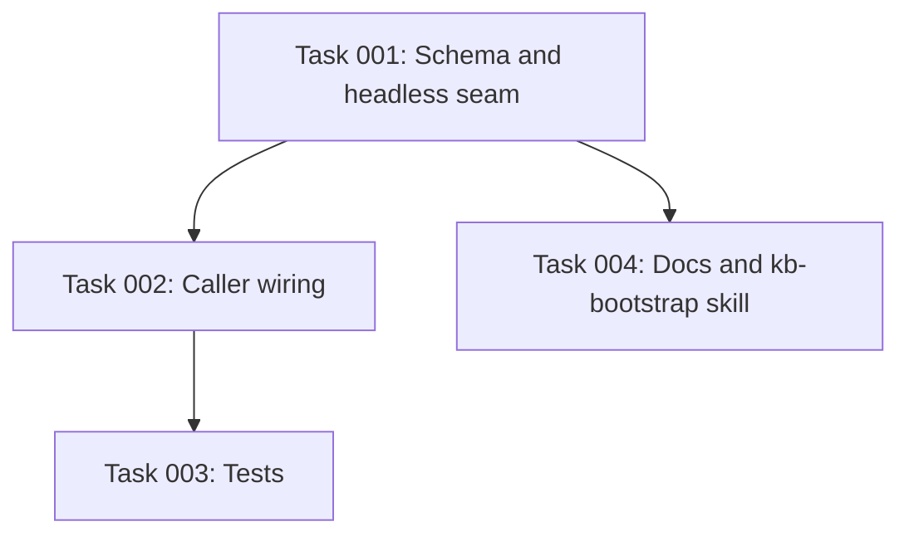

# Plan: Per-context model and effort selection for claude -p subprocesses

## Original Work Order

> I want to add some settings to be able to select the model that will be used for the Claude-P invocations in the different places and settings that they are invoked. So I like to be able to select Haiku sometimes, in some context I mean, and Sonnet in some other context, etc. This will help with speeding up some of the processes when the default model is Opus, but we don't need the whole power of Opus.

## Plan Clarifications

| Question | Decision |
| --- | --- |
| Which subprocess contexts get their own setting? | All three: `stage2-drain` (extractor hook), `curator` (CLI), `bootstrap-incremental` (CLI). |
| How is the model specified? | One object per context with both halves required when present: `{ name: ModelFamily, effort: EffortLevel }`. `ModelFamily` is `haiku` / `sonnet` / `opus`; `EffortLevel` is `low` / `medium` / `high` / `xhigh` / `max`. The Claude Code CLI already accepts `--model <alias>` and `--effort <level>` with these values. |
| CLI override flag (`--model` / `--effort` on `curate` and `bootstrap-incremental`)? | No. Config-only. |
| Default when unset? | Omit both flags entirely so the user's `claude` CLI default is used. Existing installs are unaffected unless they opt in. |
| Backwards compatibility for the existing config file shape? | No BC concerns: the settings schema only grows new optional fields; existing `config.yaml` files keep working unchanged. |
| Does the config also apply to Skill-based workflows? | Best effort. `/kb-curate` and `/kb-add` shell out to the CLI, which honors the config natively. `/kb-bootstrap` is agent-driven and reads `bootstrapModel.name` from resolved settings to pass to its `Task`-tool sub-agent; `bootstrapModel.effort` is not yet plumbable because the `Task` tool exposes no `effort` parameter. |

## Executive Summary

Today every `claude -p` subprocess spawned by this package, the Stage-2 extractor hook, the curator CLI, and the bootstrap-incremental CLI, inherits whichever model the user's `claude` CLI is set to. If that default is Opus, the high-volume Stage-2 extractor pays Opus latency and cost for work that Haiku handles fine. The user cannot tune this without rebinding their global `claude` default, which affects every other tool too.

This plan introduces a single config surface, three new optional object fields on `SettingsSchema` (`stage2Model`, `curatorModel`, `bootstrapModel`, each shaped `{ name, effort }`), that lets the operator pick a model family and effort level per subprocess context. The fields are wired through `runHeadlessClaude()` so each spawn either passes `--model <family>` and `--effort <level>` or omits them both. There is no CLI flag, no env var, and no per-call API change for callers outside the three known sites: configuration is the only knob. The same keys also feed the `/kb-bootstrap` skill on a best-effort basis (model name only, since the Claude Code `Task` tool exposes `model` but not `effort`).

Because the settings layer (defaults under user config under project config) already exists, this is a small additive change: extend the schema, plumb a resolved `{ model?, effort? }` pair from each command into the existing headless runner, and append the flags to the spawn args when they are set. Documentation under `docs/internals/` and `docs/cli-reference.md` is updated to describe the new keys.

## Context

### Current State vs Target State

| Current State | Target State | Why? |
| --- | --- | --- |
| `runHeadlessClaude()` builds `claude -p` args with no `--model` and no `--effort`. | The runner accepts optional `model` and `effort` in `RunHeadlessOptions` and appends `--model <value>` and `--effort <value>` when present. | Single seam for adding the flags; keeps the three call sites symmetrical. |
| All three subprocesses inherit whatever the user's global `claude` model is. | Each subprocess reads its own pair from resolved settings before spawning. | The user wants Haiku for cheap, high-frequency work and Opus only where reasoning matters. |
| `SettingsSchema` has no model-related fields. | Schema adds three optional object fields: `stage2Model`, `curatorModel`, `bootstrapModel`, each shaped `{ name: ModelFamily, effort: EffortLevel }`. | The two enums per context always travel together, so nesting them under one key prevents half-set configurations. |
| `.ai/knowledge-base/config.yaml` and the user-level config under `~/.config/ai-knowledge-base/config.yaml` document only timing and budget knobs. | Both files' documented examples and the schema doc-comments include the model/effort keys. | Settings are useless without discoverability. |
| Existing installs implicitly pay for the user's global model on every Stage-2 drain. | Existing installs see zero change until they add the keys (defaults are unset = omit flag). | No backwards-compatibility risk; opt-in only. |

### Background

- The package is `@e0ipso/ai-knowledge-base`. `runHeadlessClaude()` in `src/lib/headless.ts` is the single chokepoint for every `claude -p` spawn (verified via the Claude adapter at `src/adapters/types.ts` and `src/adapters/claude.ts`).
- Three callers exist today: `src/hooks/kb-stage2-drain.ts` (Stage-2 extraction, runs on Stop/SessionEnd/PreCompact), `src/commands/curate.ts` (CLI), and `src/commands/bootstrap-incremental.ts` (CLI). No other subprocesses are in scope.
- `KB_BUILDER_INTERNAL=1` is set on every child by `runHeadlessClaude()` and is independent of this plan, no change there.
- The `claude` CLI already exposes the exact flags we need: `--model <model>` (accepts the family aliases `haiku`, `sonnet`, `opus`) and `--effort <level>` with the documented values `low`, `medium`, `high`, `xhigh`, `max`. We pass values through without trying to map or translate them.
- The settings system in `src/lib/settings.ts` layers `SETTINGS_DEFAULTS` under the user-level file under the project-level file. The merge is shallow per top-level key, which is the right shape for these scalar additions.
- The Claude Code skill `/kb-bootstrap` is agent-driven, not a `claude -p` subprocess. It is partially in scope: it can read `bootstrapModel.name` and forward it to its `Task`-tool sub-agent on a best-effort basis (model only; `effort` is not yet a `Task`-tool parameter). The bootstrap-incremental *CLI* command remains fully in scope.
- Practice node `practice-v1-claude-code-only` constrains us to Claude Code only in v1, so reusing the existing adapter seam is correct; we are not adding a generic provider abstraction.

## Architectural Approach

```mermaid
flowchart LR
  subgraph Config Layer
    A1[SETTINGS_DEFAULTS]
    A2[~/.config/.../config.yaml]
    A3[.ai/knowledge-base/config.yaml]
    A1 --> R[resolveSettings]
    A2 --> R
    A3 --> R
  end
  R --> S[Resolved Settings]
  S -->|stage2Model { name, effort }| H1[kb-stage2-drain.ts]
  S -->|curatorModel { name, effort }| H2[curate.ts]
  S -->|bootstrapModel { name, effort }| H3[bootstrap-incremental.ts]
  H1 --> RH[runHeadlessClaude]
  H2 --> RH
  H3 --> RH
  RH -->|claude -p with optional --model and --effort| CLI[(claude CLI)]
```

### Schema and settings resolution

**Objective**: Make three new optional knobs visible to the type system, the YAML loader, and the docs.

Add to `SettingsSchema` (in `src/lib/schemas.ts`) two zod enums and three optional object fields shaped `{ name: ModelFamily, effort: EffortLevel }`:
- `ModelFamily`: `haiku`, `sonnet`, `opus`.
- `EffortLevel`: `low`, `medium`, `high`, `xhigh`, `max`.
- Per-context objects: `stage2Model`, `curatorModel`, `bootstrapModel`. Each value is `{ name: ModelFamily, effort: EffortLevel }`.

All three top-level fields are `.optional()`. When the object is present, both `name` and `effort` are required so a half-set config cannot leave the spawn args in an ambiguous state. The inner object is also `.strict()`, so unknown sub-keys fail loudly. `SETTINGS_DEFAULTS` does not set them, leaving "unset" as the explicit signal to omit both CLI flags. `resolveSettings()` requires no logic changes because the layering already handles optional scalars and objects.

The outer schema stays `.strict()`, so unknown top-level keys still fail loudly. There is no schema-version bump and no migrator, consistent with the project's no-migrators practice.

### Headless runner seam

**Objective**: Translate "model and effort were provided" into the right CLI args without disturbing existing callers.

`RunHeadlessOptions` in `src/lib/headless.ts` gains two optional fields, `model?: ModelFamily` and `effort?: EffortLevel`. When constructing `args`, `runHeadlessClaude()` appends `--model <value>` if `model` is set and `--effort <value>` if `effort` is set. When either is `undefined` the corresponding flag is omitted, which is exactly today's behavior.

No changes to the spawn function signature, log file behavior, recursion guard, schema validation, or error handling. The seam is purely additive at the args-construction step.

### Caller wiring

**Objective**: Each subprocess site reads its own pair from the resolved settings and forwards it to the runner.

- `src/hooks/kb-stage2-drain.ts` reads `stage2Model` from `resolveSettings()`. When set, it forwards `stage2Model.name` as `model` and `stage2Model.effort` as `effort` through whatever code path currently builds the runner options for Stage-2.
- `src/commands/curate.ts` reads `curatorModel` and, when set, forwards `curatorModel.name` and `curatorModel.effort`.
- `src/commands/bootstrap-incremental.ts` reads `bootstrapModel` and, when set, forwards `bootstrapModel.name` and `bootstrapModel.effort`.

The adapter interface (`src/adapters/types.ts` and `src/adapters/claude.ts`) must thread these two optional fields through `runHeadless()`. Since v1 ships only the Claude adapter, the change is a straight passthrough on one implementation.

### Skill workflows (best effort)

**Objective**: Where a Claude Code skill spawns a sub-agent instead of a `claude -p` subprocess, the same config keys steer the sub-agent's model on a best-effort basis.

The three CLI subprocess sites above are the binding contract: they always receive the configured flags. Skills are softer because they run inside the user's main Claude Code session and spawn sub-agents via the `Task` tool, not `claude -p`. The `Task` tool exposes a `model` parameter (`haiku`, `sonnet`, `opus`) but no `effort` parameter, so only the `name` half of each config object is enforceable from a skill today.

Concrete impact per skill:
- `/kb-bootstrap` is agent-driven only (no `claude -p` invocation). Its `SKILL.md` is updated to instruct the agent to read `bootstrapModel.name` from resolved settings and pass it as the sub-agent's `model`. `bootstrapModel.effort` is documented as ignored on this path.
- `/kb-curate` and `/kb-add` already shell out to the `ai-knowledge-base` CLI, which honors the config directly. No skill-level wiring is required for them.

`effort` plumbing into sub-agents is deferred until the `Task` tool grows an `effort` parameter; until then, `effort` applies only to `claude -p` subprocesses. This is called out explicitly in the skill docs so the asymmetry is not silent.

### Documentation

**Objective**: Make the new keys discoverable and self-documenting.

- `docs/cli-reference.md`: document the three new config keys (and their `name`/`effort` sub-keys) with allowed values, what they do, and what unsetting them means (no flags passed).
- `docs/internals/architecture.md` or the relevant internals page about subprocesses: a short note that each `claude -p` site reads its own `{ name, effort }` pair, plus the best-effort skill behavior described below.
- `.ai/knowledge-base/config.yaml` (the committed example) and any documented user-config example: add commented-out sample lines for the three keys, each showing the inner `name` and `effort` sub-keys.
- Update the schema-level doc-comment in `src/lib/schemas.ts` so the inline reference is accurate.

No CHANGELOG entry is written by hand; semantic-release covers it via the conventional commit message.

## Risk Considerations and Mitigation Strategies

<details>
<summary>Technical Risks</summary>

- **Claude CLI silently ignores or rejects a value combination (e.g. an effort level not supported by Haiku)**: zod accepts the enum but the spawned `claude` errors out, surfacing as a failed subprocess.
    - **Mitigation**: Match zod enums exactly to the documented `claude --help` output (model: `haiku`, `sonnet`, `opus`; effort: `low`, `medium`, `high`, `xhigh`, `max`). If a combination is invalid at the CLI layer, the existing subprocess-failure path reports it. Do not add client-side compatibility logic; trust the CLI.
- **Forgetting to thread the fields through the adapter, causing settings to silently no-op**: a regression that only shows up by inspecting the log file or invoice.
    - **Mitigation**: Cover the wiring with an existing-style unit test that injects a spawn function and asserts the `args` array contains `--model` and `--effort` exactly when the resolved settings include them.

</details>

<details>
<summary>Implementation Risks</summary>

- **Schema strictness breaking older config files**: the schema is already `.strict()`, so unknown keys fail today.
    - **Mitigation**: Adding fields cannot break existing valid files. We are widening the accepted set, not narrowing it.
- **Documentation drifts from schema**: easy for the doc page to forget one of six keys.
    - **Mitigation**: Group the six keys in a single table in `docs/cli-reference.md`, sourced from the schema's doc-comment. One logical change per PR with the docs update for that change (per the team's atomic-PR practice).

</details>

## Success Criteria

### Primary Success Criteria

1. Setting `stage2Model: { name: haiku, effort: low }` in `.ai/knowledge-base/config.yaml` causes the next Stage-2 drain to spawn `claude -p ... --model haiku --effort low ...` (verifiable from the captured `stage2.log` stream-json header or by injecting a test spawn).
2. Setting `curatorModel` and running `ai-knowledge-base curate` produces a `claude` invocation that includes the configured `--model` and `--effort` flags.
3. Setting `bootstrapModel` and running `ai-knowledge-base bootstrap-incremental` produces a `claude` invocation that includes the configured `--model` and `--effort` flags.
4. With no model keys present, every subprocess spawns with neither flag and behavior is identical to before the change.
5. Invalid values in `config.yaml` (e.g. `stage2Model: { name: sonet, effort: low }`) fail schema validation at load time with a clear error. Half-set objects (missing `name` or `effort`) also fail.
6. With `bootstrapModel.name` set, the `/kb-bootstrap` skill instructs its Task-tool sub-agent to use that model (best effort: model name only, `effort` is ignored by the skill path).
7. `npm test`, `npm run typecheck`, and `npm run lint` all pass.

## Self Validation

After implementation, the agent verifies the change end-to-end without relying solely on the unit-test suite:

1. Run `npx ai-knowledge-base doctor` against `/workspace` to confirm the new keys load cleanly when absent.
2. Add `stage2Model: { name: haiku, effort: low }` and `curatorModel: { name: opus, effort: max }` to `.ai/knowledge-base/config.yaml`, then run `npx ai-knowledge-base doctor` again to confirm the file still loads.
3. Run `ai-knowledge-base curate` with the spawn function intercepted in a test (`tests/...`) or via a temporary `DEBUG=1` log inspection, and confirm the assembled args contain `--model opus --effort max`.
4. Revert the config to its prior state and re-run `ai-knowledge-base curate` to confirm the args contain neither flag.
5. Insert a deliberately invalid value (`stage2Model: { name: turbo, effort: low }`) and confirm `resolveSettings()` throws with a zod error naming the offending field. Repeat with a half-set object (`stage2Model: { name: haiku }`) and confirm it also fails because `effort` is required when the object is present.
6. Diff `docs/cli-reference.md` against the new schema and confirm every new key (and its `name`/`effort` sub-keys) is listed with accepted values.

## Documentation

- `docs/cli-reference.md`: new "Model and effort selection" subsection listing all three keys (each with its inner `name` and `effort` shape), accepted values, and the "omit flags if unset" rule.
- `docs/internals/architecture.md` (or the equivalent internals page that documents the subprocess layout): one paragraph that names the three subprocess contexts and points at the config keys that govern each, plus a sentence on the best-effort skill behavior.
- `src/lib/schemas.ts`: doc-comment above `SettingsSchema` updated to mention the new keys.
- Example `.ai/knowledge-base/config.yaml` shipped in the repo: commented-out lines showing the three keys (each with `name` and `effort` sub-keys) with sample values.
- `.claude/skills/kb-bootstrap/SKILL.md` (and the templated copy under `src/templates-source/`): instruction to read `bootstrapModel.name` from resolved settings and pass it to the Task-tool sub-agent.

## Resource Requirements

### Development Skills

- TypeScript and zod for the schema additions.
- Familiarity with `execa` (already used in `runHeadlessClaude()`) for any test-level args assertion.

### Technical Infrastructure

- Existing toolchain only: `tsup`, `vitest`, `eslint`, and `semantic-release`. No new dependencies.
- The Claude Code CLI must support `--model` and `--effort` (confirmed against `claude --help` on the current dev environment).

## Notes

- The setting names use a flat, context-prefixed top-level shape (`stage2Model`, `curatorModel`, `bootstrapModel`) to match the existing flat layout of `SettingsSchema`. Each top-level key carries an inner `{ name, effort }` object so the two enums that always travel together cannot be set in isolation. A deeply nested `models: { stage2: { ... } }` shape would group all model config under one parent but is inconsistent with the rest of the schema; the mixed shape (flat top-level, object value) wins here.
- We intentionally do not add a CLI `--model` flag on `curate` or `bootstrap-incremental`. The user explicitly chose config-only. If the need arises later, the runner seam is already in place; only the Commander layer would need to grow flags.
- The Stage-2 extractor is the highest-frequency, lowest-stakes site and is the primary motivator for this work. The other two contexts get the same treatment for symmetry, not because Opus is the wrong default for them.

## Dependency Diagram



No circular dependencies.

## Execution Blueprint

**Validation Gates:**
- Reference: `/config/hooks/POST_PHASE.md`

### Phase 1: Infrastructure plumbing
**Parallel Tasks:**
- Task 001: Add model/effort schema fields and headless runner seam

### Phase 2: Wiring and docs
**Parallel Tasks:**
- Task 002: Wire three subprocess callers to read resolved model settings (depends on: 001)
- Task 004: Update docs, example config, and kb-bootstrap skill for new model keys (depends on: 001)

### Phase 3: Verification
**Parallel Tasks:**
- Task 003: Add tests for args wiring and schema validation (depends on: 002)

### Post-phase Actions

### Execution Summary
- Total Phases: 3
- Total Tasks: 4
