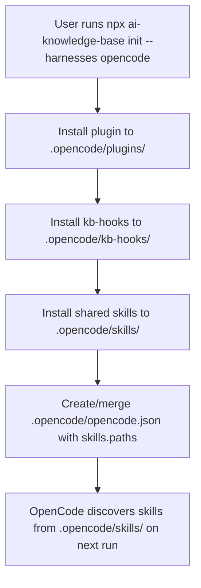
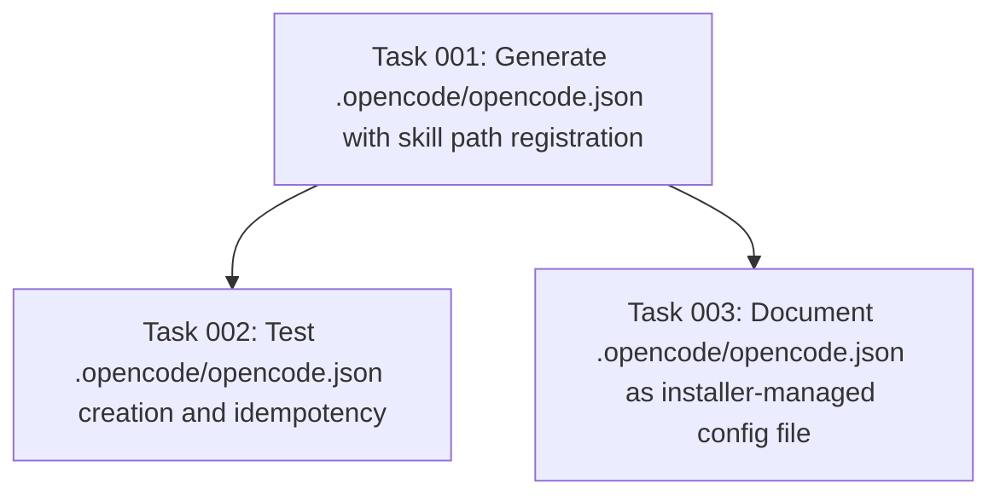

# Plan: Fix OpenCode Skill Discovery

## Original Work Order

> skills are not invokable in OpenCode. Your task is to verify this statement. If it's true, then come up with a solution so the users can invoke the skills.

## Plan Clarifications

| Question | Answer |
|---|---|
| Are we modifying the OpenCode CLI itself? | No. The fix is contained within the ai-knowledge-base installer and plugin. |
| Should this support OpenCode-only installs? | Yes. The bug manifests when `--harnesses opencode` is used without Claude/Codex. |
| Backwards compatibility? | No backwards compatibility required per project convention. Clean break. |

## Executive Summary

This plan fixes a discovery gap in the OpenCode harness adapter: OpenCode's runtime does not auto-scan `.opencode/skills/` for SKILL.md files. It only scans `.claude/skills/` and `.agents/skills/` by default (both globally under `~` and project-local when walking up the directory tree). The ai-knowledge-base installer writes shared skills into `.opencode/skills/`, which makes them invisible to OpenCode in fresh repositories where no other harness is installed.

The fix is minimal and targeted: the OpenCode installer will create `.opencode/opencode.json` containing a `skills.paths` entry pointing to `.opencode/skills`. OpenCode's config loader already searches `.opencode/opencode.json` (and `.opencode/opencode.jsonc`) when resolving project-local configuration, so no global state is modified and no CLI changes are needed.

This preserves the shared-skill abstraction (same bytes in every harness's native dir) while ensuring OpenCode can actually see and invoke the skills it installs.

## Context

### Current State vs Target State

| Current State | Target State | Why? |
|---|---|---|
| OpenCode installer copies skills to `.opencode/skills/` | Same copy step, plus a generated `.opencode/opencode.json` that registers `.opencode/skills` in `skills.paths` | OpenCode's default skill discovery scans `.claude/skills/` and `.agents/skills/` only; `.opencode/skills/` is not in the default search paths |
| Skills work when `.claude/skills/` or `.agents/skills/` exist (side effect of other harness installs) | Skills work in OpenCode-only installs because `.opencode/skills/` is explicitly registered | The bug is hidden when multiple harnesses are installed; it only surfaces on OpenCode-only installations |
| No project-level OpenCode config is created by the installer | Installer creates `.opencode/opencode.json` with skill-path registration | OpenCode's config resolver already walks up from CWD looking for `.opencode/opencode.json` / `.opencode/opencode.jsonc` |

### Background

The bug was verified by inspecting the OpenCode binary's skill-discovery code. The discovery routine builds a target list `F` containing `.claude` and `.agents` (hard-coded), then walks up from the project directory searching for `<dir>/skills/**/SKILL.md`. It also reads `skills.paths` from the resolved config, but `.opencode/skills/` is absent from the default list. The `.opencode/skills/` path only appears in OpenCode's documentation as an example of a custom `skills.paths` entry.

In the current workspace, skills ARE visible to OpenCode because `.claude/skills/` exists (the project was bootstrapped with the Claude harness) and OpenCode picks them up from there. A fresh repo with `--harnesses opencode` would have skills in `.opencode/skills/` and nowhere else, making them undiscoverable.

## Architectural Approach

### Installer Update
**Objective**: Ensure `.opencode/skills/` is discoverable by OpenCode without touching global config or other harness directories.

The `installOpenCode()` function in `src/harnesses/opencode/install.ts` already copies the plugin, kb-hooks, and shared skills into `.opencode/`. After the skill copy completes, it will write (or merge into) `.opencode/opencode.json` with the minimal registration:

```json
{
  "skills": {
    "paths": [".opencode/skills"]
  }
}
```

If `.opencode/opencode.json` already exists, the installer must merge the `skills.paths` array without overwriting unrelated keys (model, provider, plugin, etc.). The merge is shallow: read existing JSON, ensure `skills.paths` contains `.opencode/skills`, write back. No comments are preserved (OpenCode supports `.jsonc`, but the installer writes `.json` for simplicity; if a `.jsonc` exists, it is skipped to avoid corrupting comments).

### Test Coverage
**Objective**: Prevent regression by asserting that `.opencode/opencode.json` is created with the correct skill path.

`tests/init.test.ts` already has an assertion for OpenCode plugin and hook installation. A new assertion will verify that `.opencode/opencode.json` exists after `init --harnesses opencode` and that its `skills.paths` array includes `.opencode/skills`.

A second test will verify idempotent behaviour: re-running `init --harnesses opencode` in a repo that already has `.opencode/opencode.json` with custom content does not clobber that content; it only appends `.opencode/skills` to `skills.paths` if missing.

### Documentation Alignment
**Objective**: Update the docs so users understand that `.opencode/opencode.json` is a managed file and should not be manually deleted.

`docs/installation.md` already describes the `.opencode/` layout. Add a sentence noting that `.opencode/opencode.json` is created by the installer to register the local skills directory, and that it is safe to keep under version control.



## Risk Considerations and Mitigation Strategies

<details>
<summary>Technical Risks</summary>
- **OpenCode config schema changes in future versions**: If OpenCode renames `skills.paths` or changes the config shape, the generated file becomes stale.
    - **Mitigation**: The file is small and self-contained. A future plan can update the shape. The merge logic only touches `skills.paths`; other keys survive.
</details>

<details>
<summary>Implementation Risks</summary>
- **Existing `.opencode/opencode.json` with comments (jsonc)**: Writing `.json` alongside `.jsonc` may create ambiguity or the user may have chosen `.jsonc` deliberately.
    - **Mitigation**: If `.opencode/opencode.jsonc` exists, the installer skips writing `.opencode/opencode.json` and documents the manual step in a post-install message. This is a rare edge case.
- **Duplicate `.opencode/skills` entry on repeated installs**: Appending on every install could create duplicates.
    - **Mitigation**: The merge logic deduplicates the `skills.paths` array before writing.
</details>

## Success Criteria

### Primary Success Criteria
1. After `npx @e0ipso/ai-knowledge-base init --harnesses opencode` in a fresh repo, `.opencode/opencode.json` exists and contains `"skills": { "paths": [".opencode/skills"] }`.
2. The `doctor` command (`--harness opencode`) reports skills as present when `.opencode/skills/` contains the expected SKILL.md files.
3. Re-running `init --harnesses opencode` is idempotent: the config file is not duplicated or corrupted.
4. `npm test` passes, including the new assertions in `tests/init.test.ts`.

## Self Validation

1. Create a temporary directory, run the init command with `--harnesses opencode`, then verify `.opencode/opencode.json` exists and has the expected content using `cat .opencode/opencode.json | grep -A2 skills`.
2. Run `npx @e0ipso/ai-knowledge-base doctor --harness opencode` in the temp directory and confirm the output contains `OpenCode skills installed: ok`.
3. Re-run init in the same directory and verify the config file still has exactly one `.opencode/skills` entry (no duplicates).
4. Run the full test suite with `npm test` and confirm no regressions.

## Documentation

- `docs/installation.md`: Add a bullet under the OpenCode section describing `.opencode/opencode.json` as an installer-managed config file that registers the local skills directory.
- `src/harnesses/opencode/install.ts`: Add an inline comment explaining why `.opencode/opencode.json` is created.

## Resource Requirements

### Development Skills
- Node.js/TypeScript (config file I/O and JSON merging)
- OpenCode runtime behaviour (config resolution and skill discovery)

### Technical Infrastructure
- Existing test suite (`vitest`)
- OpenCode CLI (for end-to-end validation)

## Integration Strategy

The change is isolated to the OpenCode adapter's installer. It does not touch shared abstractions, the CLI surface, or other harness adapters. The generated `.opencode/opencode.json` lives inside the harness directory (`<root>/.opencode/`), which is already gitignored by the installer's managed `.gitignore` block, so it will not leak into user commits unless the user explicitly chooses to version-control `.opencode/`.

## Notes

- OpenCode's config loader reads `.opencode/opencode.json` and `.opencode/opencode.jsonc` when walking up from the project directory. By placing the config inside `.opencode/` (the same directory that holds the plugin and skills), we guarantee OpenCode sees it regardless of which subdirectory the user is in.
- The fix is intentionally minimal: one JSON file with one key. No plugin changes, no SDK changes, no global config mutations.

## Execution Blueprint

**Validation Gates:**
- Reference: `/config/hooks/POST_PHASE.md`

### Dependency Diagram



### Phase 1: Core Implementation
**Parallel Tasks:**
- Task 001: Generate `.opencode/opencode.json` with skill path registration

### Phase 2: Validation & Documentation
**Parallel Tasks:**
- Task 002: Test `.opencode/opencode.json` creation and idempotency (depends on: 001)
- Task 003: Document `.opencode/opencode.json` as installer-managed config file (depends on: 001)

### Post-phase Actions
- Run `npm test` to confirm no regressions.
- Run `npx @e0ipso/ai-knowledge-base --harness opencode doctor` in a fresh temp directory to verify skills are reported present.

### Execution Summary
- Total Phases: 2
- Total Tasks: 3
