# Plan: Centralize Category 1 Harness Duplication

## Original Work Order

> Create a plan for the Category 1 fixes on .ai/task-manager/scratch/harness-drift-report.md

## Plan Clarifications

| Question | Answer |
|----------|--------|
| Should Paths/Locations overlap within each harness be unified? | Yes — merge `*Paths()` and `*Locations()` into a single function per harness |
| Where should shared `readStdin()` live? | New file: `src/lib/stdin.ts` |
| Backwards compatibility for moved functions? | No — delete old copies and update imports directly, no re-export shims |

## Executive Summary

The harness adapter layer contains ~200-250 lines of pure duplication: functions that are byte-for-byte identical across all harnesses with zero harness-specific adaptation. This duplication was identified in the Category 1 section of the harness drift report.

The plan extracts five groups of duplicated functions into `src/lib/` shared modules, deletes the per-harness copies, and updates all import sites. This eliminates the "fix one, forget three" maintenance risk and reduces the adapter:shared ratio from 1.55:1.

No behavioral changes, no new features, no new abstractions beyond what the extraction requires. Every hook and adapter continues to do exactly what it does today, but calls shared code instead of private copies.

## Context

### Current State vs Target State

| Current State | Target State | Why? |
|---------------|-------------|------|
| `readStdin()` is copy-pasted into 15 hook files across 4 harnesses | Single `readStdin()` exported from `src/lib/stdin.ts`, imported by all 15 hooks | Worst single duplication offender — any stdin behavior change requires editing 15 files |
| `pickModelChoice()` duplicated in 4 `opts.ts` files | Single `pickModelChoice()` exported from `src/lib/settings.ts` (where `EffectiveSettings` and `ModelChoiceRole` already live) | Pure switch statement with zero harness logic, belongs alongside the types it operates on |
| `loadProposalPrompt()` duplicated in 3 `kb-proposal-drain.ts` files | Single `loadProposalPrompt()` exported from `src/lib/proposal-drain.ts` (which already hosts `drainProposalQueue()`) | Natural home — the prompt loading is a step in the drain pipeline already defined in this module |
| `copyTree()` duplicated in 4 `install.ts` files | Single `copyTree()` exported from `src/lib/fs-atomic.ts` (existing filesystem utility module) | Generic filesystem helper with no harness affinity |
| Each harness defines `*Paths()` in `install.ts` and `*Locations()` in `doctor.ts` with overlapping fields | Single `*Paths()` per harness shared between install and doctor | Eliminates within-harness duplication and risk of path definitions drifting between install and doctor |

### Background

Commit `732dce1` ("fix: work towards harness parity") already demonstrated the "fix one, forget three" problem with Category 2 duplication. Category 1 is lower risk per-item but higher volume — 15 copies of `readStdin()` alone. These are the safest extractions because the implementations are verified byte-for-byte identical, so the refactoring carries zero behavioral risk.

The existing `src/lib/` already hosts the business logic these duplicated helpers support (`proposal-drain.ts`, `settings.ts`, `fs-atomic.ts`). The extractions are natural extensions of modules that already exist.

## Architectural Approach

```mermaid
graph TD
    subgraph "Shared Library (src/lib/)"
        STDIN["stdin.ts<br/>+ readStdin()"]
        SETTINGS["settings.ts<br/>+ pickModelChoice()"]
        DRAIN["proposal-drain.ts<br/>+ loadProposalPrompt()"]
        FS["fs-atomic.ts<br/>+ copyTree()"]
    end

    subgraph "Harness Hooks"
        H1["claude/hooks/*.ts"]
        H2["codex/hooks/*.ts"]
        H3["cursor/hooks/*.ts"]
        H4["opencode/hooks/*.ts"]
    end

    subgraph "Harness Adapters"
        A1["claude/opts.ts"]
        A2["codex/opts.ts"]
        A3["cursor/opts.ts"]
        A4["opencode/opts.ts"]
        I1["claude/install.ts"]
        I2["codex/install.ts"]
        I3["cursor/install.ts"]
        I4["opencode/install.ts"]
        D1["claude/doctor.ts"]
        D2["codex/doctor.ts"]
        D3["cursor/doctor.ts"]
        D4["opencode/doctor.ts"]
    end

    H1 & H2 & H3 & H4 -->|import| STDIN
    A1 & A2 & A3 & A4 -->|import| SETTINGS
    H2 & H3 & H4 -->|import| DRAIN
    I1 & I2 & I3 & I4 -->|import| FS
```

### Extract `readStdin()` into `src/lib/stdin.ts`

**Objective**: Eliminate the 15 identical copies of `readStdin()` — the single worst duplication offender.

Create `src/lib/stdin.ts` exporting the function. Update all 15 hook files (4 hooks × 4 harnesses, minus claude's missing proposal-drain) to import from the shared module. Delete the 15 private function definitions. Each hook's call site (`const raw = await readStdin()`) remains unchanged — only the import source changes.

### Extract `pickModelChoice()` into `src/lib/settings.ts`

**Objective**: Centralize the model selection switch statement alongside the types it operates on.

Add `pickModelChoice()` as an export to `src/lib/settings.ts`, which already defines `EffectiveSettings` and `ModelChoiceRole`. Update the 4 `opts.ts` files to import instead of defining locally. The function signature stays identical.

### Extract `loadProposalPrompt()` into `src/lib/proposal-drain.ts`

**Objective**: Co-locate prompt loading with the drain pipeline it feeds.

Add `loadProposalPrompt()` as an export to `src/lib/proposal-drain.ts`. Update the 3 proposal-drain hook files (codex, cursor, opencode) to import it. The function depends on `packageTemplatesDir()` which is already available in the shared lib.

### Extract `copyTree()` into `src/lib/fs-atomic.ts`

**Objective**: Move a generic filesystem utility to the existing filesystem helpers module.

Add `copyTree()` as an export to `src/lib/fs-atomic.ts`. Update the 4 `install.ts` files to import it. Remove the 4 private definitions.

### Unify `*Paths()` / `*Locations()` per harness

**Objective**: Eliminate within-harness path definition duplication between install and doctor modules.

For each harness, create a single path-resolution function (e.g. `claudePaths()`) that returns all fields needed by both `install.ts` and `doctor.ts`. Place it in a shared location per harness — either in an existing file or inline in one of the two consumers and imported by the other. Each harness keeps its own function since the returned fields differ by architecture. The `doctor.ts` files import the unified paths function instead of defining their own `*Locations()`.

## Risk Considerations and Mitigation Strategies

Technical Risks

- **Import path resolution in hook scripts**: Hook scripts run as standalone Node processes via the harness runtime. They need correct relative imports to `src/lib/`.
    - **Mitigation**: The hooks already import from `../../lib/` (e.g., `import { captureSession } from '../../lib/capture.js'`), so the import pattern is established and working.

- **Circular dependency introduction**: Adding exports to existing modules could create import cycles.
    - **Mitigation**: The functions being moved are leaf utilities with no outgoing dependencies on harness code. `readStdin()` has zero imports. `pickModelChoice()` depends only on types already in `settings.ts`. `copyTree()` uses only Node built-ins. `loadProposalPrompt()` depends on `packageTemplatesDir()` already in the same module context.

Implementation Risks

- **Missing an import site**: A hook file might still contain a local `readStdin()` that shadows the import, causing no compile error but defeating the purpose.
    - **Mitigation**: After extraction, run `grep -rn "function readStdin" src/harnesses/` to verify zero remaining local definitions. Same for each extracted function.

- **Test coverage gaps**: If existing tests mock or stub the local functions, they may break when the import source changes.
    - **Mitigation**: Run the full test suite after each extraction. Fix any import-path-dependent test setups.

## Success Criteria

### Primary Success Criteria

1. Zero local definitions of `readStdin()`, `pickModelChoice()`, `loadProposalPrompt()`, or `copyTree()` remain in `src/harnesses/` — verified by grep
2. Zero `*Locations()` functions remain in doctor.ts files — each doctor imports from the unified paths function
3. All existing tests pass without modification (or with only import-path updates)
4. `npm run build` succeeds with no new TypeScript errors
5. Total lines removed from `src/harnesses/` exceeds lines added to `src/lib/` (net reduction of ~200+ lines)

## Self Validation

1. Run `grep -rn "function readStdin\|function pickModelChoice\|function loadProposalPrompt\|function copyTree" src/harnesses/` — expect zero matches
2. Run `grep -rn "Locations\b" src/harnesses/*/doctor.ts` — expect zero function definitions (only imports or usage of the unified paths)
3. Run `npm run build` and confirm zero errors
4. Run `npm test` and confirm all tests pass
5. Run `wc -l src/harnesses/**/*.ts | tail -1` before and after to verify net line reduction
6. Run `grep -rn "readStdin\|pickModelChoice\|loadProposalPrompt\|copyTree" src/lib/` to confirm the shared exports exist

## Documentation

No user-facing documentation changes required. The refactoring is internal and does not change any public API, CLI behavior, or configuration format.

AGENTS.md does not need updating — it describes harness behavior, not internal module structure. The shared lib's role is already implicit in the architecture.

## Resource Requirements

### Development Skills

- TypeScript module system (ESM imports, re-exports)
- Node.js filesystem APIs (`cpSync`, `mkdirSync`, `existsSync`, `readFileSync`)
- Familiarity with the harness adapter architecture and hook execution model

### Technical Infrastructure

- Node.js runtime (already in use)
- TypeScript compiler (already configured)
- Existing test suite for regression verification

## Notes

- The drift report also identifies Category 2 (partially centralizable) and Category 3 (bugs from incomplete propagation). Those are explicitly out of scope for this plan.
- The `readStdin()` extraction alone eliminates 14 of 15 copies (keeping one as the shared version), saving ~210 lines. This is the highest-value single change.
- Each extraction is independent and can be done in isolation — there are no ordering dependencies between the five groups.
