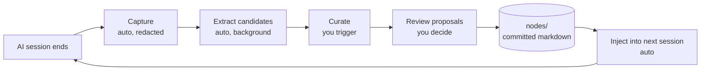

# How it works

Three things happen on a loop. You only ever drive one of them by hand.

## 1. Capture (automatic)

When a Claude Code session ends, a hook reads the transcript, runs it through [gitleaks](https://github.com/gitleaks/gitleaks) to redact secrets, and writes it to `.ai/knowledge-base/_sessions/`. Then a background extractor turns that transcript into structured _candidates_ — small bits of practice or vocabulary worth remembering.

You don't run this. It just happens.

## 2. Curate (you trigger it)

When you're ready to harvest, run `/kb-curate` in a session or `ai-knowledge-base curate` in a shell. The curator looks at all pending candidates and produces three kinds of _proposals_:

- **Additions** — new things to remember.
- **Modifications** — updates to something you already kept.
- **Contradictions** — the new candidate disagrees with something you already kept.

Proposals are written as files under `.ai/knowledge-base/_proposed/`.

## 3. Review (you decide)

Run `ai-knowledge-base proposals review` (interactive) to accept or reject each proposal. Accepted proposals move into `.ai/knowledge-base/nodes/` — plain markdown, committed with your code.

That's it. Next time you start a session, the current knowledge base index is injected into the assistant's context automatically.

## The storage model

Everything kept is a markdown file in `nodes/`, in one of two kinds:

- **Practice** — _how we build._ Imperative guidance: conventions, prohibitions, gotchas.
  e.g. "Inject dependencies via the constructor; avoid `\Drupal::service()` in module code."
- **Map** — _what exists._ Named things: modules, services, vocabulary.
  e.g. "`bravo_cards` is the personalization module at `modules/custom/bravo_cards/`."

Everything is text. Diffable, reviewable, version-controlled like any code.

## What's automatic vs. manual

| Step | Who runs it |
|---|---|
| Capture | automatic |
| Extract candidates | automatic (background) |
| Curate | **you** |
| Review proposals | **you** |
| Inject index into new sessions | automatic |

The cheap deterministic steps run on their own. Judgment-heavy steps stay manual.
