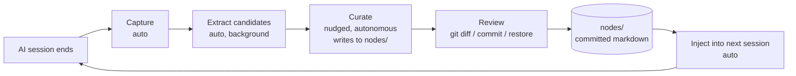
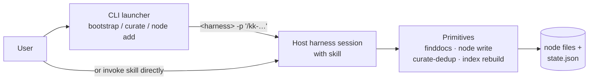

# How it works

Three things happen on a loop. You only ever drive one of them by hand, and even that one mostly drives itself.

## 1. Capture (automatic)

When an AI session ends, a hook reads the transcript and writes it to `.ai/kenkeep/_sessions/`. Then a background extractor turns that transcript into structured _candidates_ (small bits of practice or vocabulary worth remembering).

You don't run this. It just happens.


kenkeep does not scan or redact captured transcripts. Anything in the session — including secrets — is written to `.ai/kenkeep/_sessions/` (gitignored by default). If you want secret scanning, wire it up yourself; see [Installation → Secret scanning on commit](installation.md#optional-commit-time-hardening).



Per-harness wiring details (which events fire, where hooks live) are in [Installation](installation.md). Curation and review behave identically across all four harnesses.

## 2. Curate (mostly automatic)

When captured candidates accumulate, the system nudges you in the next session. You confirm (or run `/kk-curate` directly), and the curate skill runs **in the host harness session**: it reads pending candidates with the host's `Read` tool, drafts curator proposals in-session, and hands the merged proposal set to the deterministic `curate-dedup` primitive (a pure-Node helper that mints conflict ids, writes conflict files, and stamps consumed session logs atomically). Decisions land directly under `.ai/kenkeep/nodes/`:

- **Additions**: write a new node file via the `node write` primitive.
- **Modifications**: overwrite an existing node file via `node write`.
- **Contradictions**: `curate-dedup` records each conflict as `.ai/kenkeep/conflicts/<id>.md` with `status: pending` and writes nothing to `nodes/`. Inside an interactive session, `/kk-curate` then walks each conflict with you, grouping by `target_node_id`. You reply with a single character: `y` to accept the proposal, `n` to reject it, `s` to defer to the next pass, or `k` to keep the conflict file as a historical record.

The skill finishes with `index rebuild`, so `INDEX.md` and `GRAPH.md` always reflect the current `nodes/` tree.

## 3. Review (you decide)

Review the changes under `.ai/kenkeep/nodes/` with `git diff`. They are important; they may affect how the agent behaves in every future session. Tools like [self-review](https://github.com/e0ipso/self-review) work too. Accept with `git commit`, reject with `git restore <path>`. The lint-staged pre-commit hook regenerates `INDEX.md` and `GRAPH.md` and stages them into the same commit so the index never drifts from the committed nodes.

## How a launcher invocation flows

`bootstrap`, `curate`, and `node add` are thin **launchers**: they exec the active harness in `-p` mode against the matching slash-command. The LLM runs in that host harness session, the same model, prompt cache, and tool surface you use interactively, and calls back into deterministic CLI **primitives** (`finddocs`, `node write`, `curate-dedup`, `index rebuild`) for the things a prompt cannot reliably do (gitignore-aware discovery, atomic+validated writes, cross-batch dedup, index regeneration).

One harness invocation per user invocation. The model the user actually configured is the model that does the work, and the cache the user has warmed up stays warm.

Inside that single host session, `kk-bootstrap` and `kk-curate` may further fan their drafting work out across native host sub-agents (e.g. Claude Code's `Task` tool, Cursor's `Task`) when the harness exposes one, up to five concurrent agents per wave. Each agent reads its own slice in an isolated context window and returns a structured draft to the host. `kk-add` uses the same delegation primitive for a single drafting pass to keep the host transcript clean. None of this changes the outer launcher model: `launchSkill` still execs the harness binary exactly once per user invocation. On harnesses without a native sub-agent primitive, the skills detect that at runtime and degrade to sequential inline drafting; the launcher contract is unchanged either way. See [Daily use → Parallel drafting and per-batch logs](daily-use.md#parallel-drafting-and-per-batch-logs) for the per-batch JSONL artefacts each path emits.

## Storage & graph

Every kept fact is a markdown file under `nodes/` with YAML frontmatter. Two kinds:

- **Practice**: _how we build._ Imperative guidance (conventions, prohibitions, gotchas).
- **Map**: _what exists._ Named things (modules, services, vocabulary).

Frontmatter carries the edges of a directed graph: `derived_from` for provenance, `relates_to` (loose) and `depends_on` (strict) for cross-references. Two artifacts are regenerated deterministically from `nodes/` every curate run:

- **`INDEX.md`**: catalog of every node (title, path, and tags). This is what gets injected into every new session.
- **`GRAPH.md`**: full edge listing. Not injected; the harness reads it on demand when it needs the whole graph.

Everything is plain text, diffable, reviewable, version-controlled like any code. The full frontmatter shape lives in [Schemas](internals/schemas.md).

## What's automatic vs. manual

| Step | Trigger | Who runs it |
|---|---|---|
| Capture session | session end (hook) | automatic |
| Extract candidates | capture completes | automatic (background) |
| Curate → write to `nodes/` | system nudge or `/kk-curate` | autonomous AI (asks only when contradicting) |
| Resolve contradictions | curator writes a file under `.ai/kenkeep/conflicts/` | `/kk-curate` skill walks each one with **you** (`y`/`n`/`s`/`k`) |
| Regenerate `INDEX.md` / `GRAPH.md` | end of curate run + every commit (lint-staged) | automatic (deterministic) |
| Review changes to `nodes/` | whenever the curator wrote something | **you** (`git diff`, `git restore`, `git commit`) |
| Inject `INDEX.md` into new sessions | session start | automatic |

The cheap deterministic steps and the bulk-AI steps run on their own. The one place we keep humans in the loop is reviewing what to keep.
